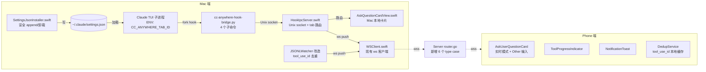
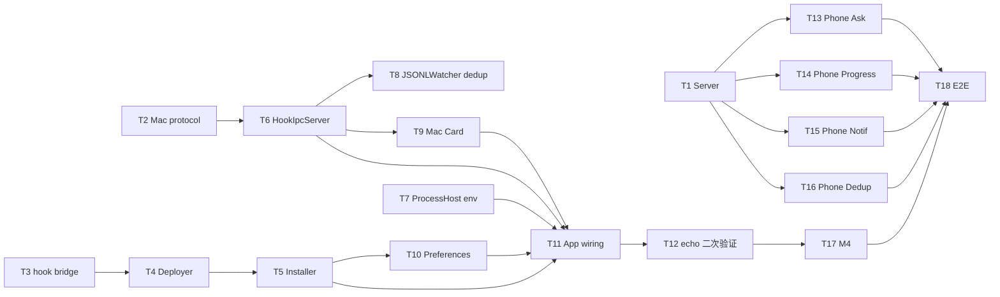

# AskUserQuestion 远程交互 - 技术实施文档

## 1. 文档信息

| 字段 | 值 |
|---|---|
| 版本号 | v1.0 |
| 创建日期 | 2026-05-15 |
| 关联文档 | `产品需求文档.md` v1.0 / `需求规格说明书.md` v1.0 / `工作流元信息.md` |
| 流程级别 | L4 |
| 执行模式 | 无人值守 |

## 2. 技术方案概述

### 2.1 整体架构



### 2.2 技术选型

| 选项 | 选型 | 理由 |
|---|---|---|
| Hook bridge 脚本语言 | Python 3 | macOS 系统预装 `/usr/bin/python3`，无 runtime 依赖；标库支持 Unix socket / JSON / 超时 / 信号；启动 ~50ms 满足 NFR-P1 |
| IPC 协议 | Unix domain socket + JSON | 同 host 通信，比 TCP 快；权限 0600 满足 NFR-S1；JSON 跟现有协议一致 |
| Mac App socket 框架 | Swift `Network.framework` | macOS 13+ 原生支持 Unix socket（`NWConnection` + `NWEndpoint.unix`）；不引入第三方依赖 |
| settings.json 操作 | Foundation `JSONSerialization` + 原子 rename | 不依赖 jq 命令行（避免运行时 PATH 问题）；用 swift 内建 JSON 解析；原子写防止损坏 |
| Tab 路由信号 | 环境变量 `CC_ANYWHERE_TAB_ID` (UUIDv4) | hook bridge 通过 `os.environ` 读；ProcessHost 子进程启动时注入；用户终端直接跑 claude 无该 env，自动放行 |
| 并发模型 | Swift `actor` + `AsyncStream` | HookIpcServer 用 actor 维护 pendingRequests 表，winner 锁通过 actor 串行化天然保证；socket 连接处理用 Task + AsyncStream |

### 2.3 设计理念

1. **零侵入用户其他场景**：用户在终端直接跑 `claude`、其他 plugin 的 hooks、其他 Claude SDK 应用都不被本需求影响（NFR-U1/U2）。
2. **软失败优先**：hook bridge 任何失败路径都退化为"无意见"（输出 `{}`），让 Claude SDK 走 fallback，永远不会比"没装 hook"更糟。
3. **数据通道隔离 + 去重**：hook 实时通道 与 JSONL 旁观通道 并存，通过 `tool_use_id` 在 Mac App 与 Phone 双端去重。
4. **可控可回滚**：偏好开关一键关闭，settings.json 完整卸载；backup 机制保护用户原配置。
5. **多端协同任一 wins**：phone + Mac App 同时展示卡片，winner 锁仲裁，无用户体验割裂。

## 3. 架构设计

### 3.1 新增/修改文件清单

#### 新增文件

| 路径 | 类型 | 职责 | 预估 LOC |
|---|---|---|---|
| `MacClient/Sources/CCAnywhere/Resources/cc-anywhere-hook-bridge.py` | Python 脚本 | hook 入口，4 子命令 + 三道软失败保护 | 200 |
| `MacClient/Sources/CCAnywhere/Services/HookIpcServer.swift` | Swift actor | Unix socket server + tab 路由 + 请求登记表 + winner 锁 + 超时回收 | 320 |
| `MacClient/Sources/CCAnywhere/Services/SettingsJsonInstaller.swift` | Swift class | 安全 install/uninstall settings.json hooks + backup | 240 |
| `MacClient/Sources/CCAnywhere/Services/HookBridgeDeployer.swift` | Swift class | 启动时把 hook bridge Python 脚本从 bundle 复制到 `~/Library/Application Support/cc-anywhere/bin/` 并 chmod +x | 80 |
| `MacClient/Sources/CCAnywhere/Models/HookProtocol.swift` | Swift struct | hook bridge ↔ Mac App 的 socket 协议数据模型 | 120 |
| `MacClient/Sources/CCAnywhere/Views/AskQuestionCardView.swift` | SwiftUI View | Mac 端 AskUserQuestion 卡片（含 Other 输入框） | 280 |
| `MacClient/Sources/CCAnywhere/Services/AskQuestionCardController.swift` | ObservableObject | Mac 端卡片状态管理 + winner 锁联动 | 120 |
| `AndroidClient/lib/widgets/ask_user_question_card_realtime.dart` | Flutter Widget | Phone 端实时模式卡片（含 Other 输入） | 250 |
| `AndroidClient/lib/widgets/tool_progress_indicator.dart` | Flutter Widget | 工具进度指示器 | 150 |
| `AndroidClient/lib/widgets/notification_toast.dart` | Flutter Widget | Toast | 80 |
| `AndroidClient/lib/services/dedup_service.dart` | Flutter Service | tool_use_id 去重 + 持久化 | 100 |

#### 修改文件

| 路径 | 改动 |
|---|---|
| `MacClient/Sources/CCAnywhere/App/DependencyContainer.swift` | 注入 HookIpcServer / SettingsJsonInstaller / HookBridgeDeployer / AskQuestionCardController |
| `MacClient/Sources/CCAnywhere/App/AppDelegate.swift` | 启动序列：HookBridgeDeployer.deploy() → SettingsJsonInstaller 首次许可弹窗 → HookIpcServer.start() |
| `MacClient/Sources/CCAnywhere/App/CCAnywhereApp.swift` | 主视图 overlay AskQuestionCardView |
| `MacClient/Sources/CCAnywhere/Services/ProcessHost.swift` | `makeEnvironment()` 增加 `CC_ANYWHERE_TAB_ID=<tabId.uuidString>` |
| `MacClient/Sources/CCAnywhere/Services/JSONLWatcher.swift` | 增加 `hookPushedToolUseIds: Set<String>`，跳过 `tool_use` 已推记录 |
| `MacClient/Sources/CCAnywhere/Services/WSClient.swift` | 暴露广播方法 `send(type:data:)` 给 HookIpcServer 用 |
| `MacClient/Sources/CCAnywhere/Models/ProtocolMessage.swift` | 新增 6 个 payload struct（AskQuestionPending / Answer / Answered / Timeout / ToolProgressPre/Post / Notification） |
| `MacClient/Sources/CCAnywhere/Views/PreferencesPanel.swift` | 新增 2 个偏好开关 |
| `MacClient/Sources/CCAnywhere/Services/PreferencesService.swift`（若存在）/ 等价位置 | 新增偏好 bool kv |
| `Server/internal/protocol/messages.go` | 新增 6 个 Type 常量（4.7 段） + 6 个 payload struct |
| `Server/internal/router/router.go` | `RouteFromMac` 增加 5 个新 type case；`RouteFromPhone` 增加 `ask.question.answer` case |
| `Server/internal/db/sqlite.go`（如有） | 无变更（本需求无数据库需求） |

### 3.2 调用关系（含数据流）


## 4. 详细设计

### 4.1 模块 A — `cc-anywhere-hook-bridge.py`（hook bridge 脚本）

#### 4.1.1 入口与子命令

```python
#!/usr/bin/env python3
"""
cc-anywhere hook bridge - Forwards Claude Code hooks to Mac App via Unix socket.

Subcommands:
  ask         (blocks; PreToolUse AskUserQuestion or Bash/Write/Edit approval)
  progress pre   (fire-and-forget; PreToolUse Bash/Write/Edit progress)
  progress post  (fire-and-forget; PostToolUse .* progress)
  notification   (fire-and-forget; Notification event)

R-F1-001/002/003/004 软失败保护：任何异常路径输出 {}。
"""
import json
import os
import socket
import sys
import traceback
from contextlib import contextmanager

SOCKET_PATH = os.path.expanduser(
    "~/Library/Application Support/cc-anywhere/hook.sock"
)
LOG_PATH = os.path.expanduser(
    "~/Library/Logs/cc-anywhere/hook-bridge.log"
)
SOCKET_CONNECT_TIMEOUT = 2.0       # socket connect 超时
ASK_RESPONSE_TIMEOUT = 1800.0      # ask 等待 Mac App 回写超时（应与 hook timeout 一致 30min）
FIRE_AND_FORGET_TIMEOUT = 0.5      # progress/notification 超时（短，绝不阻塞）

def log_stderr(msg: str) -> None:
    """所有日志写 stderr，由 hook-bridge.log 落盘。R-F1-004"""
    try:
        os.makedirs(os.path.dirname(LOG_PATH), exist_ok=True)
        with open(LOG_PATH, "a", encoding="utf-8") as f:
            f.write(f"[{os.getpid()}] {msg}\n")
    except Exception:
        pass

@contextmanager
def safe_exit_with_empty():
    """三道保护的核心：任何异常都退化为 echo '{}'。"""
    try:
        yield
    except SystemExit:
        raise
    except Exception as e:
        log_stderr(f"FATAL: {e}\n{traceback.format_exc()}")
        sys.stdout.write("{}\n")
        sys.stdout.flush()
        sys.exit(0)

def must_have_tab_id() -> str | None:
    """保护 1：无 CC_ANYWHERE_TAB_ID env 立即放行。R-F1-002"""
    tab_id = os.environ.get("CC_ANYWHERE_TAB_ID")
    if not tab_id:
        return None
    return tab_id

def socket_call(payload: dict, response_timeout: float) -> dict:
    """连接 Mac App socket 并发请求；保护 2：连不上立即输出 {}。"""
    s = socket.socket(socket.AF_UNIX, socket.SOCK_STREAM)
    s.settimeout(SOCKET_CONNECT_TIMEOUT)
    try:
        s.connect(SOCKET_PATH)
    except Exception as e:
        log_stderr(f"socket connect failed: {e}")
        return {}
    s.settimeout(response_timeout)
    try:
        # Framing: 1 行 JSON + \n
        line = (json.dumps(payload) + "\n").encode("utf-8")
        s.sendall(line)
        # 读响应（同样以 \n 分帧）
        chunks = []
        while True:
            buf = s.recv(65536)
            if not buf:
                break
            chunks.append(buf)
            if b"\n" in buf:
                break
        data = b"".join(chunks).split(b"\n", 1)[0]
        return json.loads(data.decode("utf-8"))
    except Exception as e:
        log_stderr(f"socket call failed: {e}")
        return {}
    finally:
        try:
            s.close()
        except Exception:
            pass

def cmd_ask(stdin_json: dict, tab_id: str) -> dict:
    """阻塞，输出 updatedInput 或 deny。"""
    tool_input = stdin_json.get("tool_input", {})
    tool_name = stdin_json.get("tool_name", "")
    tool_use_id = stdin_json.get("tool_use_id", "")
    session_id = stdin_json.get("session_id", "")
    payload = {
        "kind": "ask",
        "tab_id": tab_id,
        "session_id": session_id,
        "tool_use_id": tool_use_id,
        "tool_name": tool_name,
        "tool_input": tool_input,
        # ask_kind 由 Mac App 根据 tool_name 判定（user_question vs tool_approval）
    }
    response = socket_call(payload, ASK_RESPONSE_TIMEOUT)
    if not response:
        # 软失败：socket 不可达 / Mac App 没响应 → 让 SDK 走 fallback
        return {}
    if response.get("error"):
        # Mac App 明确返回 error（如 timeout / unknown tab）
        return {
            "hookSpecificOutput": {
                "hookEventName": "PreToolUse",
                "permissionDecision": "deny",
                "permissionDecisionReason": f"cc-anywhere: {response['error']}"
            }
        }
    # Success: response 含 answers (或 approval decision)
    if response.get("ask_kind") == "tool_approval":
        decision = response.get("decision", "deny")
        return {
            "hookSpecificOutput": {
                "hookEventName": "PreToolUse",
                "permissionDecision": decision,  # allow | deny
                "permissionDecisionReason": response.get("reason", "")
            }
        }
    # 普通 AskUserQuestion: 返回 updatedInput 让 SDK 跳过 TUI 弹窗
    answers = response.get("answers", {})
    questions = tool_input.get("questions", [])
    return {
        "hookSpecificOutput": {
            "hookEventName": "PreToolUse",
            "permissionDecision": "allow",
            "updatedInput": {
                "questions": questions,
                "answers": answers
            }
        }
    }

def cmd_progress(stdin_json: dict, tab_id: str, phase: str) -> dict:
    """fire-and-forget。返回 {}。"""
    payload = {
        "kind": f"progress_{phase}",  # progress_pre / progress_post
        "tab_id": tab_id,
        "tool_use_id": stdin_json.get("tool_use_id", ""),
        "tool_name": stdin_json.get("tool_name", ""),
        "tool_input": stdin_json.get("tool_input", {}),
    }
    if phase == "post":
        payload["tool_response"] = stdin_json.get("tool_response", {})
    socket_call(payload, FIRE_AND_FORGET_TIMEOUT)
    return {}

def cmd_notification(stdin_json: dict, tab_id: str) -> dict:
    """fire-and-forget。"""
    payload = {
        "kind": "notification",
        "tab_id": tab_id,
        "notification": stdin_json.get("message", ""),
        "title": stdin_json.get("title", "Claude"),
        "notification_type": stdin_json.get("type", "idle"),
    }
    socket_call(payload, FIRE_AND_FORGET_TIMEOUT)
    return {}

def main():
    with safe_exit_with_empty():
        # 保护 1
        tab_id = must_have_tab_id()
        if tab_id is None:
            sys.stdout.write("{}\n")
            return

        # 子命令路由
        args = sys.argv[1:]
        if not args:
            sys.stdout.write("{}\n")
            return
        try:
            stdin_data = sys.stdin.read()
            stdin_json = json.loads(stdin_data) if stdin_data.strip() else {}
        except Exception:
            sys.stdout.write("{}\n")
            return

        cmd = args[0]
        if cmd == "ask":
            result = cmd_ask(stdin_json, tab_id)
        elif cmd == "progress" and len(args) >= 2:
            phase = args[1]  # "pre" or "post"
            result = cmd_progress(stdin_json, tab_id, phase)
        elif cmd == "notification":
            result = cmd_notification(stdin_json, tab_id)
        else:
            result = {}
        sys.stdout.write(json.dumps(result) + "\n")

if __name__ == "__main__":
    main()
```

#### 4.1.2 部署位置

由 `HookBridgeDeployer.swift` 在 Mac App 首次启动 / 升级时执行：

1. 从 Mac App bundle `Resources/cc-anywhere-hook-bridge.py` 读取
2. 复制到 `~/Library/Application Support/cc-anywhere/bin/cc-anywhere-hook-bridge.py`
3. `chmod 0755`
4. 同时 SHA-256 校验当前部署版本与 bundle 版本，不一致则覆盖（解决升级问题）

`~/.claude/settings.json` 中 hook 的 command 字段指向 `~/Library/Application Support/cc-anywhere/bin/cc-anywhere-hook-bridge.py`，避免对 `~/.local/bin` PATH 的依赖。

### 4.2 模块 B — `HookIpcServer.swift`

#### 4.2.1 公共接口

```swift
import Foundation
import Network

public actor HookIpcServer {
    public weak var wsClient: WSClient?
    public weak var jsonlWatcher: JSONLWatcher?  // 用于回告"已推 tool_use_id"
    public weak var cardController: AskQuestionCardController?

    public init(socketPath: URL, tabRouter: TabRouter)
    public func start() async throws  // 创建 socket + 启动 accept loop
    public func stop() async           // 关闭 socket，清理 pending requests
    public func isRunning() async -> Bool

    /// 由 ws 客户端在收到 ask.question.answer 时调用
    public func receiveAnswerFromWs(requestId: String, answers: [String: String], answeredBy: String) async
    public func receiveApprovalFromWs(requestId: String, decision: String) async
}

public protocol TabRouter: AnyObject {
    func tabId(forUUIDString uuid: String) -> UUID?
    func deviceId(forTabId tabId: UUID) -> String?
}
```

#### 4.2.2 内部数据结构

```swift
struct PendingAskRequest {
    let requestId: String        // UUIDv4
    let tabId: UUID
    let toolUseId: String
    let askKind: AskKind         // .userQuestion | .toolApproval
    let questions: [AskQuestion]
    let toolName: String?
    let toolInput: [String: Any]?
    let createdAt: Date
    let deadline: Date           // createdAt + 5 min
    let socketContinuation: AsyncSocketContinuation  // 用于回写 hook bridge
    var answered: Bool = false
    var answeredBy: String? = nil
    var answers: [String: String]? = nil
    var approvalDecision: String? = nil
}

private var pendingRequests: [String: PendingAskRequest] = [:]
private let socketListener: NWListener
private let reapTimer: Task<Void, Never>  // 每 30s 扫一次过期
```

#### 4.2.3 关键算法

**accept loop**: 监听 Unix socket，每个连接独立 Task 处理（不互相阻塞）。

**handle connection**:
1. 读一行 JSON（按 `\n` 分帧）
2. 反序列化为 `IncomingPayload`（区分 ask / progress_pre / progress_post / notification）
3. 校验 `tab_id` 通过 TabRouter 查在不在活跃 tab 列表中；不在则 reply `{ "error": "unknown tab_id" }`
4. 路由：
   - `ask`：生成 request_id → 加入 pendingRequests → ws 推 `ask.question.pending` → 等待 answer（通过 continuation）
   - `progress_pre/post`：异步 ws 推 → 立即 reply `{}`
   - `notification`：异步 ws 推 → 立即 reply `{}`

**winner 锁**:
- Actor 串行化保证 `pendingRequests[reqId].answered` 的写不会竞态
- `receiveAnswerFromWs` 与 `cardController.submit` 都进入同一 actor
- 第一个进入的 mark `answered = true` 并 resolve continuation；后续者检测 `answered == true` 直接丢弃

**超时回收**:
- `reapTimer` 每 30s 扫一遍 pendingRequests
- 找出 `deadline < now && !answered` 的 request
- resolve continuation with `{ "error": "timeout" }`
- ws 推 `ask.question.timeout`

#### 4.2.4 错误处理

| 场景 | 处理 |
|---|---|
| socket bind 失败（端口被占 / 路径无权限） | 启动失败，AppLogger error，UI 提示用户 |
| socket 连接读取异常（hook bridge 崩溃） | 关闭连接，已登记 request 走超时路径 |
| ws 推送失败（mac 离线） | 不影响 hook 流程，仅日志记录 |
| 收到 unknown payload kind | reply `{ "error": "unknown kind" }` |
| reapTimer 内部异常 | catch 后日志，timer 继续 |

### 4.3 模块 C — `SettingsJsonInstaller.swift`

#### 4.3.1 公共接口

```swift
public final class SettingsJsonInstaller {
    public init(settingsPath: URL, backupDir: URL, hookBridgePath: URL)

    /// 已经安装了 cc-anywhere hook（不论是 M1-M3 还是 M4 模式）
    public func isInstalled() -> Bool

    /// 安装 M1-M3 hook（AskUserQuestion ask + Bash/Write/Edit progress + .* progress + Notification）
    public func installM1M3() throws

    /// 切换 Bash/Write/Edit 的 PreToolUse 子命令从 progress pre → ask（M4 ON）
    public func enableM4() throws

    /// 切换回 progress pre（M4 OFF）
    public func disableM4() throws

    /// 卸载所有 cc-anywhere hooks
    public func uninstall() throws

    /// 返回当前已安装的 hooks 摘要（用于偏好面板显示）
    public func currentInstalled() -> InstalledSummary
}

public enum InstallError: Error {
    case settingsNotFound
    case settingsCorrupted(String)
    case writePermissionDenied
    case backupFailed(String)
}
```

#### 4.3.2 关键算法

**install / uninstall 算法（核心）**:

```
1. 读 settingsPath → 解析 JSON（JSONSerialization → [String: Any]）
   若解析失败 → throw .settingsCorrupted
2. backup 到 backupDir/settings.json.bak.<unix_timestamp>
   只保留最近 5 份，旧的删除
3. 取 hooks 字段（不存在则初始化为空对象）
4. 处理 PreToolUse / PostToolUse / Notification 三个 array：
   - install：append cc-anywhere 条目（先扫描，已存在则跳过 — idempotent，R-F1-010）
   - uninstall：filter out command 路径以 hookBridgePath 开头的条目
5. 如果某个数组 filter 后为空 → 删除该 key
6. 如果 hooks 对象为空 → 删除整个 hooks key
7. 写入临时文件 settings.json.tmp.<pid>
8. atomic rename 临时文件 → settings.json (FileManager.default.replaceItem)
9. 校验：重读 settings.json，再次 JSON 解析，确认我们的目标条目状态符合预期
```

**identifier 策略（R-F1-011）**:

```swift
private func isCCAnywhereEntry(_ hook: [String: Any]) -> Bool {
    guard let command = hook["command"] as? String else { return false }
    // 严格匹配 hookBridgePath 前缀（不允许同名不同路径误删）
    return command.hasPrefix(hookBridgePath.path)
}
```

**hooks 数组中的 cc-anywhere 条目格式**:

```json
{
  "matcher": "AskUserQuestion",
  "timeout": 1800,
  "hooks": [
    {
      "type": "command",
      "command": "/Users/<user>/Library/Application Support/cc-anywhere/bin/cc-anywhere-hook-bridge.py ask"
    }
  ]
}
```

#### 4.3.3 settings.json 安装后示例

```json
{
  "env": { "..." : "..." },
  "permissions": { "..." : "..." },
  "hooks": {
    "PreToolUse": [
      {
        "matcher": "AskUserQuestion",
        "timeout": 1800,
        "hooks": [{ "type": "command",
                    "command": "/Users/lly/Library/Application Support/cc-anywhere/bin/cc-anywhere-hook-bridge.py ask" }]
      },
      {
        "matcher": "Bash|Write|Edit",
        "timeout": 600,
        "hooks": [{ "type": "command",
                    "command": "/Users/lly/Library/Application Support/cc-anywhere/bin/cc-anywhere-hook-bridge.py progress pre" }]
      }
    ],
    "PostToolUse": [
      {
        "matcher": ".*",
        "hooks": [{ "type": "command",
                    "command": "/Users/lly/Library/Application Support/cc-anywhere/bin/cc-anywhere-hook-bridge.py progress post" }]
      }
    ],
    "Notification": [
      {
        "hooks": [{ "type": "command",
                    "command": "/Users/lly/Library/Application Support/cc-anywhere/bin/cc-anywhere-hook-bridge.py notification" }]
      }
    ]
  }
}
```

M4 启用时，`Bash|Write|Edit` 那条变成：

```json
{
  "matcher": "Bash|Write|Edit",
  "timeout": 1800,
  "hooks": [{ "type": "command",
              "command": "/Users/lly/.../cc-anywhere-hook-bridge.py ask" }]
}
```

### 4.4 模块 D — `ProcessHost.swift` 改造

`makeEnvironment()` 增加：

```swift
private func makeEnvironment(tabId: UUID) -> [String] {
    var env = ProcessInfo.processInfo.environment
    // 既有逻辑
    env["TERM"] = "xterm-256color"
    // ...
    // 新增：tab 路由 env
    env["CC_ANYWHERE_TAB_ID"] = tabId.uuidString
    return env.map { "\($0.key)=\($0.value)" }
}
```

并将 `startProcess(for:)` 中的调用改为 `makeEnvironment(tabId: tab.id)`。

### 4.5 模块 E — `JSONLWatcher.swift` 改造

新增字段：

```swift
public final class JSONLWatcher {
    /// hook 已实时推送过的 tool_use_id，跳过 JSONL 中的对应记录避免双推。
    /// TTL 10 分钟。R-F5-001/002/003
    private var hookPushedToolUseIds: [String: Date] = [:]
    private let hookPushedTTL: TimeInterval = 600

    /// 由 HookIpcServer 调用，告知"该 tool_use_id 已通过 hook 推送过"
    public func markHookPushed(toolUseId: String) {
        queue.async { [weak self] in
            self?.hookPushedToolUseIds[toolUseId] = Date()
        }
    }
}
```

`WatchStream.shouldEmit` 改造：

```swift
private func shouldEmit(_ msg: ParsedMessage) -> Bool {
    // 既有 uuid + fallback 去重
    if !existingDedup(msg) { return false }

    // 新增：tool_use 类型且 tool_use_id 已被 hook 推送过 → 跳过
    if msg.type == "assistant" || msg.type == "user" {
        if let parsed = parseToolUseIds(from: msg.raw) {
            let now = Date()
            for toolUseId in parsed {
                if let pushedAt = watcher.hookPushedToolUseIds[toolUseId],
                   now.timeIntervalSince(pushedAt) < hookPushedTTL {
                    // 已被 hook 推送过，本条记录 phone 不需要 → 跳过
                    return false
                }
            }
        }
    }
    return true
}
```

注：JSONL 中 tool_use 在 `assistant` message 的 `content[].tool_use_id` 字段，tool_result 在 `user` message 的 `content[].tool_result_id` 字段。`parseToolUseIds` 解析这两类。

### 4.6 模块 F — Mac App AskQuestionCardView

#### 4.6.1 SwiftUI 视图签名

```swift
public struct AskQuestionCardView: View {
    @ObservedObject var controller: AskQuestionCardController
    public var body: some View {
        if let req = controller.currentRequest, !req.answered {
            CardOverlay(request: req,
                        onSubmit: controller.submit,
                        onDismiss: controller.dismiss)
        } else if let answered = controller.recentlyAnswered {
            AnsweredBadge(answered: answered,
                          onDismiss: controller.clearAnsweredBadge)
        }
    }
}
```

#### 4.6.2 控制器接口

```swift
@MainActor
public final class AskQuestionCardController: ObservableObject {
    @Published public private(set) var currentRequest: AskCardRequest?
    @Published public private(set) var recentlyAnswered: AnsweredInfo?

    public init(hookIpcServer: HookIpcServer) {
        // 接收 HookIpcServer 转过来的 ask 请求
    }

    /// 由 HookIpcServer 调用：把 ask 请求 surface 到 UI
    public func show(_ req: AskCardRequest)

    /// 由 UI 触发：用户在 Mac 端选了答案
    public func submit(requestId: String, answers: [String: String])

    /// 由 HookIpcServer 调用：phone 端答了 / 超时 / 取消
    public func dismiss(requestId: String, reason: DismissReason, by: String?)

    public func clearAnsweredBadge()
}
```

#### 4.6.3 渲染分支

- `ask_kind == .userQuestion`：渲染 question + options + "自定义回答" 输入框（R-F1-012）
- `ask_kind == .toolApproval`：顶部红色徽章"⚠ 工具批准"+ tool_name + tool_input 摘要 + "允许 / 拒绝"两键

#### 4.6.4 winner 锁联动

当 HookIpcServer 通过 `dismiss(reason: .answered, by: phone:X)` 调用控制器：
- 控制器 currentRequest 立即清空
- recentlyAnswered 设置为 `AnsweredInfo(by: phone:X, answers: ..., expireAt: now+3s)`
- 3 秒后 banner 自动消失

### 4.7 模块 G — Phone 端 Flutter Widget

#### 4.7.1 AskUserQuestionCard 实时模式

```dart
class AskUserQuestionCardRealtime extends StatefulWidget {
  final AskQuestionPendingPayload payload;
  final void Function(Map<String, String> answers) onSubmit;
  final VoidCallback onDismiss;
  // ...
}
```

UI 与 Mac 端对齐：
- 题干 + options 列表（label + description）
- 固定显示"自定义回答"输入项（TextField，限长 200）
- 提交按钮 / 取消按钮
- 收到 `ask.question.answered` 或 `ask.question.timeout` → 切换为"已被回答"状态或自动 dismiss

#### 4.7.2 ToolProgressIndicator

监听 `tool.progress.pre` / `tool.progress.post` 流，按 tool_use_id 维护一个进度条 list：

```dart
class ToolProgressState {
  final Map<String, ToolProgressItem> active = {};
  void onPre(payload) {
    active[payload.tool_use_id] = ToolProgressItem(
      tool_name: payload.tool_name,
      summary: _summarize(payload.tool_input),
      startAt: DateTime.now(),
    );
  }
  void onPost(payload) {
    if (!payload.success) {
      _flashErrorToast(active[payload.tool_use_id], payload.error);
    }
    active.remove(payload.tool_use_id);
  }
}
```

#### 4.7.3 NotificationToast

简单 SnackBar 包装，按 `notification_type` 取颜色。

#### 4.7.4 DedupService

```dart
class DedupService {
  final Set<String> _handledToolUseIds = {};
  final Map<String, DateTime> _ttl = {};

  bool checkAndMark(String toolUseId) {
    _evictExpired();
    if (_handledToolUseIds.contains(toolUseId)) return false;
    _handledToolUseIds.add(toolUseId);
    _ttl[toolUseId] = DateTime.now().add(Duration(hours: 24));
    _persist();
    return true;
  }
}
```

### 4.8 模块 H — Server 协议路由

#### 4.8.1 `Server/internal/protocol/messages.go` 新增

```go
const (
    // 4.7 Hook 实时桥接（cc-anywhere AskUserQuestion 远程交互）
    TypeAskQuestionPending  = "ask.question.pending"
    TypeAskQuestionAnswer   = "ask.question.answer"
    TypeAskQuestionAnswered = "ask.question.answered"
    TypeAskQuestionTimeout  = "ask.question.timeout"
    TypeToolProgressPre     = "tool.progress.pre"
    TypeToolProgressPost    = "tool.progress.post"
    TypeNotification        = "notification"
)

type AskQuestionPending struct {
    RequestID  string                   `json:"request_id"`
    TabID      string                   `json:"tab_id"`
    ToolUseID  string                   `json:"tool_use_id"`
    AskKind    string                   `json:"ask_kind"`       // "user_question" | "tool_approval"
    AllowOther bool                     `json:"allow_other"`
    Questions  []map[string]interface{} `json:"questions,omitempty"`
    ToolName   string                   `json:"tool_name,omitempty"`
    ToolInput  map[string]interface{}   `json:"tool_input,omitempty"`
}

type AskQuestionAnswer struct {
    RequestID string            `json:"request_id"`
    Answers   map[string]string `json:"answers"`
}

type AskQuestionAnswered struct {
    RequestID  string            `json:"request_id"`
    AnsweredBy string            `json:"answered_by"`
    Answers    map[string]string `json:"answers"`
}

type AskQuestionTimeout struct {
    RequestID string `json:"request_id"`
    Reason    string `json:"reason"`
}

type ToolProgressPre struct {
    TabID     string                 `json:"tab_id"`
    ToolUseID string                 `json:"tool_use_id"`
    ToolName  string                 `json:"tool_name"`
    ToolInput map[string]interface{} `json:"tool_input"`
}

type ToolProgressPost struct {
    TabID     string `json:"tab_id"`
    ToolUseID string `json:"tool_use_id"`
    ToolName  string `json:"tool_name"`
    Success   bool   `json:"success"`
    Error     string `json:"error,omitempty"`
}

type Notification struct {
    TabID            string `json:"tab_id"`
    NotificationType string `json:"notification_type"`
    Title            string `json:"title"`
    Message          string `json:"message"`
}
```

#### 4.8.2 `Server/internal/router/router.go` 增加 case

```go
func (r *Router) RouteFromMac(env *protocol.Envelope) *protocol.Envelope {
    switch env.Type {
    case protocol.TypeMsgStream,
         protocol.TypeMsgRaw,
         protocol.TypeMsgHistoryResponse,
         protocol.TypeTabList,
         protocol.TypeTabListResponse,
         protocol.TypeSlashListResponse,
         protocol.TypeTabChanged,
         protocol.TypeInputError,
         // 新增 5 个 mac→phone
         protocol.TypeAskQuestionPending,
         protocol.TypeAskQuestionAnswered,
         protocol.TypeAskQuestionTimeout,
         protocol.TypeToolProgressPre,
         protocol.TypeToolProgressPost,
         protocol.TypeNotification:
        r.phone.BroadcastToPhones(env)
        return nil
    }
    return nil
}

func (r *Router) RouteFromPhone(ctx context.Context, env *protocol.Envelope) *protocol.Envelope {
    switch env.Type {
    case protocol.TypeInputText,
         protocol.TypeToolUseApprove,
         protocol.TypeMsgHistoryRequest,
         protocol.TypeTabListRequest,
         protocol.TypeSlashListRequest,
         // 新增 1 个 phone→mac
         protocol.TypeAskQuestionAnswer:
        if !r.mac.HasMac() {
            return errorEnvelope(protocol.CodeMacOffline, "mac is offline")
        }
        r.mac.MacConnSend(env)
        return nil
    }
    return nil
}
```

## 5. 数据库设计

本需求**不涉及数据库变更**。所有状态：
- 持久化部分用文件（settings.json backup、hook-bridge.log、本地 plist 偏好、phone DedupService sqlite/shared_preferences）
- 内存部分用 Mac App 进程内 actor / Set

## 6. 接口设计

### 6.1 外部接口（WebSocket 协议）

详见需求规格说明书 §3.2 的 6 个新增 type 的完整 JSON schema。Server 端 Go struct 在 §4.8.1。

### 6.2 内部接口（Mac App ↔ hook bridge socket 协议）

#### 6.2.1 hook bridge → Mac App 请求

每条请求一行 JSON + `\n`，UTF-8 编码：

```json
{
  "kind": "ask" | "progress_pre" | "progress_post" | "notification",
  "tab_id": "<UUID>",
  "session_id": "<UUID, Claude SDK 提供>",
  "tool_use_id": "<toolu_xxx, 仅 ask/progress 有>",
  "tool_name": "<AskUserQuestion | Bash | Write | Edit | Read | ...>",
  "tool_input": { /* 任意结构 */ },
  "tool_response": { /* 仅 progress_post */ },
  "notification": "<string, 仅 notification>",
  "title": "<string, 仅 notification>",
  "notification_type": "<idle | permission_prompt | error>"
}
```

#### 6.2.2 Mac App → hook bridge 响应

一行 JSON + `\n`：

**ask 成功（user_question）**：
```json
{ "answers": { "<question>": "<label or custom text>", ... } }
```

**ask 成功（tool_approval）**：
```json
{ "ask_kind": "tool_approval", "decision": "allow" | "deny", "reason": "<string>" }
```

**ask 失败 / 超时**：
```json
{ "error": "timeout" | "unknown tab_id" | "..." }
```

**progress / notification**：
```json
{}
```

## 7. 部署方案

### 7.1 配置变更

| 配置 | 变更 |
|---|---|
| `~/.claude/settings.json` | Mac App 在用户首次许可后 append hooks 字段；偏好关闭时移除 |
| `~/Library/Application Support/cc-anywhere/bin/cc-anywhere-hook-bridge.py` | Mac App 启动时部署 / 升级时更新 |
| `~/Library/Application Support/cc-anywhere/hook.sock` | Mac App 启动时创建（chmod 0600） |
| `~/Library/Application Support/cc-anywhere/settings.json.bak.*` | install/uninstall 时自动 backup，保留 5 份 |
| `~/Library/Logs/cc-anywhere/hook-bridge.log` | hook bridge 运行时 stderr 落盘 |
| `~/Library/Preferences/com.yoolines.cc-anywhere.plist` | 2 个新偏好 key |

### 7.2 环境依赖

| 依赖 | 来源 | 检测时机 |
|---|---|---|
| `/usr/bin/python3` | macOS 系统预装 | Mac App 启动时检测，缺失则禁用 hook 功能并提示用户 |
| `~/.claude/` 目录可写 | Claude CLI 安装时创建 | SettingsJsonInstaller install 时 try-catch |
| Claude CLI 已安装 | 用户已装 | 既有 cc-anywhere 检测逻辑 |

### 7.3 部署步骤（开发→上线）

1. **本地构建**：`swift build`（Mac App）+ `flutter build`（Android）+ `go build`（Server）
2. **Server 部署**：先部署 Server（新增 type 路由），不影响存量功能
3. **Android 部署**：发布新版 APK，处理新 type；旧 APK 静默忽略（NFR-C3）
4. **Mac App 部署**：发布新版 dmg，首次启动弹许可弹窗

### 7.4 回滚方案

#### 7.4.1 一键回滚

如发现严重 bug：
1. 用户在偏好里关闭"启用远程 hook" 主开关
2. SettingsJsonInstaller.uninstall() 自动卸载所有 cc-anywhere hooks
3. Mac App 重启或新开 tab 后，Claude 行为完全回到本需求之前
4. （可选）发布脚本 `cc-anywhere-uninstall-hooks.sh` 给用户独立运行（不需要 Mac App）

#### 7.4.2 Git 回滚

主分支可直接 revert 整个 commit，不会破坏现有功能（hook 是增量能力，移除即恢复原 JSONL 旁观）。

### 7.5 灰度策略

- M1-M3 默认 ON（首次启动弹许可弹窗）
- M4 默认 OFF，用户主动开启
- 上线 1 周后观察 hook 错误日志频率与用户反馈，决定是否默认开启 M4

## 8. 实施计划

### 8.1 任务拆分（按子 Agent 派发粒度）

| ID | 任务 | 文件 | 验证步骤 | 依赖 |
|---|---|---|---|---|
| T1 | Server 协议常量 + 路由 case | `Server/internal/protocol/messages.go`, `Server/internal/router/router.go` | `go build ./... && go test ./internal/router/...` | 无 |
| T2 | Mac App 协议 struct | `MacClient/Sources/CCAnywhere/Models/ProtocolMessage.swift` | `swift build` 通过 | 无 |
| T3 | 写 hook bridge Python 脚本 + bundle 资源 | `MacClient/Sources/CCAnywhere/Resources/cc-anywhere-hook-bridge.py` + Package.swift 资源声明 | `python3 -c "import py_compile; py_compile.compile('....py')"` 通过；手动 echo 子命令测试 | 无 |
| T4 | HookBridgeDeployer | `MacClient/Sources/CCAnywhere/Services/HookBridgeDeployer.swift` | unit test：部署/升级幂等 | T3 |
| T5 | SettingsJsonInstaller | `MacClient/Sources/CCAnywhere/Services/SettingsJsonInstaller.swift` | unit test：install/uninstall idempotent + backup + 不误删其他 plugin hooks + 损坏 JSON 容错 | T4 |
| T6 | HookIpcServer | `MacClient/Sources/CCAnywhere/Services/HookIpcServer.swift`, `MacClient/Sources/CCAnywhere/Models/HookProtocol.swift` | unit test：accept/路由/winner锁/超时回收；本地集成测试用 nc 模拟 hook bridge | T2 |
| T7 | ProcessHost env 注入 | `MacClient/Sources/CCAnywhere/Services/ProcessHost.swift` | 启动 tab 后 `ps eww <pid>` 看 env | 无 |
| T8 | JSONLWatcher 去重 | `MacClient/Sources/CCAnywhere/Services/JSONLWatcher.swift` | unit test：mock hook 推送 + JSONL 解析双推不重复 | T6 |
| T9 | Mac App AskQuestionCardController + View | `MacClient/Sources/CCAnywhere/Services/AskQuestionCardController.swift`, `MacClient/Sources/CCAnywhere/Views/AskQuestionCardView.swift` | UI snapshot test | T6 |
| T10 | Preferences 开关 | `MacClient/Sources/CCAnywhere/Views/PreferencesPanel.swift` + Preferences 服务 | 启动后切换开关 → settings.json 变化符合预期 | T5 |
| T11 | App 启动序列接线 | `MacClient/Sources/CCAnywhere/App/AppDelegate.swift`, `DependencyContainer.swift`, `CCAnywhereApp.swift` | 启动 App 后日志显示 socket 启动、首次弹许可弹窗 | T4, T5, T6, T9, T10 |
| T12 | echo 实验二次验证（updatedInput.answers） | `/tmp` 内置一次性 hook，验证 SDK 行为 | log 写入 + Claude 跳过 TUI 弹窗 | T11 |
| T13 | Phone AskUserQuestionCard 实时模式 + Other | `AndroidClient/lib/widgets/ask_user_question_card_realtime.dart` | flutter widget test | T1 |
| T14 | Phone ToolProgressIndicator | `AndroidClient/lib/widgets/tool_progress_indicator.dart` | flutter widget test | T1 |
| T15 | Phone NotificationToast | `AndroidClient/lib/widgets/notification_toast.dart` | flutter widget test | T1 |
| T16 | Phone DedupService | `AndroidClient/lib/services/dedup_service.dart` | flutter unit test | T1 |
| T17 | M4 危险工具远程批准（开关 + ask_kind 分支） | 复用 T5 / T6 / T9 / T13 已建能力，增加 toggle 逻辑 | M4 ON 后 Bash 调用走 ask 通道 | T11 + T13 |
| T18 | 端到端集成测试 | 手工 - 启动 Mac App, 触发 AskUserQuestion, 验证 phone 收到/Mac 收到/超时 fallback/Other 输入/M4 batch | 完整 6 个场景全通过 | T11 + T13/T14/T15/T16 + T17 |

### 8.2 执行顺序



### 8.3 并行可派性

- **Wave 1（无依赖，可并行）**：T1, T2, T3, T7
- **Wave 2**：T4（依赖 T3）、T6（依赖 T2）、T13/T14/T15/T16（依赖 T1）
- **Wave 3**：T5（依赖 T4）、T8（依赖 T6）、T9（依赖 T6）
- **Wave 4**：T10（依赖 T5）
- **Wave 5**：T11（依赖 T4/T5/T6/T9/T10/T7）
- **Wave 6**：T12 echo 二次验证 → 通过则继续 T17 → T18

实际开发使用 `superpowers:subagent-driven-development` 派发子 Agent；每个 Wave 内的任务并行，Wave 之间串行依赖。

### 8.4 阶段七 echo 二次验证（T12 关键）

阶段七 Wave 5 完成后、Wave 6 启动 T17 之前**必须执行 T12**：

1. Mac App 已经写好 settings.json hook
2. 在 cc-anywhere Tab 启动 Claude → prompt 触发 AskUserQuestion
3. 期望：
   - phone 端 ≤ 1s 弹卡片（Phone DedupService 必须收到 push）
   - Mac App 端同步弹卡片
   - 用户选答案后 ≤ 2s Claude TUI 中**不出现内置 AskUserQuestion 弹窗**，而是直接 emit tool_result 落 JSONL
   - JSONLWatcher 看到 tool_use 但因 hookPushedToolUseIds 命中而跳过推送
4. 如果 SDK 不采纳 `updatedInput.answers`（即仍弹 TUI 弹窗）：
   - **立即终止 T17 开发**
   - 调研可能原因（hook 输出格式 / SDK 版本 / matcher 配置）
   - 写一份 T12 调研报告，由用户拍板是否切方案 A（SDK 路线）

### 8.5 验证矩阵（T18）

| 场景 | 期望结果 | 验证方式 |
|---|---|---|
| 单 phone 在线，问题正常答 | phone 卡片 → 选答 → Claude 继续 | 手工 |
| phone 离线，Mac 端答 | Mac 卡片 → 选答 → Claude 继续 | 手工 |
| phone 选 Other 文字 | answers 值为用户输入文本 | 手工 |
| 多 phone 同时回答 | 首回复 wins，其他显示已被回答 | 手工 + 抓包 |
| inner timeout 5min | hook 返回 deny，TUI 弹原问题 | 手工（5min 不动） |
| 用户终端直接跑 claude | 无任何 hook 介入 | 手工 |
| 偏好关闭主开关 | settings.json cc-anywhere 条目消失 | 手工 + diff |
| M4 ON 后 Bash 调用 | phone 弹"⚠ 工具批准" 卡片 | 手工 |
| M4 OFF 后 Bash 调用 | phone 仅显示 progress 不批准 | 手工 |
| hook bridge 异常（人为破坏） | Claude 不卡死，走 fallback | 手工破坏 socket 路径 |

## 9. 风险与对策（技术维度）

| 风险 | 概率 | 影响 | 缓解 |
|---|---|---|---|
| SDK 不采纳 updatedInput.answers | 中 | 高（M1 失效） | T12 二次验证，不通过升级方案 |
| Network.framework Unix socket 在 macOS 13+ 兼容性 | 低 | 中 | 后备方案：用 `socket(2)` + `dispatch_source` 原始 BSD API |
| settings.json JSON 格式特殊（注释 / 尾逗号） | 低 | 中 | JSONSerialization 失败时 throw .settingsCorrupted，UI 提示用户手动修复 |
| FSEvents 在 Apple Silicon macOS 14+ 行为变化 | 低 | 低 | 既有逻辑已经在用，本需求只增加去重不变结构 |
| Python 3 解释器路径不在标准位置 | 低 | 中 | 启动时检测，缺失则禁用 hook 功能；用 `/usr/bin/env python3` shebang 兜底 |
| 用户已有的其他 plugin 占用 PreToolUse matcher AskUserQuestion | 极低 | 中 | settings.json append 模式天然支持多个 matcher 条目，互不影响 |

## 10. 性能预算

| 操作 | 预算 | 实测目标 |
|---|---|---|
| hook bridge 启动 + 读 env + connect socket | ≤ 100ms | < 80ms |
| Mac App socket accept + 路由 + ws 推 | ≤ 30ms | < 20ms |
| ws → server → phone 单跳 | ≤ 30ms | < 20ms |
| phone 渲染卡片 | ≤ 50ms | < 30ms |
| **端到端 NFR-P3 (≤1s)** | 累计 ≤ 210ms | < 150ms |
