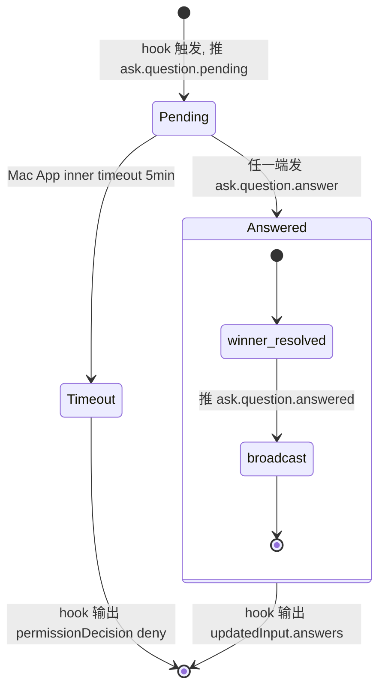

# AskUserQuestion 远程交互 - 需求规格说明书

## 1. 文档信息

| 字段 | 值 |
|---|---|
| 版本号 | v1.0 |
| 创建日期 | 2026-05-15 |
| 关联 PRD | `产品需求文档.md` v1.0 |
| 流程级别 | L4 |
| 执行模式 | 无人值守 |

## 2. 需求概述

### 2.1 功能概要

通过在 `~/.claude/settings.json` 注册 PreToolUse / PostToolUse / Notification hook，将 Claude SDK 内部的工具调用与用户决策事件**实时桥接**到 Mac App 与 Phone 端，实现 AskUserQuestion 远程决策、工具进度推送、危险工具远程批准。

### 2.2 涉及模块

| 模块 | 类型 | 改动性质 |
|---|---|---|
| `cc-anywhere-hook-bridge.py` | 新增 | 全新 Python 脚本 |
| `MacClient/Sources/CCAnywhere/Services/HookIpcServer.swift` | 新增 | 新建 Swift 服务 |
| `MacClient/Sources/CCAnywhere/Services/SettingsJsonInstaller.swift` | 新增 | 新建 Swift 服务 |
| `MacClient/Sources/CCAnywhere/Services/ProcessHost.swift`（已存在） | 修改 | 子进程启动时注入 env |
| `MacClient/Sources/CCAnywhere/Services/JSONLWatcher.swift`（已存在） | 修改 | 增加 hook 已推事件去重过滤 |
| `MacClient/Sources/CCAnywhere/Views/AskQuestionCardView.swift` | 新增 | Mac 端 SwiftUI 卡片 |
| `MacClient/Sources/CCAnywhere/Views/PreferencesPanel.swift`（已存在） | 修改 | 增加 2 个偏好开关 |
| `MacClient/Sources/CCAnywhere/Models/ProtocolMessage.swift`（已存在） | 修改 | 增加 6 个新协议 type |
| `Server/internal/router/` | 修改 | 增加 6 个 type 的路由 case |
| `AndroidClient/lib/widgets/ask_user_question_card.dart`（或等价路径） | 修改 | 实时模式 + Other 输入框 + winner 提示 |
| `AndroidClient/lib/widgets/tool_progress_indicator.dart` | 新增 | 工具进度指示器 |
| `AndroidClient/lib/widgets/notification_toast.dart` | 新增 | Toast |
| `AndroidClient/lib/services/dedup_service.dart` | 新增 | tool_use_id 去重 |

### 2.3 影响范围

- **不影响** 现有 JSONL 旁观链路（保留作为补拉历史能力）
- **不影响** Mac TUI 体验（用户直接 typing claude 照常）
- **不影响** 用户在终端直接跑 `claude` 命令（hook 软失败放行）
- **影响** `~/.claude/settings.json` 文件内容（用户同意后 append；提供卸载机制）

## 3. 详细需求

### 3.1 功能需求

---

#### 功能 F1 — Hook 基础设施 + AskUserQuestion 实时交互

##### a) 涉及元素 / 接口表

| 元素 | 类型 | 说明 |
|---|---|---|
| `cc-anywhere-hook-bridge.py` | CLI 脚本 | 4 个子命令：`ask` / `progress` `pre` / `progress` `post` / `notification` |
| Unix socket `~/Library/Application Support/cc-anywhere/hook.sock` | IPC | hook bridge ↔ Mac App 通信 |
| 环境变量 `CC_ANYWHERE_TAB_ID` | env | Mac App 子进程注入；UUIDv4 |
| Mac App `AskQuestionCardView` | SwiftUI View | 问题 + 选项 + 自定义输入框 |
| Phone `AskUserQuestionCard` | Flutter Widget | 问题 + 选项 + 自定义输入框 |
| 偏好开关"启用远程 hook（M1-M3）" | macOS Preference toggle | 默认关闭（首次启动不动 settings.json，遵循零侵入）；OFF→ON 首次会弹许可弹窗，同意后 install |

##### b) 详细操作场景

**场景 F1-S1：phone 在线，Claude 触发 AskUserQuestion，phone 回复**

1. U-Mac 在 cc-anywhere Tab #1 的 Claude TUI 里输入 prompt，触发 Claude 调用 AskUserQuestion 工具
2. Claude SDK 在执行 AskUserQuestion 前查 settings.json，命中 PreToolUse matcher `AskUserQuestion`
3. Claude SDK fork hook 进程，stdin 传入 JSON `{ session_id, transcript_path, cwd, hook_event_name: "PreToolUse", tool_name: "AskUserQuestion", tool_input: { questions: [...] }, tool_use_id: "toolu_xxx" }`
4. hook bridge 读 `CC_ANYWHERE_TAB_ID` env，命中 UUID（如 `1a2b3c-...`）
5. hook bridge 通过 socket POST 给 Mac App `HookIpcServer`，payload `{ kind: "ask", tab_id: "1a2b3c-...", tool_use_id, questions }`
6. Mac App 生成 `request_id`（UUIDv4），记入登记表 `pendingRequests[request_id] = (tab_id, tool_use_id, continuation, deadline=now+5min)`
7. Mac App 通过 ws 向 server 推 `ask.question.pending { request_id, tab_id, tool_use_id, questions, allow_other: true }`
8. Server 转发给所有在线 phone（属于 tab_id 所属 device）
9. Mac App 同时在内部触发 `AskQuestionCardView` 显示
10. Phone 收到事件，0.5s 内渲染 AskUserQuestionCard
11. U-Phone 点选项 "蓝色" → phone 发 `ask.question.answer { request_id, answers: { "你喜欢什么颜色": "蓝色" } }` → server → Mac App
12. Mac App 收到 → 检查登记表 winner 锁（首回复 wins）→ resolve continuation → 通过 socket 回写 hook bridge `{ answers: { ... } }`
13. hook bridge 收到 answers → 输出 stdout `{ "hookSpecificOutput": { "hookEventName": "PreToolUse", "permissionDecision": "allow", "updatedInput": { "questions": [...], "answers": { ... } } } }` → 进程退出
14. Claude SDK 拿到 updatedInput → 跳过 TUI 内置弹窗，直接 emit tool_result 把 answers 写回 → tool_use_id 落 JSONL
15. Mac App 同时向 server 推 `ask.question.answered { request_id, answered_by: "phone:device-X", answers }` → server 转发给其他 phone + Mac App AskQuestionCardView → 其他卡片更新为"已被 phone:device-X 回答：蓝色"

**场景 F1-S2：phone 离线，Claude 触发 AskUserQuestion**

1. 同 F1-S1 步骤 1-9
2. Server 向 phone 推送时无在线 phone（device 列表为空）
3. Mac App AskQuestionCardView 仍然显示
4. 用户在 Mac App 卡片选择答案 → 走与 F1-S1 步骤 12-14 相同的逻辑，winner = mac
5. Mac App 不必推 `ask.question.answered`（无 phone 在线）

**场景 F1-S3：phone + Mac 都没有响应，inner timeout 触发**

1. 同 F1-S1 步骤 1-9
2. 5 分钟内无任何端响应
3. Mac App 检测到 `deadline < now` → 从登记表删除 request_id → 通过 socket 回写 hook bridge `{ error: "timeout" }`
4. hook bridge 收到 error → 输出 stdout `{ "hookSpecificOutput": { "hookEventName": "PreToolUse", "permissionDecision": "deny", "permissionDecisionReason": "cc-anywhere remote timeout" } }`
5. Claude SDK 收到 deny → 走 fallback，TUI 弹原 AskUserQuestion 问题（标准 Claude TUI 行为）
6. Mac App 同时向 server 推 `ask.question.timeout { request_id, reason: "timeout" }` → phone 端撤销卡片

**场景 F1-S4：用户在终端直接跑 `claude`（不经过 Mac App）**

1. U-Mac 打开 macOS Terminal，运行 `claude`
2. 在 TUI 里 prompt 触发 AskUserQuestion
3. Claude SDK fork hook bridge
4. hook bridge 第一步：读 `os.environ.get("CC_ANYWHERE_TAB_ID")` → None
5. hook bridge 立即输出 `{}` 到 stdout，退出
6. Claude SDK 收到空 JSON → 等价于 hook 无意见 → 走 TUI 内置弹窗
7. **结果：用户完全感知不到 hook 存在，体验 100% 等价于"没装 hook"**

**场景 F1-S5：Mac App 已退出，cc-anywhere tab 之前启动的 claude 子进程仍然存在**

1. cc-anywhere Mac App 退出 → 按"无 daemon"原则杀掉所有 tab 的 claude 子进程
2. 但 ~/.claude/settings.json 中的 hook 配置依旧存在（"退出不动"策略）
3. 用户重新打开 cc-anywhere → Mac App 启动，socket server 启动
4. 用户开启新 tab → claude 子进程注入 `CC_ANYWHERE_TAB_ID` → 正常工作
5. **场景假设**：如果用户在 Mac App 退出后立即打开终端跑 `claude`（不该有 CC_ANYWHERE_TAB_ID env，因为 env 是 Mac App 注入给子进程的），hook bridge 第一步 env 检查 = None → 立即放行（同 F1-S4）

**场景 F1-S6：Phone Other 自定义文字回答**

1. Mac/Phone 收到 `ask.question.pending`，渲染 AskUserQuestionCard，包含 N 个 label 选项 + 一个固定的"自定义回答"输入项
2. U-Phone 看到 3 个预设选项都不合适，点击"自定义回答"→ 展开 TextField（200 字符限制）
3. U-Phone 输入"用红色和蓝色的渐变" → 点击键盘"发送"或卡片底部"提交"按钮
4. Phone 发 `ask.question.answer { request_id, answers: { "你喜欢什么颜色": "用红色和蓝色的渐变" } }`
5. Mac App 收到 → winner 锁仲裁 → resolve continuation → hook bridge 输出 `updatedInput.answers` 字段值为用户输入的原文
6. Claude SDK 处理时，answers 值是任意字符串，不限于 label 列表中的值（对齐 AskUserQuestion 工具原生 Other 行为）

**场景 F1-S7：偏好开关关闭"启用远程 hook"**

1. U-Mac 打开 cc-anywhere 偏好面板
2. 切换"启用远程 hook（M1-M3）"开关为 OFF
3. Mac App 立即调用 `SettingsJsonInstaller.uninstall()`
4. 读取 `~/.claude/settings.json` → jq 解析 → 找到所有 hooks 数组中 command 路径前缀匹配 `cc-anywhere-hook-bridge` 的条目 → 删除
5. 删除后如果某个 PreToolUse / PostToolUse / Notification 数组为空，整个 key 也删除
6. 删除后 hooks 字段为空对象 → 整个 hooks key 也删除
7. 写入临时文件 → 原子 rename 覆盖原文件
8. Mac App 同时停止 HookIpcServer
9. **结果**：U-Mac 之后跑任何 claude（Mac App 内 或 终端直接跑）都没有 hook 介入

**场景 F1-S8：多 phone 同时回答的竞态**

1. U-Phone-A 与 U-Phone-B 同时收到同一个 `ask.question.pending`
2. 两人几乎同时点选项（A 选"蓝色"，B 选"红色"）
3. A 的 answer 网络包先到 server 先到 Mac App（假设 A 早 50ms）
4. Mac App winner 锁：检查 pendingRequests[request_id]，发现 continuation 已 resolve → 直接丢弃 B 的 answer
5. Mac App 向 server 推 `ask.question.answered { request_id, answered_by: "phone:A", answers: { ...: "蓝色" } }`
6. B 收到 answered 事件 → AskUserQuestionCard 更新为"已被 phone:A 回答：蓝色"，禁止再次提交

##### c) 业务规则

| 规则编号 | 规则描述 |
|---|---|
| R-F1-001 | hook bridge 必须以 `python3` shebang 启动（`#!/usr/bin/env python3`），兼容 macOS 系统 Python |
| R-F1-002 | hook bridge 启动后**第一行代码**必须是检查 `CC_ANYWHERE_TAB_ID` env；任何在此之前的 IO / 异常都不被允许 |
| R-F1-003 | hook bridge `ask` 子命令的 stdout 输出**必须是单行合法 JSON**，否则 Claude SDK 会失败重试 |
| R-F1-004 | hook bridge 的 stderr 必须 redirect 到 `~/Library/Logs/cc-anywhere/hook-bridge.log`，避免污染 Claude TUI |
| R-F1-005 | Unix socket 文件权限必须为 0600（owner only），Mac App 启动时强制 chmod |
| R-F1-006 | Mac App 收到 socket 请求必须先校验 `tab_id` 在当前活跃 tab 列表中；不在则返回 `{ error: "unknown tab_id" }` |
| R-F1-007 | Mac App 登记表 deadline 默认 5 分钟，过期请求由后台定时器（每 30s 扫一次）回收 |
| R-F1-008 | settings.json 必须每次写入前 backup 到 `~/Library/Application Support/cc-anywhere/settings.json.bak.<unix_timestamp>`，保留最近 5 份 |
| R-F1-009 | settings.json 写入采用"jq 解析 → 写入临时文件 → 原子 rename"模式，禁止 truncate + write |
| R-F1-010 | settings.json append 必须 idempotent —— 已经存在 cc-anywhere 条目则跳过，不重复 append |
| R-F1-011 | settings.json 卸载必须**精准匹配** command 路径前缀 `cc-anywhere-hook-bridge`，不得误删其他 plugin 的 hook |
| R-F1-012 | AskUserQuestion 工具 `Other` 选项的对齐：phone/Mac Card 必须始终展示"自定义回答"输入项（即便上游 `allow_other` 字段缺失也默认 true） |
| R-F1-013 | winner 锁仲裁：首个收到的 answer 生效，后续 answer 丢弃；丢弃的 phone 收到 `ask.question.answered` 后必须禁止用户再次提交 |
| R-F1-014 | answers 字段值类型支持：① label 字符串（来自 options） ② 任意字符串（来自 Other 输入），不区分 |
| R-F1-015 | `request_id` 必须为 UUIDv4，由 Mac App 生成 |

---

#### 功能 F2 — 工具进度推送

##### a) 涉及元素 / 接口表

| 元素 | 类型 | 说明 |
|---|---|---|
| hook bridge `progress pre` / `progress post` subcommand | CLI 子命令 | 异步推送，立即返回 `{}` |
| Phone `ToolProgressIndicator` | Flutter Widget | 消息列表底部进度条 |
| Mac App 内部不显示 | — | （Mac TUI 已经能看到工具调用，不需要 Mac App 重复显示） |

##### b) 详细操作场景

**场景 F2-S1：Claude 调用 Read 工具读取大文件**

1. Claude SDK 触发 Read 工具调用
2. PreToolUse hook 命中 matcher `Bash|Write|Edit`（不含 Read）—— **注意 Read 默认不在 matcher**
3. PostToolUse hook matcher `.*` 命中所有工具
4. hook bridge `progress post` 子命令收到 stdin `{ tool_name: "Read", tool_input: { file_path: "..." }, tool_output: "...", success: true }`
5. hook bridge 发 socket POST `{ kind: "progress_post", tab_id, tool_use_id, tool_name, success: true }`，立即返回 `{}` 退出
6. Mac App socket server 收到 → 立即 ws 推 `tool.progress.post { tab_id, tool_use_id, tool_name: "Read", success: true }` → 不等待响应
7. Phone 端 ToolProgressIndicator 收到 → 移除该 tool_use_id 对应的进度条

**场景 F2-S2：Claude 调用 Bash 工具**

1. Claude SDK 触发 Bash 工具
2. PreToolUse hook matcher 命中（M4 启用时走 `ask` 通道阻塞批准；M4 未启用时走 `progress pre` 通道）
3. **M4 未启用情况**：hook bridge `progress pre` 子命令收到 stdin → 异步 socket POST `{ kind: "progress_pre", tab_id, tool_use_id, tool_name: "Bash", tool_input: { command: "..." } }` → 立即返回 `{}`
4. Mac App ws 推 `tool.progress.pre { tab_id, tool_use_id, tool_name: "Bash", tool_input: { command: "..."（截断 200 字符）} }`
5. Phone 端 ToolProgressIndicator 渲染："⚡ 正在执行 Bash: ls -la..."
6. Claude SDK 实际跑 Bash 命令
7. PostToolUse 命中 → 同 F2-S1 步骤 4-7

**场景 F2-S3：Bash 工具失败**

1. 同 F2-S2 步骤 1-6
2. Bash 命令失败 → tool_output 含错误
3. hook bridge `progress post` 收到 `{ success: false, error: "..." }`
4. Mac App ws 推 `tool.progress.post { success: false, error: "..." }`
5. Phone 端 ToolProgressIndicator 不消失而是变红色 toast 显示 5 秒后消失

##### c) 业务规则

| 规则编号 | 规则描述 |
|---|---|
| R-F2-001 | PreToolUse hook 的 matcher 不包括 Read（只有 progress pre 不阻塞，无需对 Read 推送以避免噪音） |
| R-F2-002 | PostToolUse hook 的 matcher 必须包括所有工具（`.*`） |
| R-F2-003 | progress pre/post 子命令必须异步（fire-and-forget），从读 stdin 到 echo `{}` 总耗时 ≤ 50ms |
| R-F2-004 | `tool_input` 推送给 phone 时必须截断长字段（如 Bash command）至 200 字符以保护带宽与隐私 |
| R-F2-005 | progress 推送失败（socket 不可达 / Mac App 没响应）必须静默放行，绝不阻塞 Claude SDK |

---

#### 功能 F3 — Notification 推送

##### a) 涉及元素 / 接口表

| 元素 | 类型 | 说明 |
|---|---|---|
| hook bridge `notification` subcommand | CLI 子命令 | 接收 Claude SDK 的 Notification 事件 |
| Phone `NotificationToast` | Flutter Widget | 顶部 snackbar |

##### b) 详细操作场景

**场景 F3-S1：Claude session 进入 idle**

1. Claude SDK 完成一轮对话进入 idle 状态
2. Notification hook 触发
3. hook bridge `notification` 子命令收到 stdin `{ hook_event_name: "Notification", notification: { type: "idle", message: "..." } }`
4. hook bridge socket POST `{ kind: "notification", tab_id, type: "idle", title, message }`
5. Mac App ws 推 `notification { tab_id, type: "idle", title, message }`
6. Phone 端顶部 snackbar 显示 "[Tab 1] Claude idle"，3 秒后自动消失

##### c) 业务规则

| 规则编号 | 规则描述 |
|---|---|
| R-F3-001 | Notification hook 不阻塞（同 progress），立即返回 `{}` |
| R-F3-002 | NotificationToast 最多同时显示 3 个；超过则队列等待 |
| R-F3-003 | NotificationToast 类型按颜色区分：`idle` = 灰，`permission_prompt` = 黄，`error` = 红 |

---

#### 功能 F4 — 危险工具远程批准（M4，默认关闭）

##### a) 涉及元素 / 接口表

| 元素 | 类型 | 说明 |
|---|---|---|
| hook bridge `ask` subcommand 扩展 | 既有 | 复用 F1 的 ask 通道，根据 tool_name 切换 UI 行为 |
| Phone `AskUserQuestionCard` 复用 | 既有 | 检测 tool_name 是 Bash/Write/Edit → 顶部加红色 "⚠ 工具批准" 徽章 |
| Mac App `AskQuestionCardView` 复用 | 既有 | 同上 |
| 偏好开关"启用工具批准远程化（M4）" | macOS Preference toggle | 默认 OFF |

##### b) 详细操作场景

**场景 F4-S1：Claude 尝试跑 `rm -rf /tmp/foo`**

1. M4 开关 ON 状态
2. Claude SDK 调用 Bash 工具 → PreToolUse hook 命中 matcher `Bash|Write|Edit`
3. hook bridge `ask` 子命令收到 stdin `{ tool_name: "Bash", tool_input: { command: "rm -rf /tmp/foo" }, tool_use_id }`
4. hook bridge socket POST `{ kind: "ask", tab_id, tool_use_id, tool_name: "Bash", tool_input, ask_kind: "tool_approval" }`
5. Mac App 生成 `request_id`，登记表设置 deadline 5 分钟
6. Mac App ws 推 `ask.question.pending { request_id, tab_id, tool_use_id, ask_kind: "tool_approval", tool_name: "Bash", tool_input: { command: "rm -rf /tmp/foo" } }`
7. Phone 端 AskUserQuestionCard 检测 `ask_kind == "tool_approval"` → 顶部红色徽章"⚠ 工具批准"，标题"Claude 想执行 Bash"，正文"`rm -rf /tmp/foo`"，按钮"允许 / 拒绝"
8. U-Phone 选"拒绝"→ Phone 发 `ask.question.answer { request_id, answers: { _approval: "deny" } }`
9. Mac App 收到 → winner 锁 → hook bridge 输出 `{ "hookSpecificOutput": { "hookEventName": "PreToolUse", "permissionDecision": "deny", "permissionDecisionReason": "user denied via phone" } }`
10. Claude SDK 收到 deny → 不执行 Bash → 把 deny reason 反馈给 Claude，让它换思路

**场景 F4-S2：M4 开关 OFF 时的 Bash 调用**

1. M4 开关 OFF 状态
2. Claude SDK 调用 Bash 工具
3. PreToolUse hook 命中（M4 关闭时 Bash matcher 走 `progress pre` 通道，跟 F2-S2 完全相同）
4. **不阻塞，不批准**，Claude TUI 仍然按本机 settings.json 的 `defaultMode` 决定是否弹本地批准框

##### c) 业务规则

| 规则编号 | 规则描述 |
|---|---|
| R-F4-001 | M4 开关 OFF 时 PreToolUse hook 的 matcher 必须是 `Bash\|Write\|Edit` 且子命令为 `progress pre` |
| R-F4-002 | M4 开关 ON 时 PreToolUse hook 的 matcher `Bash\|Write\|Edit` 子命令切换为 `ask`，独立 hook entry |
| R-F4-003 | M4 切换开关必须重新写 settings.json，行为变更立即生效 |
| R-F4-004 | tool_input 中的 command/file_path 推送给 phone 前必须截断 500 字符 |
| R-F4-005 | M4 deny 决策的 reason 必须传回 Claude SDK（`permissionDecisionReason`），让 Claude 知道原因 |

---

#### 功能 F5 — 双推去重

##### a) 涉及元素 / 接口表

| 元素 | 类型 | 说明 |
|---|---|---|
| `JSONLWatcher.swift` 改造 | Mac App 服务 | 增加"hook 已推事件集" |
| Phone `DedupService` | Flutter Service | tool_use_id 去重 |

##### b) 详细操作场景

**场景 F5-S1：hook 已推送 AskUserQuestion + 落盘后 JSONLWatcher 读到**

1. AskUserQuestion 完成（场景 F1-S1）→ JSONL 落盘 `tool_use: { id: "toolu_xxx", name: "AskUserQuestion", input: {...} }` + `tool_result: { tool_use_id: "toolu_xxx", content: { answers: {...} } }`
2. JSONLWatcher 检测文件变化，解析新行
3. 检查 hook 已推事件集（按 `tool_use_id` 索引，TTL 10 分钟）
4. `toolu_xxx` 命中 → JSONLWatcher 跳过该事件，不发 ws 推送
5. Phone 端不会重复收到 AskUserQuestion 卡片

**场景 F5-S2：phone 重新连接补拉历史**

1. Phone 离线一段时间，再上线
2. Phone 向 server 拉取最近 N 条历史消息（现有补拉机制）
3. 历史消息中包含曾被 hook 推送过的 AskUserQuestion / Bash 工具调用
4. Phone DedupService 检查每条历史的 tool_use_id 是否在本地"已处理"集中
5. 已处理 → 不重复渲染卡片，仅作为历史消息显示
6. 未处理 → 走正常的"事后历史显示"路径

##### c) 业务规则

| 规则编号 | 规则描述 |
|---|---|
| R-F5-001 | JSONLWatcher 维护"hook 已推事件集"，键为 tool_use_id，TTL 10 分钟 |
| R-F5-002 | Mac App 每次通过 hook 向 phone 推送时同步把 tool_use_id 加入该集合 |
| R-F5-003 | JSONLWatcher 解析到 `tool_use` 记录时，先查 hook 已推集，命中 → 跳过 ws 推送 |
| R-F5-004 | Phone DedupService 持久化"已处理 tool_use_id"集合到本地存储，TTL 24 小时 |

---

#### 功能 F6 — 用户控制

##### a) 涉及元素 / 接口表

| 元素 | 类型 | 说明 |
|---|---|---|
| Mac App 偏好面板"启用远程 hook（M1-M3）" | Toggle | **默认 OFF**（首启零侵入；用户主动 OFF→ON 时弹首次许可） |
| Mac App 偏好面板"启用工具批准远程化（M4）" | Toggle | 默认 OFF，依赖主开关 |
| 首次许可弹窗 | NSAlert | 主开关首次 OFF→ON 时触发；标题"cc-anywhere 需要修改 Claude 配置"，按钮"允许并启用 / 暂不启用" |

##### b) 详细操作场景

**场景 F6-S1：首次启动**

1. U-Mac 首次启动 cc-anywhere Mac App
2. 偏好开关默认值：**主开关 OFF / M4 OFF**（零侵入）
3. Mac App **不**自动弹许可弹窗，也**不**自动写 settings.json
4. 用户体验：Mac App 正常工作，但 Claude TUI 行为完全不变（hook 未注册）
5. 用户想开启远程 hook 时：偏好面板手动 OFF→ON 主开关 → 触发场景 F6-S1.5

**场景 F6-S1.5：用户首次 OFF→ON 主开关**

1. 用户在偏好面板切换"启用远程 hook"为 ON
2. Mac App 检测到从未弹过许可弹窗（持久化标志 `did_show_hook_install_alert = false`）
3. 弹 NSAlert，标题"cc-anywhere 需要修改 Claude 配置"，正文"为了让 Claude 的提问能实时推到您的手机，cc-anywhere 需要在 `~/.claude/settings.json` 中注册一组 PreToolUse / PostToolUse / Notification hook。这些 hook 不会修改您已有的其他 hook 配置。您可以随时在偏好里关闭此功能。"
4. 按钮："允许并启用" / "暂不启用"
5. 选"允许并启用"→ `SettingsJsonInstaller.installM1M3()` 写 settings.json + 启动 HookIpcServer + 持久化 `did_show_hook_install_alert = true`
6. 选"暂不启用"→ 主开关回滚到 OFF + 持久化标志 → 之后用户再 OFF→ON 时不再弹许可（直接 install）

**场景 F6-S2：偏好关闭主开关**

1. U-Mac 进入偏好面板，关闭"启用远程 hook（M1-M3）"
2. Mac App 调用 `SettingsJsonInstaller.uninstall()`
3. M4 开关如果 ON 也被自动关闭（依赖主开关）
4. HookIpcServer 停止 + socket 文件删除
5. 偏好面板提示"远程 hook 已禁用，Claude TUI 恢复内置弹窗行为"

**场景 F6-S3：偏好开启 M4 开关**

1. U-Mac 主开关 ON 前提下开启 M4 开关
2. Mac App 调用 `SettingsJsonInstaller.installM4()`
3. settings.json 中 PreToolUse 数组的 `Bash|Write|Edit` 那一条的子命令从 `progress pre` 切到 `ask`
4. 立即生效（下次 Claude 调用 Bash/Write/Edit 走批准流程）

##### c) 业务规则

| 规则编号 | 规则描述 |
|---|---|
| R-F6-001 | 首次启动若用户拒绝许可，主开关保持 OFF，下次启动不再弹许可弹窗（用户可在偏好里手动开启） |
| R-F6-002 | 主开关关闭即卸载所有 cc-anywhere hooks，M4 开关自动关闭 |
| R-F6-003 | M4 开关必须依赖主开关；主开关 OFF 时 M4 开关灰显不可点 |
| R-F6-004 | 偏好开关状态持久化到 `~/Library/Preferences/com.yoolines.cc-anywhere.plist` |

### 3.2 接口需求（协议 type 定义）

cc-anywhere 协议是 WebSocket JSON 消息。所有消息含 `{ type, payload }`。本需求新增 6 个 type：

#### 3.2.1 `ask.question.pending`（mac → server → phone & Mac App）

```json
{
  "type": "ask.question.pending",
  "payload": {
    "request_id": "550e8400-e29b-41d4-a716-446655440000",
    "tab_id": "1a2b3c-...",
    "tool_use_id": "toolu_01EJNtmw2p17LzwJsymkvAF4",
    "ask_kind": "user_question",
    "allow_other": true,
    "questions": [
      {
        "question": "你喜欢什么颜色？",
        "header": "颜色偏好",
        "multiSelect": false,
        "options": [
          { "label": "红色", "description": "热情" },
          { "label": "蓝色", "description": "宁静" }
        ]
      }
    ]
  }
}
```

- `ask_kind` 枚举：`user_question` / `tool_approval`
- `tool_approval` 时 payload 额外含 `tool_name`、`tool_input`（截断后）字段

#### 3.2.2 `ask.question.answer`（phone & Mac App → server → mac）

```json
{
  "type": "ask.question.answer",
  "payload": {
    "request_id": "550e8400-e29b-41d4-a716-446655440000",
    "answers": {
      "你喜欢什么颜色？": "蓝色"
    }
  }
}
```

- `answers` 值类型：string；可以是 options 中的 label，也可以是任意自定义文字（Other）
- tool_approval 类的 answers 形式：`{ "_approval": "allow" | "deny" }`

#### 3.2.3 `ask.question.answered`（mac → server → phone & Mac App）

```json
{
  "type": "ask.question.answered",
  "payload": {
    "request_id": "550e8400-...",
    "answered_by": "phone:device-X",
    "answers": { "你喜欢什么颜色？": "蓝色" }
  }
}
```

- 用途：通知所有 endpoint，问题已被某端回答，其他端 UI 应切换为"已被回答"状态

#### 3.2.4 `ask.question.timeout`（mac → server → phone & Mac App）

```json
{
  "type": "ask.question.timeout",
  "payload": {
    "request_id": "550e8400-...",
    "reason": "timeout"
  }
}
```

- 用途：所有 endpoint 撤销卡片
- `reason` 枚举：`timeout` / `cancelled`

#### 3.2.5 `tool.progress.pre`（mac → server → phone）

```json
{
  "type": "tool.progress.pre",
  "payload": {
    "tab_id": "1a2b3c-...",
    "tool_use_id": "toolu_xxx",
    "tool_name": "Bash",
    "tool_input": { "command": "ls -la" }
  }
}
```

- `tool_input` 中长字段（command / file_path / content）必须 Mac 端截断 200 字符

#### 3.2.6 `tool.progress.post`（mac → server → phone）

```json
{
  "type": "tool.progress.post",
  "payload": {
    "tab_id": "1a2b3c-...",
    "tool_use_id": "toolu_xxx",
    "tool_name": "Bash",
    "success": true,
    "error": null
  }
}
```

- `success: false` 时 `error` 为错误信息字符串

#### 3.2.7 `notification`（mac → server → phone）

```json
{
  "type": "notification",
  "payload": {
    "tab_id": "1a2b3c-...",
    "notification_type": "idle",
    "title": "[Tab 1] Claude",
    "message": "等待您的下一个指令"
  }
}
```

- `notification_type` 枚举：`idle` / `permission_prompt` / `error`

### 3.3 数据需求

#### 3.3.1 持久化数据

| 数据 | 位置 | 形态 |
|---|---|---|
| 偏好开关状态 | `~/Library/Preferences/com.yoolines.cc-anywhere.plist` | bool kv |
| 首次许可弹窗标志 | 同上 | bool kv `did_show_hook_install_alert` |
| settings.json backup | `~/Library/Application Support/cc-anywhere/settings.json.bak.<timestamp>` | 文本副本，保留 5 份，旧的自动清理 |
| hook bridge 错误日志 | `~/Library/Logs/cc-anywhere/hook-bridge.log` | rolling text，单文件最大 10MB |
| Phone DedupService 持久化 | Phone 本地 sqlite / shared_preferences | `Set<tool_use_id>`，TTL 24h |

#### 3.3.2 内存数据

| 数据 | 位置 | 形态 |
|---|---|---|
| `HookIpcServer.pendingRequests` | Mac App 内存 | `[request_id: PendingAskRequest]`，含 deadline / continuation / tab_id / tool_use_id / answered |
| `JSONLWatcher.hookPushedIds` | Mac App 内存 | `Set<tool_use_id>`，TTL 10 分钟 |
| `CC_ANYWHERE_TAB_ID` env | claude 子进程 env | string，UUIDv4 |

### 3.4 页面/交互需求

#### 3.4.1 Mac App AskQuestionCardView

```
┌──────────────────────────────────────────────┐
│  [⚠ 工具批准]  (仅 tool_approval 类显示)        │
│                                              │
│  Claude 想问您：                              │
│  ┌─────────────────────────────────────────┐ │
│  │  你喜欢什么颜色？                          │ │
│  │  (header: 颜色偏好)                       │ │
│  └─────────────────────────────────────────┘ │
│                                              │
│  ○ 红色  ─ 热情                              │
│  ○ 蓝色  ─ 宁静                              │
│  ○ 自定义回答  ─ 用键盘输入                    │
│                                              │
│  ┌─────────────────────────────────────────┐ │
│  │  (TextField，仅选择自定义回答后展开)        │ │
│  └─────────────────────────────────────────┘ │
│                                              │
│           [提交]    [取消]                    │
└──────────────────────────────────────────────┘
```

#### 3.4.2 Phone AskUserQuestionCard

布局同 Mac App，使用 Flutter Material `Card`。

#### 3.4.3 Phone ToolProgressIndicator

消息列表底部一行：

```
⚡  正在执行 Bash: ls -la /tmp/foo...
```

工具成功 → 消失；失败 → 变红色 toast 5 秒后消失。

#### 3.4.4 Phone NotificationToast

顶部 SnackBar：

```
┌──────────────────────────────────┐
│ ●  [Tab 1] Claude idle           │
└──────────────────────────────────┘
```

颜色对应 notification_type：灰 / 黄 / 红。

#### 3.4.5 状态流转图（AskUserQuestion 实时模式）



## 4. 业务流程图

```mermaid
flowchart TD
    A[U-Mac 在 cc-anywhere Tab 输入 prompt] --> B[Claude SDK 触发 AskUserQuestion]
    B --> C[Claude SDK 查 settings.json hooks]
    C --> D[PreToolUse matcher AskUserQuestion 命中]
    D --> E[fork hook bridge.py 子进程]
    E --> F{CC_ANYWHERE_TAB_ID env?}
    F -->|无| G[echo {} 退出 / 用户终端直接跑]
    F -->|有| H[connect Unix socket]
    H --> I{socket 可达?}
    I -->|否| G
    I -->|是| J[Mac App HookIpcServer 收 ask 请求]
    J --> K[生成 request_id, 登记 deadline 5min]
    K --> L[ws 推 ask.question.pending 给 phone + Mac App Card]
    L --> M{5min 内有 endpoint 回复?}
    M -->|是| N[winner 锁仲裁]
    N --> O[hook bridge stdout updatedInput.answers]
    O --> P[Claude SDK 跳过 TUI 弹窗 继续]
    M -->|否| Q[hook bridge stdout permissionDecision deny]
    Q --> R[Claude SDK fallback TUI 弹原问题]
    P --> S[tool_use_id 加入 JSONLWatcher 去重集]
    R --> S
    S --> T[JSONL 落盘时 JSONLWatcher 检查 tool_use_id 集 跳过]
```

## 5. 约束与限制

| 约束 | 说明 |
|---|---|
| C-1 | 仅支持 macOS 13+ |
| C-2 | 仅支持 Claude CLI（SDK 路线本需求不覆盖） |
| C-3 | hook bridge 启动开销天生不为 0（Python ~50ms），不适合超高频工具（Claude 已经控制了工具调用频率，无需额外限流） |
| C-4 | hook timeout 默认 30min（settings.json 中 `timeout: 1800`），由 Mac App inner timeout 5min 兜底（响应早于 hook 超时） |
| C-5 | Phone Other 输入框限长 200 字符；超长在前端截断并提示 |
| C-6 | 同 cwd 起多 tab 时通过 env CC_ANYWHERE_TAB_ID 区分（不依赖 cwd 唯一） |

## 6. 名词解释

| 名词 | 解释 |
|---|---|
| hook bridge | `cc-anywhere-hook-bridge.py` 脚本，hook 命令实际执行的入口 |
| HookIpcServer | Mac App 内的 Unix socket server，接收 hook bridge 的请求 |
| SettingsJsonInstaller | Mac App 内安全读写 `~/.claude/settings.json` 的服务 |
| winner 锁 | 多 endpoint 竞答时首回复 wins 的并发控制 |
| inner timeout | Mac App 端控制的等待应答超时（5min），早于 hook timeout（30min） |
| 软失败 | hook 任何异常路径都输出 `{}`，等价于"无意见"，让 Claude SDK 走 fallback |
| ask_kind | 协议中区分"普通 AskUserQuestion" 与"危险工具批准"的 enum |
| Other 选项 | AskUserQuestion 工具原生提供的"自定义文字回答"能力，本需求在 phone/Mac Card 中对齐实现 |
| 双推去重 | hook 与 JSONLWatcher 两条数据通道对同一 tool_use_id 仅推送一次的机制 |
