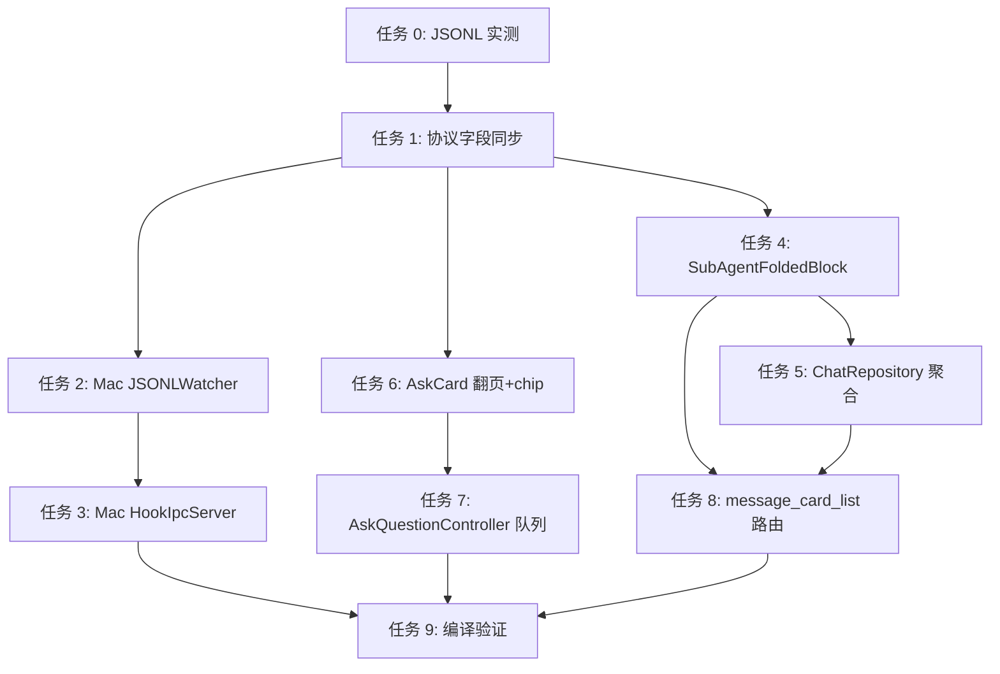

# 手机端翻页与子agent可见性 - 技术实施文档

## 1. 文档信息

| 字段 | 内容 |
|---|---|
| 版本号 | v1.0 |
| 创建日期 | 2026-05-19 |
| 关联文档 | `产品需求文档.md` / `需求规格说明书.md` |
| 流程级别 | L4 |
| 执行模式 | 无人值守 |

## 2. 技术方案概述

### 2.1 整体技术路线

**方案 A：双通道透传 + 手机端聚合**（已在阶段一头脑风暴选定）

- mac 端 JSONLWatcher / HistoryBridge 解除 agent-*.jsonl 过滤，**透传 JSONL 原生字段**（isSidechain / parentUuid / sessionId / parentToolUseId）
- Server 零改动（dumb proxy 哲学保留）
- 手机端 ChatRepository 按 parentToolUseId 聚合 sidechain 消息成折叠块
- HookIpcServer 在推 tool_approval 卡片前从 JSONLWatcher 反查 activeSubAgents，注入 subAgentSummary + parentToolUseId 上下文

### 2.2 设计理念

| 原则 | 体现 |
|---|---|
| dumb proxy 不破 | Server 零改动；新字段全部 optional 走业务协议透传机制 |
| 向下兼容 | 旧版手机收到新字段静默忽略；旧版 mac 不发新字段，手机端按缺省处理（退化为现有体验） |
| 实时性优先 | 不等子 agent 跑完才推容器；每条消息即收即推，手机端做聚合 |
| 防御性 race 处理 | pendingSidechainBuffer 5 秒超时孤儿展示，避免子先父后场景下信息丢失 |

---

## 3. 架构设计

### 3.1 模块划分

```mermaid
graph LR
    subgraph Mac App
        JW[JSONLWatcher]
        HB[HistoryBridge]
        HIS[HookIpcServer]
        PM_M[ProtocolMessage.swift]
        SA[ActiveSubAgents 索引<br/>新增数据结构]
    end

    subgraph Server
        SV[dumb proxy<br/>零改动]
    end

    subgraph Android
        CR[ChatRepository]
        AQR[ask_user_question_card_realtime]
        SAFB[SubAgentFoldedBlock<br/>新组件]
        MCL[message_card_list]
        AQC[ask_question_controller]
        PM_A[protocol_message.dart]
    end

    JW --> SA
    HIS --> SA
    JW -.推 msg.stream.-> SV
    HIS -.推 ask.question.pending.-> SV
    HB -.推历史消息.-> SV
    SV -.广播.-> CR
    CR --> SAFB
    CR --> MCL
    AQR --> AQC
```

### 3.2 新增/修改文件清单

#### Mac 端

| 文件 | 类型 | 改动摘要 | 行数估计 |
|---|---|---|---|
| `MacClient/Sources/CCAnywhere/Models/ProtocolMessage.swift` | 修改 | `MsgStreamPayload` 加 4 字段；`AskQuestionPendingPayload` 加 3 字段 | +15 |
| `MacClient/Sources/CCAnywhere/Services/JSONLWatcher.swift` | 修改 | line 264 解除过滤；解析时透传 4 字段；维护 `activeSubAgents: [TabId: [ToolUseId: SubAgentMeta]]` 索引 | +60 |
| `MacClient/Sources/CCAnywhere/Services/HistoryBridge.swift` | 修改 | line 127 解除过滤；透传字段；历史回放 buffer 超时延长 | +20 |
| `MacClient/Sources/CCAnywhere/Services/HookIpcServer.swift` | 修改 | `handleAsk` 注入 subAgentSummary / parentToolUseId / isFromSubAgent | +30 |

#### Android 端

| 文件 | 类型 | 改动摘要 | 行数估计 |
|---|---|---|---|
| `AndroidClient/lib/models/protocol_message.dart` | 修改 | 同步 Mac 端字段 | +25 |
| `AndroidClient/lib/data/chat_repository.dart` | 修改 | parentToolUseId 聚合 + pendingSidechainBuffer + dedup | +120 |
| `AndroidClient/lib/features/chat/widgets/sub_agent_folded_block.dart` | **新增** | 折叠块 widget（标题栏 + 展开内容 + 状态 icon） | +200 |
| `AndroidClient/lib/features/chat/widgets/ask_user_question_card_realtime.dart` | 修改 | ① 翻页 UI（@State currentIndex + 滑动手势 + 上下题按钮）；② 子 agent chip 标签 | +150 |
| `AndroidClient/lib/services/ask_question_controller.dart` | 修改 | pending 卡片队列 FIFO + winner-lock 出队 | +50 |
| `AndroidClient/lib/features/chat/widgets/message_card_list.dart` | 修改 | 识别 SubAgentFoldedBlock，路由渲染 | +20 |

#### Server

零改动。

---

## 4. 详细设计

### 4.0 前置实测任务（开发任务 0）

**必须先完成实测**，结果决定后续代码路径：

**实测 1**：在测试 Mac 上让 Claude 跑一个简单 Task subagent，对照：

```bash
# 父 session.jsonl 中查找 Task tool_use 的 id
grep -E '"tool_use".*"name":"Task"' ~/.claude/projects/<encoded>/<session>.jsonl | head -1

# 对照 agent-*.jsonl 文件名
ls ~/.claude/projects/<encoded>/agent-*.jsonl
```

**决策点 A**：agent-X.jsonl 的 X 是否就是父 Task tool_use 的 id？
- 是 → parentToolUseId 从文件名直接 derive
- 否 → 走决策点 B

**实测 2**：检查 agent-*.jsonl 内 record 字段：

```bash
head -3 ~/.claude/projects/<encoded>/agent-*.jsonl | python3 -c 'import sys,json; [print(json.dumps(json.loads(l), indent=2)) for l in sys.stdin if l.strip()]'
```

**决策点 B**：record 中是否含 `parentToolUseId` / `parent_tool_use_id` / `parentToolUse` 字段？
- 是 → 从 record 取
- 否 → 用其他方法（如 cross-reference session.jsonl 找 Task tool_use 创建时间相邻的 agent-*.jsonl）

**实测 3**：hook bridge stdin JSON 是否传 isSidechain？

```bash
# 临时修改 cc-anywhere-hook-bridge.py 第一行 log dump
echo "$STDIN_CONTENT" > /tmp/hook-stdin-debug.json
# 跑一次 Task 触发的工具调用
cat /tmp/hook-stdin-debug.json
```

**决策点 C**：hook stdin 是否直接传 sidechain 标记？
- 是 → tool_approval 上下文从 hook 直接拿
- 否 → 仍走 JSONLWatcher.activeSubAgents 反查（**这是默认设计**）

**实测 4**：permission mode 继承（功能 F7）：

```bash
# mac tab acceptEdits 模式下让 Claude 跑 Task subagent
# 子 agent 内部触发 Bash hook
# 观察是否走 auto-allow 路径（不弹卡 / 不推手机）
tail -f ~/Library/Logs/cc-anywhere/hook-bridge.log
```

**决策点 D**：当前 permission mode 继承是否已成立？
- 是 → R-F7 标"已成立"，跳过代码改动
- 否 → 修改 HookIpcServer 加显式查找父 tab permission mode 路径

---

### 4.1 Mac 端：ProtocolMessage.swift

```swift
// MsgStreamPayload —— msg.stream 协议字段扩展
public struct MsgStreamPayload: Codable {
    public let tabId: String
    public let messageType: String
    public let uuid: String?           // 现有
    public let content: AnyJSON?       // 现有

    // ⊕ 新增字段（均 optional，向下兼容）
    public let sessionId: String?
    public let parentUuid: String?
    public let isSidechain: Bool?       // 默认 false
    public let parentToolUseId: String?

    enum CodingKeys: String, CodingKey {
        case tabId = "tab_id"
        case messageType = "message_type"
        case uuid
        case content
        case sessionId = "session_id"
        case parentUuid = "parent_uuid"
        case isSidechain = "is_sidechain"
        case parentToolUseId = "parent_tool_use_id"
    }
}

// AskQuestionPendingPayload —— tool_approval 上下文扩展
public struct AskQuestionPendingPayload: Codable {
    // ... 现有字段
    public let parentToolUseId: String?
    public let subAgentSummary: String?
    public let isFromSubAgent: Bool?
}
```

### 4.2 Mac 端：JSONLWatcher.swift

#### 改动 1：line 264 解除过滤

```swift
// 改前：
return name.hasSuffix(".jsonl") && !name.hasPrefix("agent-")

// 改后：
return name.hasSuffix(".jsonl")
```

#### 改动 2：维护 activeSubAgents 索引

```swift
public final class JSONLWatcher {
    // ⊕ 新增
    private var activeSubAgents: [UUID: [String: SubAgentMeta]] = [:]  // tabId → toolUseId → meta

    public struct SubAgentMeta {
        public let parentToolUseId: String
        public let promptSummary: String  // 截断 60 字符
        public let createdAt: Date
        public let agentSessionId: String?  // agent-X.jsonl 对应的 session
    }

    /// 给 HookIpcServer 反查用
    public func findSubAgent(tabId: UUID, sessionId: String) -> SubAgentMeta? {
        // 按 sessionId 匹配 activeSubAgents[tabId] 中的某条
        return activeSubAgents[tabId]?.values.first { $0.agentSessionId == sessionId }
    }
}
```

#### 改动 3：解析时填充字段 + 维护索引

在 record 解析路径（已有方法）追加：

```swift
// 解析 record
let isSidechain = record["isSidechain"] as? Bool ?? false
let parentUuid = record["parentUuid"] as? String
let sessionId = record["sessionId"] as? String
let parentToolUseId: String?

if isSidechain {
    // 子 agent 消息：从文件名 / 实测决定的方式 derive parentToolUseId
    parentToolUseId = deriveParentToolUseId(from: filePath, record: record)
} else if let toolUse = parseToolUse(from: record), toolUse.name == "Task" {
    // 父 session 中的 Task tool_use：注册到 activeSubAgents
    let summary = truncate(toolUse.input["prompt"] as? String ?? "", to: 60)
    let meta = SubAgentMeta(
        parentToolUseId: toolUse.id,
        promptSummary: summary,
        createdAt: Date(),
        agentSessionId: nil  // 后续 sidechain 消息到达时回填
    )
    activeSubAgents[tabId, default: [:]][toolUse.id] = meta
    parentToolUseId = nil
} else {
    parentToolUseId = nil
}

// 构造 MsgStreamPayload 透传
let payload = MsgStreamPayload(
    ...,
    sessionId: sessionId,
    parentUuid: parentUuid,
    isSidechain: isSidechain,
    parentToolUseId: parentToolUseId
)
```

### 4.3 Mac 端：HookIpcServer.swift

`handleAsk` 改动（在 line 555 askKind 判定之后、推 ws 之前）：

```swift
// 现有 line 555-573 auto-allow 逻辑保持不变

// ⊕ 新增：tool_approval 注入 subAgentSummary
var subAgentSummary: String? = nil
var parentToolUseId: String? = nil
var isFromSubAgent = false

if askKind == "tool_approval" {
    let hookSessionId = req.sessionId ?? ""
    if let meta = jsonlWatcher?.findSubAgent(tabId: tabUUID, sessionId: hookSessionId) {
        subAgentSummary = meta.promptSummary
        parentToolUseId = meta.parentToolUseId
        isFromSubAgent = true
    }
}

// 构造 AskQuestionPendingPayload 时传入这 3 个字段
let payload = AskQuestionPendingPayload(
    ...,
    parentToolUseId: parentToolUseId,
    subAgentSummary: subAgentSummary,
    isFromSubAgent: isFromSubAgent
)
```

### 4.4 Android 端：protocol_message.dart

```dart
class MessageStreamPayload {
  // ... 现有字段
  final String? sessionId;
  final String? parentUuid;
  final bool isSidechain;
  final String? parentToolUseId;

  factory MessageStreamPayload.fromJson(Map<String, dynamic> json) =>
    MessageStreamPayload(
      // ...
      sessionId: json['session_id'] as String?,
      parentUuid: json['parent_uuid'] as String?,
      isSidechain: (json['is_sidechain'] as bool?) ?? false,
      parentToolUseId: json['parent_tool_use_id'] as String?,
    );
}

class AskQuestionPendingPayload {
  // ...
  final String? parentToolUseId;
  final String? subAgentSummary;
  final bool isFromSubAgent;

  factory AskQuestionPendingPayload.tryFrom(Map<String, dynamic> data) => ...;
}
```

### 4.5 Android 端：chat_repository.dart 聚合逻辑

```dart
class ChatRepository {
  // ⊕ 新增
  final Map<String, SubAgentBlock> _subAgentBlocks = {};  // parentToolUseId → block
  final Map<String, List<MessageStreamPayload>> _pendingSidechainBuffer = {};

  static const _bufferTimeoutRealtime = Duration(seconds: 5);
  static const _bufferTimeoutHistory = Duration(seconds: 30);

  void handleMsgStream(MessageStreamPayload msg) {
    if (msg.isSidechain) {
      _handleSidechainMessage(msg);
    } else if (msg.toolName == 'Task' && msg.toolUseId != null) {
      _registerSubAgentBlock(msg);
    } else if (msg.toolUseId != null && _subAgentBlocks.containsKey(msg.toolUseId)) {
      // 父 session 的 Task tool_result
      _subAgentBlocks[msg.toolUseId]!.finalResult = msg;
      _emitUpdate();
    } else {
      _appendToMainStream(msg);
    }
  }

  void _handleSidechainMessage(MessageStreamPayload msg) {
    final parentId = msg.parentToolUseId;
    if (parentId == null) {
      _appendToMainStream(msg);  // 无 parent，孤儿
      return;
    }
    if (_subAgentBlocks.containsKey(parentId)) {
      _subAgentBlocks[parentId]!.children.add(msg);
      _emitUpdate();
    } else {
      // race：父尚未到，暂存
      _pendingSidechainBuffer.putIfAbsent(parentId, () => []).add(msg);
      _scheduleBufferTimeout(parentId);
    }
  }

  void _registerSubAgentBlock(MessageStreamPayload taskMsg) {
    final block = SubAgentBlock.from(taskMsg);
    _subAgentBlocks[taskMsg.toolUseId!] = block;
    // 检查 pendingSidechainBuffer 是否有等候的 children
    final pending = _pendingSidechainBuffer.remove(taskMsg.toolUseId!);
    if (pending != null) {
      block.children.addAll(pending);
    }
    _emitUpdate();
  }
}
```

### 4.6 Android 端：sub_agent_folded_block.dart 新组件

骨架：

```dart
class SubAgentFoldedBlock extends StatefulWidget {
  final SubAgentBlock block;
  // ...
}

class _SubAgentFoldedBlockState extends State<SubAgentFoldedBlock> {
  bool _expanded = false;

  @override
  void initState() {
    super.initState();
    // R-F4-004 失败时自动展开
    if (widget.block.status == 'failed') _expanded = true;
  }

  @override
  Widget build(BuildContext context) {
    return Container(
      decoration: BoxDecoration(
        border: Border(left: BorderSide(color: Colors.blue, width: 2)),  // R-F4-005
      ),
      child: Column(
        children: [
          _buildHeader(),  // ⚡ Task + summary + 状态 + 步数 + 展开按钮
          if (_expanded) ..._buildChildrenList(),
        ],
      ),
    );
  }
}
```

### 4.7 Android 端：ask_user_question_card_realtime.dart 双改造

#### 改造 1：翻页 UI（对齐 mac 方案 A）

```dart
class _AskUserQuestionCardRealtimeState extends State<AskUserQuestionCardRealtime> {
  int _currentIndex = 0;
  final Map<int, Set<String>> _selections = {};
  final Map<int, String> _otherTexts = {};

  bool get _showStepper => widget.payload.questions.length >= 2;
  bool get _isFirst => _currentIndex <= 0;
  bool get _isLast => _currentIndex >= widget.payload.questions.length - 1;

  @override
  Widget build(BuildContext context) {
    return GestureDetector(
      onHorizontalDragEnd: _showStepper ? _handleSwipe : null,
      child: Column(
        children: [
          if (widget.payload.isFromSubAgent) _buildSubAgentChip(),  // R-F5-003
          if (_showStepper) _buildProgressIndicator(),
          AnimatedSwitcher(
            duration: Duration(milliseconds: 200),
            child: _buildCurrentQuestion(key: ValueKey(_currentIndex)),
          ),
          _buildNavigationBar(),
        ],
      ),
    );
  }

  void _handleSwipe(DragEndDetails details) {
    final v = details.velocity.pixelsPerSecond.dx;
    if (v < -300 && !_isLast) setState(() => _currentIndex++);  // 左滑下一题
    if (v > 300 && !_isFirst) setState(() => _currentIndex--);  // 右滑上一题
  }
}
```

#### 改造 2：子 agent chip

```dart
Widget _buildSubAgentChip() {
  return Container(
    padding: EdgeInsets.all(8),
    color: Colors.blue.shade50,
    child: Row(
      children: [
        Icon(Icons.bolt, size: 14),
        SizedBox(width: 4),
        Text(
          '子 agent: ${widget.payload.subAgentSummary}',
          style: TextStyle(fontSize: 11, color: Colors.blue.shade900),
          overflow: TextOverflow.ellipsis,
        ),
      ],
    ),
  );
}
```

### 4.8 Android 端：ask_question_controller.dart 队列

```dart
class AskQuestionController extends ChangeNotifier {
  final List<AskQuestionPendingPayload> _pendingQueue = [];

  AskQuestionPendingPayload? get current => _pendingQueue.isEmpty ? null : _pendingQueue.first;
  int get pendingCount => _pendingQueue.length;

  void onNewPending(AskQuestionPendingPayload payload) {
    _pendingQueue.add(payload);
    notifyListeners();
  }

  /// winner-lock 仲裁后调用：从队列移除任意位置的卡片
  void onAnswered(String requestId) {
    _pendingQueue.removeWhere((p) => p.requestId == requestId);
    notifyListeners();
  }
}
```

UI 在卡片顶部显示 `${currentIdx}/${pendingCount} 待审批`，仅在 pendingCount >= 2 时显示。

---

## 5. 数据库设计

**N/A** — 无数据库变更。本次需求纯协议字段扩展 + UI 改造，无持久化层影响。

## 6. 接口设计

**协议字段变更**已在 §4.1 / §4.4 列明。Server 内部接口零变动。Hook bridge 接口无变化。

## 7. 部署方案

### 7.1 配置变更

无。

### 7.2 环境依赖

- Mac App：macOS 14+（不变）
- Android App：Flutter 3.x（不变）
- Server：不需要重部署（dumb proxy 红利）

### 7.3 部署步骤

1. Mac 客户端：`bash build_app.sh release` → 替换 `/Applications/遥指.app`
2. Android 客户端：`flutter build apk --release` → `adb install -r app-release.apk`
3. Server：无需操作

### 7.4 回滚方案

- 单 commit 回滚整段
- 即便 mac 端回滚但手机端未回滚：手机端收不到新字段，按缺省 isSidechain=false 处理 → 子 agent 内容直接进主流（退化为现有体验）
- 反之亦然：mac 端发新字段但手机端旧版 → 手机端静默忽略 → 退化为现有体验

---

## 8. 实施计划

### 任务拆分（执行顺序）

#### 任务 0：JSONL 实测前置（必做）

执行 §4.0 实测 1-4，把结果记录到 `docs/手机端翻页与子agent可见性/JSONL实测结果.md`。决策点 A/B/C/D 的结果影响后续代码路径。

**预估**：30 分钟

#### 任务 1：双端协议字段同步

修改 mac 端 `ProtocolMessage.swift` + 手机端 `protocol_message.dart`。这是所有后续任务的基础。

**预估**：20 分钟  
**依赖**：任务 0（实测结果决定 parentToolUseId 字段语义）

#### 任务 2：Mac 端 JSONLWatcher + HistoryBridge 改造

- 解除过滤
- 字段透传
- activeSubAgents 索引
- 历史回放兼容

**预估**：2 小时  
**依赖**：任务 1

#### 任务 3：Mac 端 HookIpcServer 改造

- handleAsk 注入 subAgentSummary
- permission mode 继承验证（依据任务 0 决策点 D）

**预估**：1 小时  
**依赖**：任务 2

#### 任务 4：手机端 SubAgentFoldedBlock 新组件

新建 `sub_agent_folded_block.dart` widget。

**预估**：2 小时  
**依赖**：任务 1

#### 任务 5：手机端 ChatRepository 聚合逻辑

- parentToolUseId 聚合
- pendingSidechainBuffer + 超时
- dedup

**预估**：2 小时  
**依赖**：任务 1、4

#### 任务 6：手机端 ask_user_question_card_realtime 双改造

- 翻页 UI（对齐 mac 方案 A）
- 子 agent chip

**预估**：2 小时  
**依赖**：任务 1

#### 任务 7：手机端 AskQuestionController 队列

- pendingQueue FIFO
- winner-lock 出队联动

**预估**：1 小时  
**依赖**：任务 6

#### 任务 8：手机端 message_card_list 路由

识别 SubAgentFoldedBlock，路由渲染。

**预估**：20 分钟  
**依赖**：任务 4、5

#### 任务 9：编译验证

- mac 端：`swift build` + `bash build_app.sh release`
- 手机端：`flutter pub get && flutter build apk --release`

**预估**：15 分钟  
**依赖**：任务 1-8

### 任务依赖图



### 并行机会

- 任务 2/3（mac）与任务 4/5/6/7（手机）在协议字段同步（任务 1）完成后**可并行派发独立子 Agent**
- 主 Agent 协调，按 subagent-driven-development 模式
