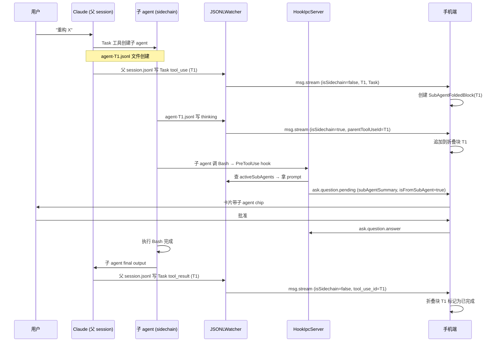

# 手机端翻页与子agent可见性 - 需求规格说明书

## 1. 文档信息

| 字段 | 内容 |
|---|---|
| 版本号 | v1.0 |
| 创建日期 | 2026-05-19 |
| 关联 PRD | `产品需求文档.md` v1.0 |

## 2. 需求概述

- **功能概要**：手机端 AskUserQuestion 卡片单题翻页 UI + 子 agent 进度可见性（折叠块 / 卡片上下文 / 队列 UI）
- **涉及模块**：
  - Mac 端：JSONLWatcher / HistoryBridge / HookIpcServer / ProtocolMessage
  - Android 端：ChatRepository / ask_user_question_card_realtime / message_card_list / protocol_message / ask_question_controller
  - 新增组件：SubAgentFoldedBlock widget
- **影响范围**：双端协议层新增 7 个 optional 字段；Server 零改动（dumb proxy）

---

## 3. 详细需求

### 3.1 功能 F1：手机端 AskUserQuestion 卡片单题翻页

#### a) 页面元素

| 元素 | 类型 | 用途 |
|---|---|---|
| 卡片顶部进度文字 | Text | 显示 "X / N"（仅 N≥2 时显示） |
| 当前问题区 | Column | 显示当前题的问题文本 / 选项列表 / 自定义输入框 |
| "上一题 ←" 按钮 | Button | N≥2 时显示在底部左侧；首题（X=1）disabled 灰显 |
| "下一题 →" 按钮 | Button | N≥2 且非末题时显示在底部右侧 |
| "提交" 按钮 | Button | 末题（X=N）显示在底部右侧；单题（N=1）始终显示 |
| 左右滑动手势区 | GestureDetector | 包裹整个卡片，左滑切下一题、右滑切上一题 |

#### b) 操作场景

**场景 F1-S1：多题正向翻页**

1. Claude 推送 5 题给手机端，手机端弹出卡片
2. 卡片顶部显示 "1 / 5"，底部显示「上一题」（灰显）与「下一题」按钮
3. 用户选择问题 1 的某个选项
4. 用户点击「下一题」或在卡片上左滑
5. 卡片切换到问题 2，顶部更新为 "2 / 5"，「上一题」按钮变为可点
6. 用户继续答完 3、4 题
7. 切换到问题 5（末题）时，底部「下一题」按钮被「提交」替换
8. 用户答完问题 5 后，「提交」按钮启用
9. 用户点击「提交」，卡片消失，pending 状态清除

**场景 F1-S2：回退修改答案**

1. 用户已答完 1、2、3 题，当前在第 3 题
2. 用户点击「上一题」或在卡片上右滑
3. 卡片回到第 2 题，**保留之前选中的选项 / 自定义输入文本**
4. 用户修改选项
5. 用户点击「下一题」/左滑
6. 卡片回到第 3 题，**保留之前选中的选项**
7. 翻到末题点提交，提交时携带所有 5 题最终答案

**场景 F1-S3：单题退化**

1. Claude 只推送 1 个问题
2. 卡片不显示 "X / N" 进度文字
3. 卡片不显示「上一题」/「下一题」按钮（左右滑动手势 disabled）
4. 卡片底部仅显示「提交」按钮
5. 用户答完后点提交（与改造前体验完全一致）

#### c) 业务规则

| 编号 | 规则描述 |
|---|---|
| R-F1-001 | 仅在 questions.length ≥ 2 时显示进度文字 / 翻页按钮 / 启用滑动手势 |
| R-F1-002 | 翻页过程中已答题目的选项 / 自定义文本 **必须保留**，UI state 持久化在卡片 view 生命周期内 |
| R-F1-003 | 「提交」按钮**仅在末题或单题时**显示，非末题时即便所有题已答完也不显示提交（避免用户跳过中间题） |
| R-F1-004 | 「提交」按钮 enable 条件：**所有 N 题**都已选择有效答案（与改造前 canSubmit 一致） |
| R-F1-005 | 首题「上一题」按钮 disabled；末题「下一题」按钮被「提交」替换 — 不允许通过滑动绕过首末边界 |
| R-F1-006 | 翻页动画时长 ≤ 300ms；切换时不允许两题同时可见 |

---

### 3.2 功能 F2：JSONLWatcher 解除 agent-*.jsonl 过滤

#### a) 改动元素

| 文件 | 元素 | 改动 |
|---|---|---|
| `MacClient/.../JSONLWatcher.swift:264` | `name.hasSuffix(".jsonl") && !name.hasPrefix("agent-")` | 移除 `!hasPrefix("agent-")` 条件 |
| `MacClient/.../HistoryBridge.swift:127` | 同上 | 同上 |
| `MacClient/.../ProcessHost.swift:67` | `hasHistory` 检查 | 保留过滤（用于判断 -c continue 是否可用，与本次需求无关） |

#### b) 操作场景

**场景 F2-S1：子 agent 启动后实时透传**

1. 父 session 调用 Task 工具，触发 Claude SDK 创建子 agent
2. 子 agent 开始执行，Claude SDK 在 `~/.claude/projects/<encoded>/agent-<X>.jsonl` 写第一条 assistant thinking record
3. mac 端 FSEvents 监听到新文件，JSONLWatcher 解析其内容
4. 解析时识别该文件的 `isSidechain=true` 字段（来自 JSONL record）
5. 透传字段到 msg.stream payload：`isSidechain / parentUuid / sessionId / parentToolUseId`
6. 通过 ws 推到 server → 手机端

**场景 F2-S2：子 agent 跑完后父 tool_result 到达**

1. 子 agent 完成所有内部工作，写最后一条 message 到 agent-X.jsonl
2. Claude SDK 在父 session.jsonl 写一条 tool_result（来自 Task 工具，包含子 agent 的 final output）
3. JSONLWatcher 解析父 session.jsonl 的这条 tool_result，识别 `isSidechain=false`、`tool_use_id=<对应 Task tool_use 的 id>`
4. msg.stream 推手机端，手机端按 tool_use_id 关联到对应的折叠块作为"最终结果"

#### c) 业务规则

| 编号 | 规则描述 |
|---|---|
| R-F2-001 | JSONLWatcher 现在监听**所有** `*.jsonl` 文件（包括 `agent-*.jsonl`），不再过滤 |
| R-F2-002 | 每条 msg.stream payload 必须透传 `isSidechain / parentUuid / sessionId / parentToolUseId` 4 个字段；其中前 3 个直接来自 JSONL record，第 4 个从 agent-*.jsonl 文件名 / record 字段解析（实测决定） |
| R-F2-003 | parentToolUseId 在父 session 消息中 = null；在子 agent 消息中 = 对应父 session 中 Task tool_use 的 id |
| R-F2-004 | 子 agent 在父 session 的最终结果（Task tool_result）isSidechain=false，但 tool_use_id 对应 Task — 手机端识别为"折叠块的最终结果" |

---

### 3.3 功能 F3：手机端 ChatRepository 按 parentToolUseId 聚合

#### a) 数据流

```
ws inbound msg.stream
  ├─ isSidechain=false && tool_name=Task → 主流，记录 Task tool_use 创建折叠块
  ├─ isSidechain=false && tool_use_id 在已知折叠块的 parentToolUseId 集合中 → 进入折叠块作为 final result
  ├─ isSidechain=true && parentToolUseId 已知 → 进入对应折叠块的 children
  └─ isSidechain=true && parentToolUseId 未知 → 放进 pendingSidechainBuffer，5 秒超时 → 孤儿展示
```

#### b) 操作场景

**场景 F3-S1：正常聚合（父先到，子后到）**

1. 手机收到 msg.stream A：`isSidechain=false, tool_name=Task, tool_use_id=T1`
2. ChatRepository 在消息列表中插入一个 `SubAgentFoldedBlock` 占位（折叠态），parentToolUseId=T1
3. 后续收到 msg.stream B：`isSidechain=true, parentToolUseId=T1, type=assistant_thinking`
4. ChatRepository 把 B 追加到折叠块 T1 的 children 列表
5. UI 折叠块顶部显示"⚡ 1 个 thinking + ..."
6. 继续收 msg.stream C/D/E（更多子 agent 步骤），同样追加
7. 最后收 msg.stream F：`isSidechain=false, tool_name=Task tool_result, tool_use_id=T1`
8. ChatRepository 把 F 作为折叠块 T1 的 final_result，折叠块状态从"运行中"变为"已完成"

**场景 F3-S2：race（子先到，父后到）**

1. 手机收到 msg.stream X：`isSidechain=true, parentToolUseId=T2, type=assistant_thinking`
2. ChatRepository 暂存 X 到 pendingSidechainBuffer，key=T2
3. 1 秒后收到 msg.stream Y：`isSidechain=false, tool_name=Task, tool_use_id=T2`
4. ChatRepository 创建折叠块 T2，从 pendingSidechainBuffer[T2] 取出 X 加入 children
5. 后续 children 直接追加（已知折叠块）

**场景 F3-S3：孤儿超时**

1. 手机收到 msg.stream Z：`isSidechain=true, parentToolUseId=T3`
2. pendingSidechainBuffer[T3] 暂存 Z
3. 5 秒过去，T3 的父消息始终未到（异常或 race 失败）
4. ChatRepository 把 Z 转为孤儿消息直接显示在主流（带"无父 agent"标记，让用户知道情况异常）
5. 后续如果 T3 父消息到达，孤儿消息保留在原位（不回溯重组，避免 UI 跳动）

#### c) 业务规则

| 编号 | 规则描述 |
|---|---|
| R-F3-001 | 折叠块按 parentToolUseId 唯一聚合，相同 parentToolUseId 的子消息合并到同一块 |
| R-F3-002 | pendingSidechainBuffer 超时 5 秒；超时后子消息作为孤儿展示，不再等父 |
| R-F3-003 | 孤儿消息一旦展示，即便父消息后到也不重组（避免 UI 闪烁） |
| R-F3-004 | dedup 按 message uuid（JSONL 原生）— 同一 uuid 重复到达只渲染一次 |

---

### 3.4 功能 F4：SubAgentFoldedBlock widget（手机端新组件）

#### a) UI 元素

```
┌──────────────────────────────────────────┐
│ ⚡ Task 子 agent                          │ ← 标题栏（一直可见）
│    "重构 ProcessHost 让多 Tab..."          │ ← prompt 摘要（一行截断）
│    🔄 运行中 · 3 步                         │ ← 状态 + 步数
│                                       [▼] │ ← 展开按钮
├──────────────────────────────────────────┤ ← 展开后内容
│   ├─ thinking: 我需要先看一下...          │
│   ├─ tool_use: Read ProcessHost.swift     │
│   ├─ tool_result: (内容预览 200 字符)      │
│   ├─ ...                                  │
│   └─ final: 完成，已修改 3 个文件          │ ← 子 agent 跑完后追加
└──────────────────────────────────────────┘
```

#### b) 操作场景

**场景 F4-S1：默认折叠态**

1. 折叠块出现在主对话流中
2. 默认折叠，只显示标题栏（⚡ icon + Task prompt 摘要 + 状态 + 步数）
3. 用户点击 [▼] 按钮，块展开
4. 用户再次点击 [▲] 按钮，块折叠

**场景 F4-S2：运行中状态实时更新**

1. 折叠块标题栏显示 "🔄 运行中 · 0 步"
2. 子 agent 内部跑 thinking → 状态显示 "🔄 运行中 · 1 步"
3. 子 agent 内部跑 Bash tool_use → "🔄 运行中 · 2 步"
4. 跑完最后收到 tool_result（父 session）→ "✅ 已完成 · 5 步"

**场景 F4-S3：失败展示**

1. 子 agent 内部抛错 / 父 Task tool_result 含 error
2. 折叠块状态变为 "❌ 失败 · N 步"
3. **自动展开**让用户看到错误细节（不强制用户点击）

#### c) 业务规则

| 编号 | 规则描述 |
|---|---|
| R-F4-001 | 默认折叠态；用户手动展开 |
| R-F4-002 | 步数 = isSidechain=true 消息数 + 1（final result） |
| R-F4-003 | 状态根据父 tool_result 内容判定：含 error 字段 = ❌；否则 = ✅；尚未到达 = 🔄 |
| R-F4-004 | 失败时自动展开（覆盖默认折叠规则） |
| R-F4-005 | 视觉上左侧加 2px 色条（如蓝色）作为"子 agent 块"标识，与普通消息区分 |

---

### 3.5 功能 F5：tool_approval 卡片注入 subAgentSummary

#### a) 改动

**Mac 端 HookIpcServer.handleAsk**：在确定 askKind=tool_approval 后、推 ask.question.pending 前，从 jsonlWatcher 查询当前 tab 的 activeSubAgents 集合，按 currentSessionId（hook stdin 提供）查找对应的 Task prompt 摘要。

**Android 端 ask_user_question_card_realtime**：当 payload.isFromSubAgent=true 时，卡片顶部加 chip。

#### b) 操作场景

**场景 F5-S1：子 agent 内部 Bash 推卡片到手机**

1. 父 session permission mode = default，子 agent 内部调 Bash
2. PreToolUse hook 触发，hook bridge 把 ask 请求发到 HookIpcServer
3. HookIpcServer 通过 session_id 查 JSONLWatcher 的 activeSubAgents，得到 parentToolUseId=T1 + Task prompt="重构 X"
4. HookIpcServer 注入 `subAgentSummary="重构 X"` 和 `isFromSubAgent=true` 到 ask.question.pending
5. 手机收到卡片，顶部显示 chip：`⚡ 子 agent: 重构 X`
6. 用户看到上下文，做出"批准/拒绝"决策

**场景 F5-S2：父 session 直接调 Bash（非子 agent）**

1. 用户直接让 Claude 跑 Bash
2. PreToolUse hook 触发，session_id 对应**主 session**
3. HookIpcServer 查 activeSubAgents 无匹配 → isFromSubAgent=false
4. 手机卡片**不显示** chip（与现有体验一致）

#### c) 业务规则

| 编号 | 规则描述 |
|---|---|
| R-F5-001 | tool_approval payload 新增字段：`parentToolUseId` / `subAgentSummary` / `isFromSubAgent`，均 optional |
| R-F5-002 | subAgentSummary 必须截断到 60 字符；超长加 "…" |
| R-F5-003 | 仅在 isFromSubAgent=true 时显示 chip；false 或字段缺失时降级为现有 UI |
| R-F5-004 | 同一 parentToolUseId 的多个 tool_approval 卡片共享同一 subAgentSummary（不重复反查） |

---

### 3.6 功能 F6：手机端 pending 卡片队列 UI

#### a) UI 元素

```
┌──────────────────────────────────────────┐
│ ⚡ 子 agent: 重构 X        1/3 待审批 ◀▶ │ ← 顶部 chip + 队列指示
├──────────────────────────────────────────┤
│  Claude 想执行 Bash:                       │
│  rm -rf /tmp/foo                          │
│  ...                                      │
│  [拒绝]              [允许]               │
└──────────────────────────────────────────┘
```

#### b) 操作场景

**场景 F6-S1：多卡片队列**

1. 手机端当前有 1 个 pending 卡片，UI 正在显示
2. 又收到 2 个新的 ask.question.pending（不同 requestId）
3. ChatRepository 把新 pending 加入 `pendingQueue`，UI 顶部显示 "1/3 待审批"
4. 用户答完当前卡片
5. UI 自动出队，显示队列第二个卡片，顶部更新为 "2/3 待审批"
6. 用户继续答，最后剩 1 个时不显示队列指示

#### c) 业务规则

| 编号 | 规则描述 |
|---|---|
| R-F6-001 | pending 卡片按到达时间 FIFO 入队 |
| R-F6-002 | 队列指示仅在 pendingCount ≥ 2 时显示 |
| R-F6-003 | 单个卡片被 winner-lock 仲裁掉（如 mac 端答完）时，从队列移除，不影响其他 pending |
| R-F6-004 | 队列指示与翻页指示视觉分离：队列在卡片**顶部**，翻页在卡片**底部** |

---

### 3.7 功能 F7：Permission mode 继承验证

#### a) 实测前置

子 agent 的 hook 调用是否继承父 tab 的 CC_ANYWHERE_TAB_ID env？参考 `ProcessHost.makeEnvironment(tabId:)` — env 是父进程注入，subagent 不 fork 新进程（claude SDK 内异步任务），所以 env 继承。**理论上已成立**。

#### b) 业务规则

| 编号 | 规则描述 |
|---|---|
| R-F7-001 | 实测：子 agent 内部触发的 hook bridge env 必须包含父 tab 的 CC_ANYWHERE_TAB_ID。如不成立 → 修复代码 |
| R-F7-002 | 当父 tab permission mode 为 acceptEdits/auto/dontAsk/bypassPermissions 时，子 agent 触发的 tool_approval 走 HookIpcServer.handleAsk 的 auto-allow 路径（line 555-573），不推手机不弹 mac 卡 |

---

### 3.8 功能 F8：HistoryBridge 历史回放兼容

#### a) 操作场景

**场景 F8-S1：手机断线重连后历史含子 agent**

1. 手机离线期间 mac 端跑了一个子 agent 任务
2. 手机重连，请求历史补拉
3. HistoryBridge 读取 session.jsonl + agent-*.jsonl（不再过滤）
4. 按 timestamp 顺序推消息流，带 isSidechain/parentToolUseId 字段
5. 手机端 ChatRepository 同 F3 的实时聚合逻辑，正确重建折叠块

#### b) 业务规则

| 编号 | 规则描述 |
|---|---|
| R-F8-001 | HistoryBridge 解除 agent-*.jsonl 过滤；历史消息透传同样字段 |
| R-F8-002 | 历史回放时 pendingSidechainBuffer 超时延长到 30 秒（避免大批量历史 race） |

---

## 4. 业务流程图



## 5. 约束与限制

- ❌ 不支持子 agent 嵌套（Claude Code 当前限制）
- ❌ 不动 Server（dumb proxy 哲学）
- ❌ 不破坏现有 winner 锁机制
- ❌ 协议字段必须 optional（向下兼容旧版客户端）
- ❌ pendingSidechainBuffer 超时阈值不可配置（5s 实时 / 30s 历史）

## 6. 名词解释

| 术语 | 含义 |
|---|---|
| 子 agent / subagent | Claude Code 的 Task 工具创建的内部异步执行单元，在父 session 进程内执行但拥有独立 sessionId |
| sidechain | Claude SDK 内对子 agent 内部消息的统称（JSONL record 字段 `isSidechain=true`） |
| parentToolUseId | 子 agent 的 sidechain 消息关联到父 session 中触发 Task 的 tool_use.id |
| 折叠块 | 手机端 SubAgentFoldedBlock widget，把同一 parentToolUseId 的所有 sidechain 消息聚合显示 |
| 队列 UI | 手机端在多个 pending tool_approval 卡片同时存在时的串行展示机制 |
| 孤儿消息 | parentToolUseId 在 pendingSidechainBuffer 中超时仍未匹配父消息的 sidechain 消息 |
