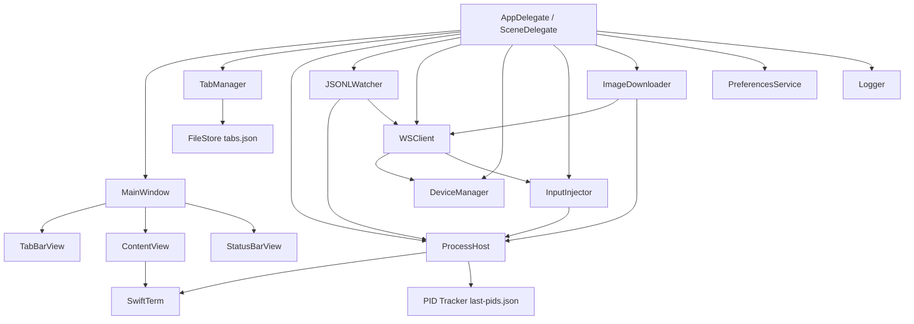
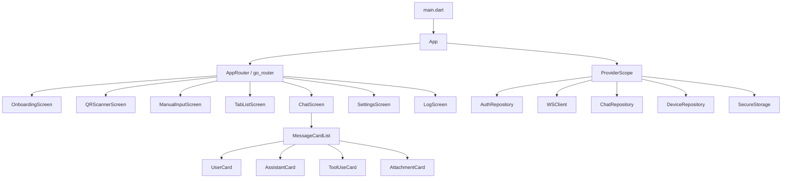
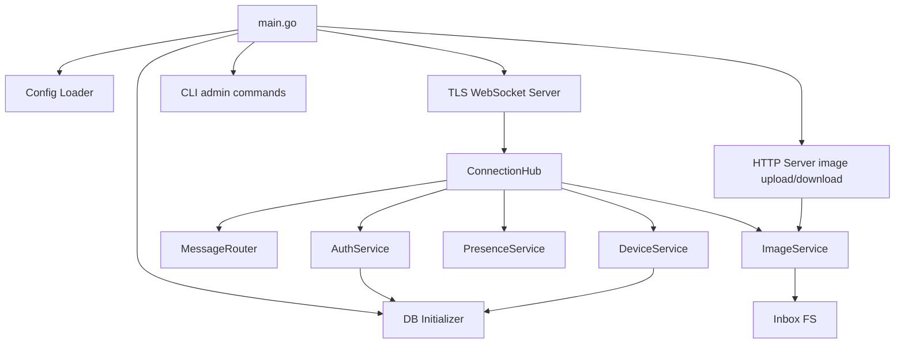
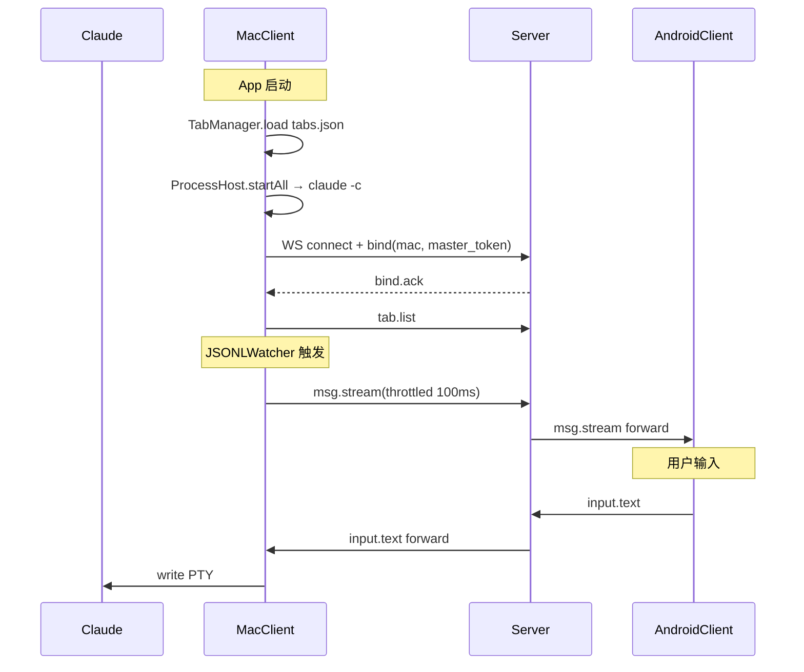
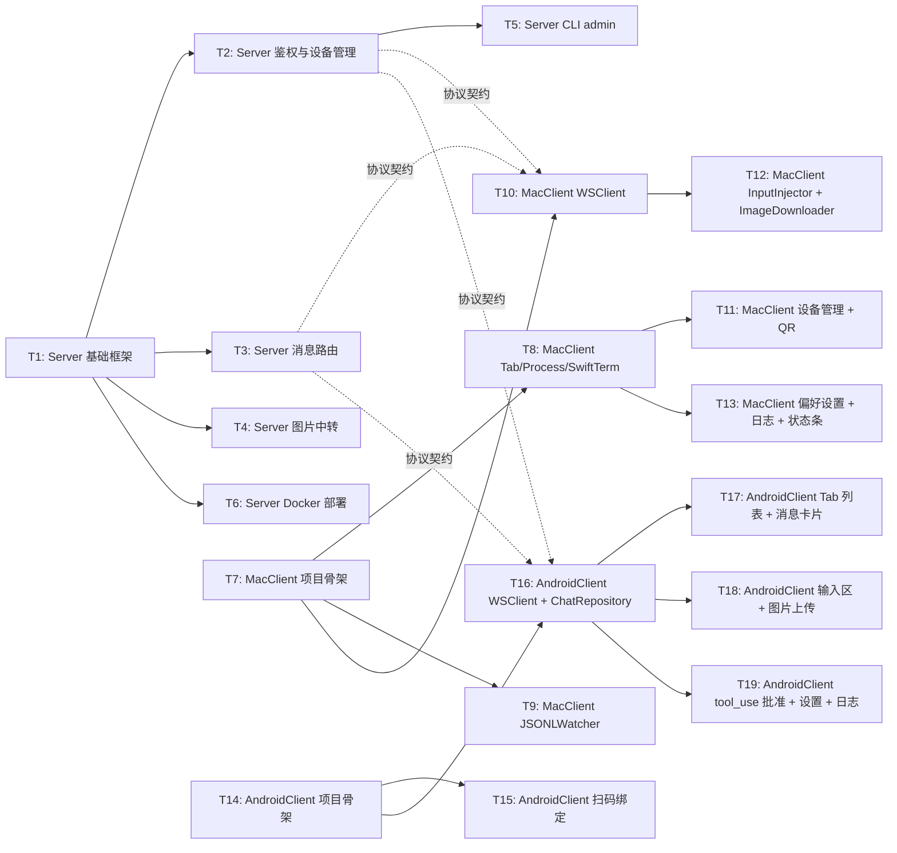

# cc-anywhere 跨端协作客户端 - 技术实施文档

## 1. 文档信息

| 项 | 内容 |
|----|------|
| 版本号 | v1.0 |
| 创建日期 | 2026-05-13 |
| 作者 | 梁立宇（LiangLiYu）|
| 状态 | 已确认 |
| 上游依赖 | `docs/跨端协作客户端/需求规格说明书.md` v1.0 |

---

## 2. 技术方案概述

### 2.1 整体架构

```
┌──────────────────────────────────────────────────────────┐
│ MacClient (Swift 原生 / macOS 14+)                       │
│  ┌─────────────────────────────────────────────────────┐ │
│  │ MainWindow (SwiftUI)                                │ │
│  │  TabBarView + ContentView                           │ │
│  └─────────────────────────────────────────────────────┘ │
│  ┌──────────────┐  ┌──────────────┐  ┌───────────────┐  │
│  │ TabManager   │  │ ProcessHost   │  │ JSONLWatcher  │  │
│  │ - tabs.json  │  │ - PTY forkpty │  │ - FSEvents    │  │
│  │ - persist    │  │ - claude proc │  │ - parse+throttle│
│  └──────────────┘  └──────────────┘  └───────────────┘  │
│  ┌──────────────────────────────────────────────────────┐│
│  │ WSClient (WebSocket)                                 ││
│  │ - reconnect (1/3/10/30s)                             ││
│  │ - message router                                     ││
│  └──────────────────────────────────────────────────────┘│
│  ┌──────────────┐  ┌──────────────┐  ┌───────────────┐  │
│  │ DeviceManager│  │ InputInjector │  │ ImageDownloader│ │
│  └──────────────┘  └──────────────┘  └───────────────┘  │
└───────────────────────────┬──────────────────────────────┘
                            │ WSS
                            │
            ┌───────────────▼──────────────────────────────┐
            │ Server (Go / Docker)                         │
            │  ┌────────────────────────────────────────┐  │
            │  │ TLS WebSocket Listener                 │  │
            │  └────────────────────────────────────────┘  │
            │  ┌──────────────┐  ┌──────────────────────┐  │
            │  │ AuthService  │  │ DeviceService        │  │
            │  └──────────────┘  └──────────────────────┘  │
            │  ┌──────────────┐  ┌──────────────────────┐  │
            │  │ MessageRouter│  │ PresenceService      │  │
            │  └──────────────┘  └──────────────────────┘  │
            │  ┌──────────────┐  ┌──────────────────────┐  │
            │  │ ImageHTTPSvc │  │ SQLite Repository    │  │
            │  └──────────────┘  └──────────────────────┘  │
            └───────────────────────────┬──────────────────┘
                                        │ WSS
            ┌───────────────────────────▼──────────────────┐
            │ AndroidClient (Flutter / Android 10+)        │
            │  ┌──────────────────────────────────────┐    │
            │  │ AppRouter (go_router)                │    │
            │  └──────────────────────────────────────┘    │
            │  ┌────────────┐  ┌─────────────────────┐    │
            │  │ AuthScreen │  │ TabListScreen        │    │
            │  └────────────┘  └─────────────────────┘    │
            │  ┌──────────────────────────────────────┐    │
            │  │ ChatScreen (消息卡片流)              │    │
            │  └──────────────────────────────────────┘    │
            │  ┌────────────┐  ┌─────────────────────┐    │
            │  │ WSClient   │  │ ChatRepository       │    │
            │  └────────────┘  └─────────────────────┘    │
            │  ┌──────────────────────────────────────┐    │
            │  │ EncryptedStorage (token / config)    │    │
            │  └──────────────────────────────────────┘    │
            └──────────────────────────────────────────────┘
```

### 2.2 技术选型

| 模块 | 选型 | 理由 |
|------|------|------|
| MacClient UI | SwiftUI (主) + AppKit (NSOpenPanel 等)  | macOS 14+ 下 SwiftUI 已成熟；TabView/WindowGroup 满足布局；偏好设置用 AppKit Window 更稳 |
| MacClient 终端 | **SwiftTerm**（开源 Swift 终端组件）| xterm 完整兼容，原生性能，活跃维护 |
| MacClient PTY | SwiftTerm 内置 LocalProcessTerminalView（封装 forkpty）| 现成的 PTY 集成，与 SwiftTerm 渲染层一体 |
| MacClient WebSocket | **URLSessionWebSocketTask**（Foundation 内置）| 无第三方依赖，自动支持 TLS |
| MacClient FSEvents | Foundation `FSEventStreamCreate` C API | 系统原生 |
| MacClient QR 生成 | CoreImage `CIFilter.qrCodeGenerator` | 系统原生，无依赖 |
| MacClient 配置存储 | `Codable` + JSON 文件 + FileManager | 简单可靠 |
| MacClient 日志 | `os.Logger` + 自定义文件输出 | 系统原生 + 易调试 |
| AndroidClient 框架 | Flutter 3.19+ (SDK ≥ 3.3) | 跨平台 + 性能可接受 |
| AndroidClient 状态管理 | **Riverpod 2.x** | 类型安全、社区主流 |
| AndroidClient 路由 | **go_router** | Flutter 官方推荐 |
| AndroidClient WebSocket | `web_socket_channel` 包 | Flutter 主流方案 |
| AndroidClient 扫码 | `mobile_scanner` 包 | 性能好，维护活跃 |
| AndroidClient 加密存储 | `flutter_secure_storage` | 基于 EncryptedSharedPreferences |
| AndroidClient 图片 | `image_picker` + `dio` 上传 | 标准方案 |
| AndroidClient Markdown | `flutter_markdown` | 主流 |
| Server 语言 | Go 1.21+ | 单二进制 + 协程 + 标准库完整 |
| Server WebSocket | `nhooyr.io/websocket` | 比 gorilla/websocket 更现代，context-aware |
| Server HTTP | 标准库 `net/http` | 图片上传/下载 endpoint |
| Server DB | `modernc.org/sqlite`（纯 Go SQLite）| 无 CGO 依赖，Docker 镜像可 scratch |
| Server 配置 | YAML + envconfig | 直观 |
| Server 日志 | `log/slog`（标准库）| Go 1.21+ 原生结构化日志 |

### 2.3 设计理念

1. **YAGNI**：所有模块严格按需求规格说明书实现，不做"未来可能用到"的扩展点
2. **单一职责**：每个模块文件 ≤ 400 行（参考超出即拆分）
3. **接口分离**：跨模块通过 protocol/interface 解耦，便于单元测试
4. **错误透明**：所有 IO/网络错误直接传给上层，不静默；UI 显式反馈
5. **协议先行**：WebSocket 消息格式已在阶段三定义，三端按契约独立开发

---

## 3. 架构设计

### 3.1 MacClient 模块划分



| 模块 | 职责 | 输入 | 输出 |
|------|------|------|------|
| `AppMain` | 应用入口、依赖注入容器 | — | 启动各模块 |
| `MainWindow` | 主窗口 SwiftUI 视图 | App state | UI |
| `TabBarView` | Tab 栏组件 | tabs from TabManager | tab 切换 / 创建 / 关闭事件 |
| `StatusBarView` | 顶部状态条 | WS state, presence | UI |
| `TabManager` | Tab 数据模型、tabs.json 读写、增删改命名 | UI 事件 | tab 变化事件 |
| `ProcessHost` | 管理每个 Tab 的 PTY + claude 子进程 | tab open/close 事件 | PTY master, exit 事件 |
| `JSONLWatcher` | 监听 ~/.claude/projects/ 文件变化、解析、节流 | tab 创建事件 | msg.stream 消息 |
| `WSClient` | WebSocket 连接、重连、消息收发 | 配置 + 出站消息 | 入站消息事件 |
| `DeviceManager` | sub_token 生成、设备列表、撤销 | UI 事件 + 入站消息 | 出站消息 + UI 更新 |
| `InputInjector` | 接收手机输入、写入 PTY | 入站 input.* 消息 | PTY 写入 |
| `ImageDownloader` | 从 Server 下载图片到本地 inbox | input.image 消息 | 本地路径 |
| `PreferencesService` | 偏好设置（Server config、字体、主题）| 用户 UI 操作 | 配置持久化 |
| `Logger` | 统一日志接口 + 文件落盘 | 所有模块 | 日志文件 |

### 3.2 AndroidClient 模块划分



| 模块 | 文件 | 职责 |
|------|------|------|
| `App` | `lib/main.dart` | 入口、ProviderScope、MaterialApp |
| `AppRouter` | `lib/routes/app_router.dart` | go_router 路由配置 |
| `OnboardingScreen` | `lib/features/auth/onboarding_screen.dart` | 首次启动欢迎 |
| `QRScannerScreen` | `lib/features/auth/qr_scanner_screen.dart` | 扫码 |
| `ManualInputScreen` | `lib/features/auth/manual_input_screen.dart` | 手动输入绑定信息 |
| `TabListScreen` | `lib/features/tabs/tab_list_screen.dart` | Tab 列表 |
| `ChatScreen` | `lib/features/chat/chat_screen.dart` | 消息流主页 |
| `MessageCardList` | `lib/features/chat/widgets/message_card_list.dart` | 卡片列表 |
| `UserCard` / `AssistantCard` / `ToolUseCard` / `AttachmentCard` / `RawCard` | `lib/features/chat/widgets/` | 各类型卡片组件 |
| `InputBar` | `lib/features/chat/widgets/input_bar.dart` | 底部输入区 |
| `SettingsScreen` | `lib/features/settings/settings_screen.dart` | 设置页 |
| `LogScreen` | `lib/features/logs/log_screen.dart` | 日志查看 |
| `AuthRepository` | `lib/data/auth_repository.dart` | 绑定 / 解绑流程封装 |
| `WSClient` | `lib/data/ws_client.dart` | WebSocket 客户端 |
| `ChatRepository` | `lib/data/chat_repository.dart` | 消息状态管理、去重、本地缓存 |
| `DeviceRepository` | `lib/data/device_repository.dart` | 设备信息 |
| `SecureStorage` | `lib/data/secure_storage.dart` | 加密存储封装 |
| `Logger` | `lib/utils/logger.dart` | 日志接口 |

### 3.3 Server 模块划分



| 模块 | 文件 | 职责 |
|------|------|------|
| `main` | `cmd/cc-anywhere/main.go` | 启动入口 |
| `cli` | `cmd/cc-anywhere/cli.go` | admin 子命令（reset-master-token 等）|
| `config` | `internal/config/config.go` | YAML 配置加载 |
| `db` | `internal/db/sqlite.go` | SQLite 连接 + migrations |
| `server` | `internal/server/server.go` | TLS WebSocket + HTTP 监听启动 |
| `hub` | `internal/server/hub.go` | 连接管理（mac_conn + phone_conns）|
| `auth` | `internal/auth/auth.go` | Token 校验、哈希 |
| `device` | `internal/device/device.go` | sub_token 生成、撤销、列表 |
| `router` | `internal/router/router.go` | 消息路由 |
| `presence` | `internal/presence/presence.go` | 在线状态广播 |
| `image` | `internal/image/image.go` | 图片上传/下载/清理 |
| `protocol` | `internal/protocol/messages.go` | 所有 WebSocket 消息 struct |

### 3.4 跨端调用关系（数据流）



---

## 4. 详细设计

### 4.1 MacClient - TabManager

```swift
// MacClient/Sources/Models/Tab.swift
struct Tab: Codable, Identifiable {
    let id: UUID
    var folder: URL
    var name: String
    let createdAt: Date
}

// MacClient/Sources/Services/TabManager.swift
@MainActor
final class TabManager: ObservableObject {
    @Published private(set) var tabs: [Tab] = []
    @Published var selectedTabId: UUID?
    
    private let storeURL: URL  // ~/Library/Application Support/cc-anywhere/tabs.json
    private let logger = Logger.shared.tagged("TabManager")
    
    init() throws { /* 加载 tabs.json */ }
    
    func createTab(folder: URL, name: String) throws -> Tab {
        // 1. 校验 folder 未被占用
        guard !tabs.contains(where: { $0.folder == folder }) else {
            throw TabError.folderAlreadyOpen(folder)
        }
        // 2. 创建 Tab
        let tab = Tab(id: UUID(), folder: folder, name: name, createdAt: Date())
        tabs.append(tab)
        try persist()
        return tab
    }
    
    func removeTab(_ id: UUID) throws { /* ... */ }
    func renameTab(_ id: UUID, to newName: String) throws { /* ... */ }
    private func persist() throws { /* JSON 编码并写文件 */ }
}

enum TabError: LocalizedError {
    case folderAlreadyOpen(URL)
    case fileSystem(Error)
}
```

**核心算法**：
- `persist()`：原子写入（先写 tabs.json.tmp 然后 rename，避免崩溃时损坏）
- 加载失败时不阻塞启动，记录 ERROR 日志并清空 tabs

### 4.2 MacClient - ProcessHost

```swift
// MacClient/Sources/Services/ProcessHost.swift
@MainActor
final class ProcessHost: ObservableObject {
    @Published private(set) var processes: [UUID: ChildProcess] = [:]
    
    func startProcess(for tab: Tab) async {
        let terminalView = LocalProcessTerminalView(frame: .zero)
        let env = [
            "TERM": "xterm-256color",
            "LANG": ProcessInfo.processInfo.environment["LANG"] ?? "zh_CN.UTF-8",
            "PATH": ProcessInfo.processInfo.environment["PATH"] ?? "/usr/local/bin:/usr/bin:/bin",
            "HOME": NSHomeDirectory(),
            "USER": NSUserName()
        ]
        terminalView.startProcess(
            executable: "/usr/local/bin/claude", // 也支持 ~/.bin/claude 等
            args: ["-c"],
            environment: env,
            execName: "claude"
        )
        terminalView.processTerminated = { [weak self] view, exitCode in
            Task { @MainActor in self?.handleExit(tabId: tab.id, exitCode: exitCode) }
        }
        let cp = ChildProcess(tabId: tab.id, terminalView: terminalView)
        processes[tab.id] = cp
        await trackPid(cp.pid, for: tab.id)
    }
    
    func write(to tabId: UUID, bytes: [UInt8]) {
        processes[tabId]?.terminalView.feed(byteArray: bytes)
    }
    
    func resize(tabId: UUID, cols: Int, rows: Int) {
        processes[tabId]?.terminalView.resize(cols: cols, rows: rows)
    }
    
    func stopAll() async {
        for cp in processes.values {
            cp.terminalView.terminateProcess()  // 内部 close PTY + SIGTERM
        }
        // 等待 500ms，剩余的 SIGKILL
    }
}

struct ChildProcess {
    let tabId: UUID
    let terminalView: LocalProcessTerminalView
    var pid: pid_t { terminalView.process?.shellPid ?? -1 }
}
```

**核心要点**：
- `claude` 可执行文件查找顺序：`/usr/local/bin/claude` → `~/.local/bin/claude` → `which claude`
- 找不到 `claude` 时返回错误，UI 显示"未找到 claude 命令"
- PTY 关闭 → 子进程收 SIGHUP（macOS 默认）→ 进程退出

### 4.3 MacClient - JSONLWatcher

```swift
// MacClient/Sources/Services/JSONLWatcher.swift
final class JSONLWatcher {
    typealias OnMessages = ([ParsedMessage], UUID /* tabId */) -> Void
    
    private var streams: [UUID: WatchStream] = [:]
    private let onMessages: OnMessages
    private let throttleInterval: TimeInterval = 0.1
    
    init(onMessages: @escaping OnMessages) {
        self.onMessages = onMessages
    }
    
    func watch(tab: Tab) {
        let encodedPath = encodeFolderPath(tab.folder)
        let claudeProjectDir = FileManager.default
            .homeDirectoryForCurrentUser
            .appendingPathComponent(".claude/projects/\(encodedPath)")
        
        let stream = WatchStream(
            tabId: tab.id,
            directory: claudeProjectDir,
            throttle: throttleInterval,
            callback: onMessages
        )
        stream.start()
        streams[tab.id] = stream
    }
    
    func unwatch(tabId: UUID) {
        streams[tabId]?.stop()
        streams.removeValue(forKey: tabId)
    }
    
    static func encodeFolderPath(_ url: URL) -> String {
        // /Users/foo/bar → -Users-foo-bar
        return url.path.replacingOccurrences(of: "/", with: "-")
    }
}

final class WatchStream {
    private var fsEventStream: FSEventStreamRef?
    private var activeSessionFile: URL?
    private var lastOffset: UInt64 = 0
    private var pendingMessages: [ParsedMessage] = []
    private var throttleTimer: Timer?
    private let knownUuids = NSMutableSet()  // 去重
    
    func start() {
        // 创建 FSEvents 流
        let context = ... // pointer to self
        fsEventStream = FSEventStreamCreate(
            nil,
            { _, info, count, paths, _, _ in
                guard let info = info else { return }
                let watcher = Unmanaged<WatchStream>.fromOpaque(info).takeUnretainedValue()
                watcher.handleFSEvent(paths: paths, count: Int(count))
            },
            &context,
            [directory.path] as CFArray,
            FSEventStreamEventId(kFSEventStreamEventIdSinceNow),
            0.05,
            FSEventStreamCreateFlags(kFSEventStreamCreateFlagFileEvents | kFSEventStreamCreateFlagNoDefer)
        )
        FSEventStreamSetDispatchQueue(fsEventStream!, .main)
        FSEventStreamStart(fsEventStream!)
        identifyActiveSession()
    }
    
    private func identifyActiveSession() {
        // 取目录下最近修改的非 agent-*.jsonl
        let files = try? FileManager.default.contentsOfDirectory(at: directory, includingPropertiesForKeys: [.contentModificationDateKey])
        let candidates = files?.filter { $0.lastPathComponent.hasSuffix(".jsonl") && !$0.lastPathComponent.hasPrefix("agent-") } ?? []
        activeSessionFile = candidates.max { lhs, rhs in
            (lhs.modDate ?? .distantPast) < (rhs.modDate ?? .distantPast)
        }
        if let f = activeSessionFile {
            // 全量读取一次，初始化 lastOffset
            readNewLines(from: f)
        }
    }
    
    private func handleFSEvent(paths: ...) {
        // 检查是否有新的 .jsonl 文件（session rotation）→ 切换 activeSessionFile
        // 否则读取当前 activeSessionFile 的增量
        guard let file = activeSessionFile else { return }
        readNewLines(from: file)
        scheduleThrottle()
    }
    
    private func readNewLines(from file: URL) {
        // 用 FileHandle seek 到 lastOffset，读到 EOF，按 \n 切行
        // 解析每行 JSON 为 ParsedMessage
        // 按 uuid 去重，加入 pendingMessages
        // 更新 lastOffset
    }
    
    private func scheduleThrottle() {
        throttleTimer?.invalidate()
        throttleTimer = Timer.scheduledTimer(withTimeInterval: 0.1, repeats: false) { [weak self] _ in
            guard let self = self, !self.pendingMessages.isEmpty else { return }
            let batch = self.pendingMessages
            self.pendingMessages.removeAll()
            self.callback(batch, self.tabId)
        }
    }
}

struct ParsedMessage: Codable {
    let type: String
    let uuid: String?
    let sessionId: String?
    let timestamp: Date?
    let raw: String  // 原始 JSON 字符串
    let parsed: [String: Any]?  // 解析后的字典（用于路由判断）
}
```

**核心要点**：
- FSEvents 必须 dispatch 到 main queue（或自己的 queue）
- 节流定时器在每次新事件到来时重置（合并多次抖动）
- session 文件 rotation 处理：每次 FSEvents 触发时检查是否有新的 .jsonl 文件

### 4.4 MacClient - WSClient

```swift
// MacClient/Sources/Services/WSClient.swift
@MainActor
final class WSClient: ObservableObject {
    enum State {
        case disconnected(reason: String?)
        case connecting
        case connected
        case reconnecting(attempt: Int)
    }
    
    @Published private(set) var state: State = .disconnected(reason: nil)
    @Published private(set) var phoneCount: Int = 0
    
    private var task: URLSessionWebSocketTask?
    private var reconnectAttempt = 0
    private let backoffSeconds = [1, 3, 10, 30]
    
    let inboundMessages = PassthroughSubject<ProtocolMessage, Never>()
    
    func connect(config: ServerConfig) async {
        state = .connecting
        let session = URLSession(configuration: configureURLSession(config))
        let url = URL(string: "wss://\(config.server):\(config.port)/")!
        task = session.webSocketTask(with: url)
        task?.resume()
        await sendBind(token: config.masterToken)
        startReceiveLoop()
    }
    
    private func sendBind(token: String) async {
        let msg = BindRequest(type: "mac", token: token)
        try? await send(msg)
    }
    
    private func startReceiveLoop() {
        Task {
            while let msg = try? await task?.receive() {
                handleInbound(msg)
            }
            handleDisconnect()
        }
    }
    
    func send<M: Encodable>(_ message: M) async throws {
        let data = try JSONEncoder().encode(message)
        let str = String(data: data, encoding: .utf8)!
        try await task?.send(.string(str))
    }
    
    private func handleDisconnect() {
        guard reconnectAttempt < .max else { return }
        let delay = backoffSeconds[min(reconnectAttempt, backoffSeconds.count - 1)]
        state = .reconnecting(attempt: reconnectAttempt + 1)
        reconnectAttempt += 1
        Task {
            try? await Task.sleep(nanoseconds: UInt64(delay) * 1_000_000_000)
            await connect(...)
        }
    }
    
    private func configureURLSession(_ config: ServerConfig) -> URLSessionConfiguration {
        let urlConfig = URLSessionConfiguration.default
        if config.trustSelfSigned {
            // 实现 URLSessionDelegate 让 self-signed 证书通过
        }
        return urlConfig
    }
}
```

### 4.5 MacClient - InputInjector

```swift
// MacClient/Sources/Services/InputInjector.swift
final class InputInjector {
    private weak var processHost: ProcessHost?
    
    init(processHost: ProcessHost) { self.processHost = processHost }
    
    func handle(_ message: ProtocolMessage) async {
        switch message.type {
        case "input.text":
            guard let tabId = message["tab_id"] as? UUID,
                  let text = message["text"] as? String else { return }
            let bytes = Array((text + "\r").utf8)
            await MainActor.run { processHost?.write(to: tabId, bytes: bytes) }
        case "input.image":
            // 下载 → 拼 @path → 注入
            let url = ...; let filename = ...
            let localPath = try await ImageDownloader.shared.download(url: url, name: filename)
            let injection = "@\(localPath)\r"
            await MainActor.run { processHost?.write(to: tabId, bytes: Array(injection.utf8)) }
        case "tool_use.approve":
            let action = message["action"] as? String
            let key: String
            switch action {
            case "approve": key = "1\r"
            case "reject":  key = "2\r"
            case "always_approve": key = "3\r"
            default: return
            }
            await MainActor.run { processHost?.write(to: tabId, bytes: Array(key.utf8)) }
        default: break
        }
    }
}
```

### 4.6 AndroidClient - WSClient (Dart)

```dart
// AndroidClient/lib/data/ws_client.dart
class WSClient {
  WebSocketChannel? _channel;
  final _inbound = StreamController<ProtocolMessage>.broadcast();
  Stream<ProtocolMessage> get inbound => _inbound.stream;
  
  ConnectionState _state = ConnectionState.disconnected;
  ConnectionState get state => _state;
  
  Future<void> connect(ServerConfig config) async {
    _setState(ConnectionState.connecting);
    final uri = Uri.parse('wss://${config.server}:${config.port}/');
    _channel = IOWebSocketChannel.connect(uri);
    await _sendBind(config);
    _channel!.stream.listen(
      _handleMessage,
      onError: (e) => _handleDisconnect(reason: '$e'),
      onDone: () => _handleDisconnect(reason: 'closed'),
    );
  }
  
  Future<void> _sendBind(ServerConfig config) async {
    final msg = {
      'type': 'bind',
      'id': const Uuid().v4(),
      'data': {
        'type': 'phone',
        'token': config.subToken,
        'device_name': config.deviceName,
        'device_model': await DeviceInfoPlugin().androidInfo.then((i) => i.model),
        'os_version': 'Android ${await DeviceInfoPlugin().androidInfo.then((i) => i.version.release)}',
      },
    };
    _channel!.sink.add(jsonEncode(msg));
  }
  
  Future<void> send(Map<String, dynamic> message) async {
    if (_state != ConnectionState.connected) {
      throw const NotConnectedException();
    }
    _channel!.sink.add(jsonEncode(message));
  }
  
  void _handleDisconnect({String? reason}) {
    _setState(ConnectionState.reconnecting);
    Future.delayed(_nextBackoff(), () => connect(_lastConfig));
  }
  
  Duration _nextBackoff() {
    final delays = [1, 3, 10, 30];
    final idx = math.min(_reconnectAttempt, delays.length - 1);
    return Duration(seconds: delays[idx]);
  }
}

enum ConnectionState { disconnected, connecting, connected, reconnecting }
```

### 4.7 AndroidClient - ChatRepository

```dart
// AndroidClient/lib/data/chat_repository.dart
class ChatRepository {
  // tab_id -> 消息列表（去重后）
  final Map<String, List<Message>> _messages = {};
  // tab_id -> uuid set（用于 O(1) 去重）
  final Map<String, Set<String>> _uuidIndex = {};
  
  final WSClient _wsClient;
  
  ChatRepository(this._wsClient) {
    _wsClient.inbound.listen(_onInbound);
  }
  
  Stream<List<Message>> watchMessages(String tabId) =>
    _messageController(tabId).stream;
  
  Future<void> loadHistory(String tabId, {DateTime? before, int limit = 50}) async {
    await _wsClient.send({
      'type': 'msg.history.request',
      'id': const Uuid().v4(),
      'data': {
        'tab_id': tabId,
        'limit': limit,
        if (before != null) 'before': before.toIso8601String(),
      },
    });
  }
  
  Future<void> sendText(String tabId, String text) async {
    await _wsClient.send({
      'type': 'input.text',
      'id': const Uuid().v4(),
      'data': {'tab_id': tabId, 'text': text},
    });
  }
  
  void _onInbound(ProtocolMessage msg) {
    switch (msg.type) {
      case 'msg.stream':
        final tabId = msg.data['tab_id'];
        final List<Map<String, dynamic>> raws = msg.data['messages'];
        _mergeMessages(tabId, raws);
        break;
      case 'msg.history.response':
        final tabId = msg.data['tab_id'];
        _prependMessages(tabId, msg.data['messages']);
        break;
    }
  }
  
  void _mergeMessages(String tabId, List<Map<String, dynamic>> raws) {
    final list = _messages.putIfAbsent(tabId, () => []);
    final index = _uuidIndex.putIfAbsent(tabId, () => {});
    for (final raw in raws) {
      final uuid = raw['uuid'] as String?;
      if (uuid != null && index.contains(uuid)) {
        // 已存在，更新内容（streaming case）
        final i = list.indexWhere((m) => m.uuid == uuid);
        if (i >= 0) list[i] = Message.fromJson(raw);
      } else {
        list.add(Message.fromJson(raw));
        if (uuid != null) index.add(uuid);
      }
    }
    _notify(tabId);
  }
}
```

### 4.8 Server - Hub

```go
// Server/internal/server/hub.go
package server

type Hub struct {
    mu         sync.RWMutex
    macConn    *Connection // 同时只允许一个
    phoneConns map[string]*Connection // sub_token_hash -> conn
    deviceSvc  *device.Service
    authSvc    *auth.Service
    presence   *presence.Service
}

func (h *Hub) AcceptMac(conn *Connection) error {
    h.mu.Lock()
    defer h.mu.Unlock()
    if h.macConn != nil {
        // 踢旧的
        h.macConn.SendAndClose(&protocol.ForceDisconnect{Reason: "new_session"})
    }
    h.macConn = conn
    h.presence.NotifyMacOnline()
    return nil
}

func (h *Hub) AcceptPhone(conn *Connection, tokenHash string) error {
    h.mu.Lock()
    defer h.mu.Unlock()
    if existing, ok := h.phoneConns[tokenHash]; ok {
        existing.SendAndClose(&protocol.ForceDisconnect{Reason: "new_session"})
    }
    h.phoneConns[tokenHash] = conn
    h.presence.NotifyPhoneJoined(conn)
    return nil
}

func (h *Hub) RouteFromPhone(msg *protocol.Message) error {
    h.mu.RLock()
    defer h.mu.RUnlock()
    if h.macConn == nil {
        return protocol.ErrMacOffline
    }
    return h.macConn.Send(msg)
}

func (h *Hub) BroadcastToPhones(msg *protocol.Message) {
    h.mu.RLock()
    defer h.mu.RUnlock()
    for _, conn := range h.phoneConns {
        _ = conn.Send(msg) // best-effort
    }
}

type Connection struct {
    ws       *websocket.Conn
    out      chan *protocol.Message
    closed   atomic.Bool
}

func (c *Connection) Send(msg *protocol.Message) error {
    if c.closed.Load() { return errors.New("closed") }
    select {
    case c.out <- msg:
        return nil
    case <-time.After(time.Second):
        return errors.New("send timeout")
    }
}
```

### 4.9 Server - Image Service

```go
// Server/internal/image/image.go
type Service struct {
    inboxDir string
    secret   []byte // HMAC secret
    pending  sync.Map // upload_id → metadata
}

func (s *Service) BeginUpload(req *protocol.ImageUploadBegin) (*protocol.ImageUploadURL, error) {
    if req.Size > 20*1024*1024 {
        return nil, protocol.ErrImageTooLarge
    }
    uploadID := uuid.New().String()
    expiresAt := time.Now().Add(5 * time.Minute)
    s.pending.Store(uploadID, &PendingUpload{
        ID:       uploadID,
        TabID:    req.TabID,
        Filename: req.Filename,
        Sha256:   req.Sha256,
        ExpiresAt: expiresAt,
    })
    token := s.signHMAC(uploadID, "upload", expiresAt)
    return &protocol.ImageUploadURL{
        UploadID:  uploadID,
        UploadURL: fmt.Sprintf("https://%s/upload/%s?token=%s", s.publicHost, uploadID, token),
    }, nil
}

func (s *Service) ServeUploadHTTP(w http.ResponseWriter, r *http.Request) {
    uploadID := chi.URLParam(r, "uploadID")
    token := r.URL.Query().Get("token")
    pending, ok := s.pending.Load(uploadID)
    if !ok { http.Error(w, "not found", 404); return }
    if !s.verifyHMAC(uploadID, "upload", token, pending.ExpiresAt) {
        http.Error(w, "invalid token", 401); return
    }
    // 写到 inbox/<uploadID>
    file, err := os.Create(filepath.Join(s.inboxDir, uploadID))
    if err != nil { http.Error(w, "io", 500); return }
    defer file.Close()
    h := sha256.New()
    tee := io.TeeReader(r.Body, h)
    if _, err := io.Copy(file, tee); err != nil {
        os.Remove(file.Name())
        http.Error(w, "io", 500); return
    }
    if hex.EncodeToString(h.Sum(nil)) != pending.Sha256 {
        os.Remove(file.Name())
        http.Error(w, "sha256 mismatch", 400); return
    }
    // 通知 Mac 来取
    s.hub.RouteFromPhone(&protocol.Message{
        Type: "input.image",
        Data: map[string]any{
            "tab_id": pending.TabID,
            "image_url": fmt.Sprintf("https://%s/download/%s?token=%s", s.publicHost, uploadID, s.signHMAC(uploadID, "download", pending.ExpiresAt)),
            "filename": pending.Filename,
            "sha256": pending.Sha256,
        },
    })
}

func (s *Service) HandleFetched(uploadID string) {
    pending, ok := s.pending.LoadAndDelete(uploadID)
    if !ok { return }
    os.Remove(filepath.Join(s.inboxDir, uploadID))
}

// 后台 goroutine：每分钟扫描过期的 pending，删除文件
func (s *Service) gcLoop(ctx context.Context) {
    t := time.NewTicker(time.Minute)
    defer t.Stop()
    for {
        select {
        case <-ctx.Done(): return
        case <-t.C:
            now := time.Now()
            s.pending.Range(func(k, v any) bool {
                p := v.(*PendingUpload)
                if now.After(p.ExpiresAt) {
                    s.pending.Delete(k)
                    os.Remove(filepath.Join(s.inboxDir, p.ID))
                }
                return true
            })
        }
    }
}
```

---

## 5. 数据库设计

### 5.1 DDL

```sql
-- migrations/001_init.up.sql
CREATE TABLE IF NOT EXISTS schema_version (
    version INTEGER PRIMARY KEY,
    applied_at TIMESTAMP NOT NULL DEFAULT CURRENT_TIMESTAMP
);

CREATE TABLE IF NOT EXISTS master_token (
    id INTEGER PRIMARY KEY CHECK (id = 1),
    token_hash TEXT NOT NULL,
    created_at TIMESTAMP NOT NULL DEFAULT CURRENT_TIMESTAMP,
    rotated_at TIMESTAMP
);

CREATE TABLE IF NOT EXISTS sub_tokens (
    id INTEGER PRIMARY KEY AUTOINCREMENT,
    token_hash TEXT UNIQUE NOT NULL,
    status TEXT NOT NULL CHECK(status IN ('pending', 'active', 'revoked')),
    device_name TEXT,
    device_model TEXT,
    os_version TEXT,
    created_at TIMESTAMP NOT NULL DEFAULT CURRENT_TIMESTAMP,
    bound_at TIMESTAMP,
    last_seen_at TIMESTAMP,
    expires_at TIMESTAMP
);

CREATE INDEX IF NOT EXISTS idx_sub_tokens_status ON sub_tokens(status);
CREATE INDEX IF NOT EXISTS idx_sub_tokens_hash ON sub_tokens(token_hash);

INSERT INTO schema_version(version) VALUES (1);
```

### 5.2 迁移机制

Server 启动时按 `migrations/NNN_*.up.sql` 顺序检查 `schema_version` 表，未应用的执行并记录。

---

## 6. 接口设计

### 6.1 WebSocket 消息（详见需求规格说明书 §3.4，此处仅列结构）

所有消息共用 envelope：
```json
{
  "type": "msg.stream",
  "id": "uuid-v4",
  "ts": "ISO8601 timestamp",
  "data": { /* 类型相关 */ }
}
```

### 6.2 HTTP 接口（Server 提供，用于图片中转）

| Method | Path | 用途 | 鉴权 |
|--------|------|------|------|
| POST | `/upload/{uploadID}?token=<hmac>` | 手机上传图片 | HMAC URL token，5 分钟过期 |
| GET | `/download/{uploadID}?token=<hmac>` | Mac 下载图片 | HMAC URL token，5 分钟过期 |
| GET | `/healthz` | 健康检查 | 无 |

### 6.3 CLI 命令

```bash
# 容器内执行
cc-anywhere admin reset-master-token --force
cc-anywhere admin list-devices
cc-anywhere admin revoke-device --id <sub_token_id>
cc-anywhere serve --config /etc/cc-anywhere/config.yaml
```

---

## 7. 部署方案

### 7.1 Docker 镜像

```dockerfile
# Server/Dockerfile
FROM golang:1.22-alpine AS builder
WORKDIR /src
COPY go.mod go.sum ./
RUN go mod download
COPY . .
RUN CGO_ENABLED=0 go build -o /out/cc-anywhere ./cmd/cc-anywhere

FROM alpine:3.19
RUN apk add --no-cache ca-certificates
COPY --from=builder /out/cc-anywhere /usr/local/bin/cc-anywhere
VOLUME ["/etc/cc-anywhere", "/var/lib/cc-anywhere"]
EXPOSE 8443
ENTRYPOINT ["/usr/local/bin/cc-anywhere"]
CMD ["serve", "--config", "/etc/cc-anywhere/config.yaml"]
```

### 7.2 docker-compose.yml

```yaml
services:
  cc-anywhere:
    image: cc-anywhere:latest
    build: ./Server
    restart: unless-stopped
    ports:
      - "8443:8443"
    volumes:
      - ./config:/etc/cc-anywhere:ro
      - cc-data:/var/lib/cc-anywhere
    environment:
      - TZ=Asia/Shanghai

volumes:
  cc-data:
```

### 7.3 配置文件示例

```yaml
# config/config.yaml
server:
  address: "0.0.0.0:8443"
  tls:
    cert_file: "/etc/cc-anywhere/tls/cert.pem"
    key_file: "/etc/cc-anywhere/tls/key.pem"
  public_host: "cc.example.com:8443"  # 用于生成图片 URL

db:
  path: "/var/lib/cc-anywhere/cc-anywhere.db"

image:
  inbox_dir: "/var/lib/cc-anywhere/inbox"
  hmac_secret: "${CC_HMAC_SECRET}"  # 通过 env 注入

log:
  level: "info"
```

### 7.4 部署步骤

```bash
# 1. SSH 到 VPS
ssh user@vps

# 2. 准备目录
mkdir -p /opt/cc-anywhere/{config,tls}
cd /opt/cc-anywhere

# 3. 准备配置
cp config.yaml.example config/config.yaml
# 修改 public_host 等

# 4. 生成 TLS 证书（Let's Encrypt ACME-DNS 或自签）
# Let's Encrypt:
docker run -it --rm \
  -v /opt/cc-anywhere/tls:/etc/letsencrypt \
  certbot/certbot certonly --manual --preferred-challenges dns \
  -d cc.example.com

# 5. 部署
docker compose up -d

# 6. 初始化主 Token
docker compose exec cc-anywhere cc-anywhere admin reset-master-token --force
# 复制输出的 token

# 7. 验证
curl -k https://cc.example.com:8443/healthz
```

### 7.5 回滚方案

- Docker 镜像保留历史 tag（如 v1.0.0, v1.0.1）
- `docker compose down && docker pull cc-anywhere:v1.0.0 && docker compose up -d`
- 数据库 schema 兼容（迁移用 `up.sql` + `down.sql` 配对）

---

## 8. 实施计划

### 8.1 子任务依赖图



### 8.2 子任务清单

#### Server 子任务（可与 MacClient/AndroidClient 并行）

**T1：Server 基础框架**
- 文件：`Server/cmd/cc-anywhere/main.go`、`internal/config/config.go`、`internal/db/sqlite.go`、`internal/server/server.go`、`internal/protocol/messages.go`
- 内容：
  - `go.mod` 初始化（module: `github.com/yoolines/cc-anywhere`）
  - 配置加载（YAML + envconfig）
  - SQLite 连接 + migrations 机制 + 初始 DDL（5.1）
  - TLS WebSocket Listener（nhooyr.io/websocket）+ HTTP /healthz
  - 所有协议消息 struct 定义
  - log/slog 日志输出 JSON
- 验证：`go build`；本地起服务能通过 healthz；migrations 在空 DB 上正确执行

**T2：Server 鉴权与设备管理**
- 文件：`internal/auth/auth.go`、`internal/device/device.go`
- 内容：
  - master_token 与 sub_token 的哈希存储与校验
  - `bind` 消息处理（mac / phone 分支）
  - `device.create_subtoken` / `device.bound` / `device.list` / `device.revoke` 处理
  - 5 分钟 pending 清理 goroutine
  - sub_token 唯一约束 + 状态机
- 验证：单元测试覆盖所有 bind 分支；模拟 pending 过期清理

**T3：Server 消息路由**
- 文件：`internal/server/hub.go`、`internal/router/router.go`、`internal/presence/presence.go`
- 内容：
  - Hub 实现（mac_conn 单例 + phone_conns map）
  - 新连接踢旧连接逻辑
  - msg.stream / input.* / tab.* 路由
  - presence 广播
- 验证：集成测试模拟 1 Mac + 2 Phone 同时连接，验证消息双向流动

**T4：Server 图片中转**
- 文件：`internal/image/image.go`、HTTP handler 注册到 server
- 内容：
  - upload/download HTTP endpoints + HMAC URL token
  - sha256 校验
  - inbox 目录管理
  - 5 分钟未取自动清理
  - Mac fetched 后立即删除
- 验证：手动测试用 curl 上传/下载；sha256 校验失败路径

**T5：Server CLI admin**
- 文件：`cmd/cc-anywhere/cli.go`
- 内容：cobra 命令树（serve、admin reset-master-token、admin list-devices、admin revoke-device）
- 验证：`cc-anywhere admin reset-master-token --force` 输出 token，DB 更新

**T6：Server Docker 部署**
- 文件：`Server/Dockerfile`、`docker-compose.yml`、`config/config.yaml.example`、`Server/README.md`
- 内容：Dockerfile 多阶段构建；docker-compose 文件；部署文档
- 验证：本地 `docker compose up`，curl healthz 成功

#### MacClient 子任务（依赖：UI 设计稿 + T1 协议契约）

**T7：MacClient 项目骨架**
- 文件：`MacClient/cc-anywhere.xcodeproj`、`Package.swift`、`Info.plist`、`AppMain.swift`、`Resources/Assets.xcassets`
- 内容：
  - Xcode 项目 + SPM 依赖（SwiftTerm）
  - 入口 AppMain（@main + AppDelegate）
  - 基础窗口骨架
  - 日志 Logger 单例
- 验证：`xcodebuild`，App 能启动显示空窗口

**T8：MacClient Tab + Process + SwiftTerm 集成**
- 文件：`MacClient/Sources/Models/Tab.swift`、`Services/TabManager.swift`、`Services/ProcessHost.swift`、`Views/TabBarView.swift`、`Views/ContentView.swift`、`Services/PIDTracker.swift`
- 内容：
  - Tab 模型 + 持久化（tabs.json）
  - ProcessHost（LocalProcessTerminalView 集成）
  - 创建/关闭/重命名 Tab
  - SwiftTerm 视图嵌入主窗口
  - 启动时自动恢复所有 Tab
  - 退出时优雅关闭子进程
- 验证：创建 Tab → 看到 Claude Code 启动 → 输入交互正常 → 关闭 App → 重启恢复

**T9：MacClient JSONLWatcher**
- 文件：`MacClient/Sources/Services/JSONLWatcher.swift`、`Models/ParsedMessage.swift`
- 内容：
  - FSEvents 集成（C API 桥接）
  - encoded path 计算
  - active session 识别 + rotation 处理
  - 节流（100ms）+ uuid 去重
  - 解析失败回退到 raw
- 验证：手动跑 claude，验证文件变化时回调被触发，节流正确

**T10：MacClient WSClient**
- 文件：`MacClient/Sources/Services/WSClient.swift`、`Models/ProtocolMessage.swift`
- 内容：
  - URLSessionWebSocketTask 集成
  - 自签证书信任开关（URLSessionDelegate）
  - 重连退避
  - 消息收发 + state 发布
  - bind 流程
- 验证：连到本地 Server（T1-T6），看到 bind.ack；断网模拟自动重连

**T11：MacClient 设备管理 + QR**
- 文件：`MacClient/Sources/Services/DeviceManager.swift`、`Views/PreferencesView.swift`、`Views/DeviceListView.swift`、`Views/QRDisplayView.swift`
- 内容：
  - 设备列表（从 Server 拉取）
  - 生成 QR（CoreImage）
  - 撤销流程
- 验证：手机 App 扫码绑定流程跑通

**T12：MacClient InputInjector + ImageDownloader**
- 文件：`MacClient/Sources/Services/InputInjector.swift`、`Services/ImageDownloader.swift`
- 内容：
  - 处理 input.text / input.image / tool_use.approve
  - 图片 HTTPS 下载到 inbox 目录
  - inbox 7 天清理（启动时扫描）
- 验证：手机发文字/图片/批准，Mac PTY 收到预期注入

**T13：MacClient 偏好设置 + 日志 + 状态条**
- 文件：`MacClient/Sources/Views/StatusBarView.swift`、`Views/LogViewerWindow.swift`、`Services/PreferencesService.swift`
- 内容：
  - 顶部状态条（绿/黄/红 + Toast）
  - 偏好设置面板（Server 配置 + 字体）
  - 日志查看窗口
  - 在线手机数显示
- 验证：UI 完整可操作；状态变化正确反馈

#### AndroidClient 子任务（依赖：UI 设计稿 + T1 协议契约）

**T14：AndroidClient 项目骨架**
- 文件：`AndroidClient/pubspec.yaml`、`lib/main.dart`、`lib/routes/app_router.dart`、`lib/utils/logger.dart`
- 内容：
  - Flutter 项目初始化（`flutter create`）
  - 依赖：riverpod、go_router、web_socket_channel、mobile_scanner、flutter_secure_storage、image_picker、dio、flutter_markdown、device_info_plus
  - 路由骨架
  - Logger
- 验证：`flutter run` 启动到欢迎页

**T15：AndroidClient 扫码绑定**
- 文件：`lib/features/auth/onboarding_screen.dart`、`qr_scanner_screen.dart`、`manual_input_screen.dart`、`device_name_screen.dart`、`lib/data/auth_repository.dart`、`secure_storage.dart`
- 内容：
  - 三个绑定页面
  - QR 解析（mobile_scanner）
  - 手动输入页
  - 设备命名页
  - bind 请求 + 持久化
- 验证：扫码完整流程，错误场景（过期/错误码/网络断）覆盖

**T16：AndroidClient WSClient + ChatRepository**
- 文件：`lib/data/ws_client.dart`、`chat_repository.dart`、`tab_repository.dart`、`device_repository.dart`、`lib/models/`
- 内容：
  - WSClient 实现 + 重连
  - ChatRepository 实现（去重、streaming 更新）
  - TabRepository 拉取 + 实时更新
  - 消息 model 类
- 验证：连到 Server，手动收发消息

**T17：AndroidClient Tab 列表 + 消息卡片**
- 文件：`lib/features/tabs/tab_list_screen.dart`、`lib/features/chat/chat_screen.dart`、`widgets/message_card_list.dart`、`widgets/user_card.dart` 等
- 内容：
  - Tab 列表渲染（含状态点、最后活动时间、未读 badge）
  - Mac 离线遮罩
  - 消息流渲染（首屏 50 + 向上加载更多）
  - 各类卡片组件
  - thinking 折叠、Markdown 渲染
  - 时间分隔符、滚动到底部 FAB
- 验证：进入 Tab 看到消息正确渲染；向上滚动加载更多；新消息追加正确

**T18：AndroidClient 输入区 + 图片上传**
- 文件：`lib/features/chat/widgets/input_bar.dart`、`image_upload_service.dart`
- 内容：
  - 文本输入框（多行可扩展）
  - 图片选择（相册/相机）
  - 图片预览
  - sha256 + HTTPS 上传 + 进度
  - 失败重试
- 验证：发文本、发图片、发组合（文本+图片）

**T19：AndroidClient tool_use 批准 + 设置 + 日志**
- 文件：`lib/features/chat/widgets/tool_use_card.dart`、`lib/features/settings/settings_screen.dart`、`lib/features/logs/log_screen.dart`
- 内容：
  - tool_use 卡片三按钮
  - 处理中遮罩 + 30s 超时
  - 设置页（解绑、修改设备名、版本号、跳转日志）
  - 日志查看器
- 验证：批准/拒绝/总是批准；解绑流程清理本地数据

### 8.3 子任务派发策略

主 Agent 在阶段七按以下顺序派发子任务：

**第 1 批（无依赖，可并行）**：T1（Server 基础）+ T7（MacClient 骨架）+ T14（AndroidClient 骨架）

**第 2 批（依赖第 1 批）**：T2、T3、T4、T5、T6（Server 全部完成）+ T8（MacClient 核心）+ T15（AndroidClient 扫码）

**第 3 批（依赖第 1+2 批的协议契约）**：T9、T10、T11、T12、T13（MacClient 其他）+ T16、T17、T18、T19（AndroidClient 其他）

**整合 + 联调**：所有子任务完成后，主 Agent 做端到端联调（创建 Tab → 绑定手机 → 双向消息）

### 8.4 验证步骤

每个子任务的"验证"已在 8.2 列出。整体集成验证清单：

- [ ] Server 跑起来 + healthz 通
- [ ] MacClient 启动 + 创建 Tab + Claude Code 跑起来 + 终端交互正常
- [ ] MacClient 配置 Server + 连接成功（绿灯）
- [ ] MacClient 生成 QR + Android 扫码绑定成功
- [ ] Mac 上 Claude 输出消息 → Android 端实时收到卡片
- [ ] Android 发文字 → Mac 端 Claude 收到
- [ ] Android 发图片 → Mac 端 Claude 通过 `@path` 看到
- [ ] tool_use 在 Android 端批准 → Mac 端 Claude 继续执行
- [ ] Mac 重启 → Tab 自动恢复 + Android 重连
- [ ] Server 重启 → Mac/Android 自动重连
- [ ] Android 切到第二台手机扫码 → 两台同时在线
- [ ] 撤销其中一台手机 → 该手机被踢下线 + Mac 列表移除

---

## 9. 风险点与缓解（开发阶段）

| 风险 | 缓解 |
|------|------|
| SwiftTerm `processTerminated` 回调签名跨版本变化 | 锁定 SwiftTerm 主分支某个 commit，写入 Package.resolved；变化后单独适配 |
| `claude` 命令路径不固定 | PATH 探测 + 偏好设置允许手动指定路径 |
| Flutter mobile_scanner 在某些设备相机预览异常 | 提供手动输入入口作为 fallback |
| Server SQLite 单写并发 | 启用 WAL 模式（`PRAGMA journal_mode=WAL`）|
| 自签证书在 Android 受限（network_security_config）| 在 AndroidClient 提供"信任此证书"开关 + 配置文件加载 |

---

*本文档由 yoolines-dev-workflow L4 流程阶段四自动产出。阶段七开发将基于本文档 §8 的子任务清单派发并行 Agent。*
