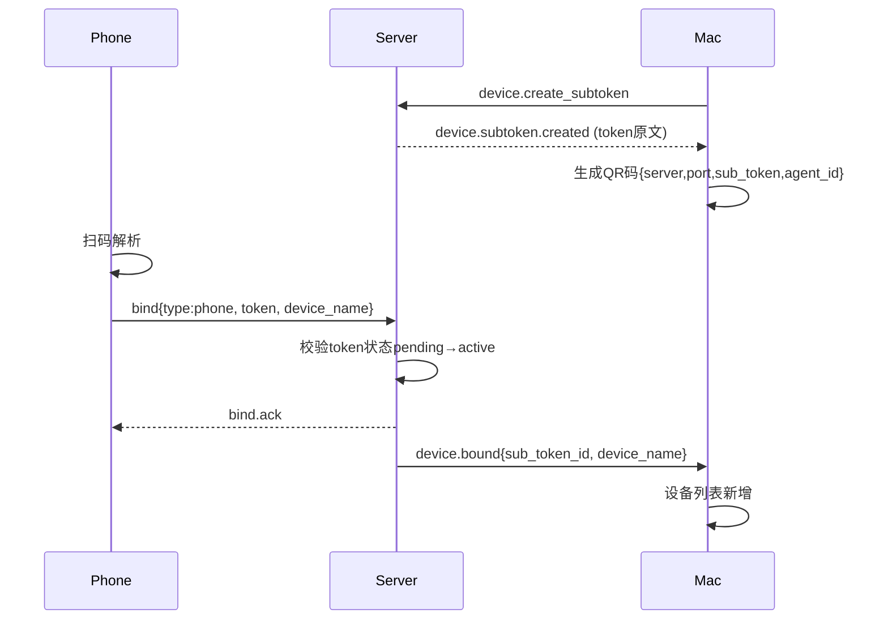
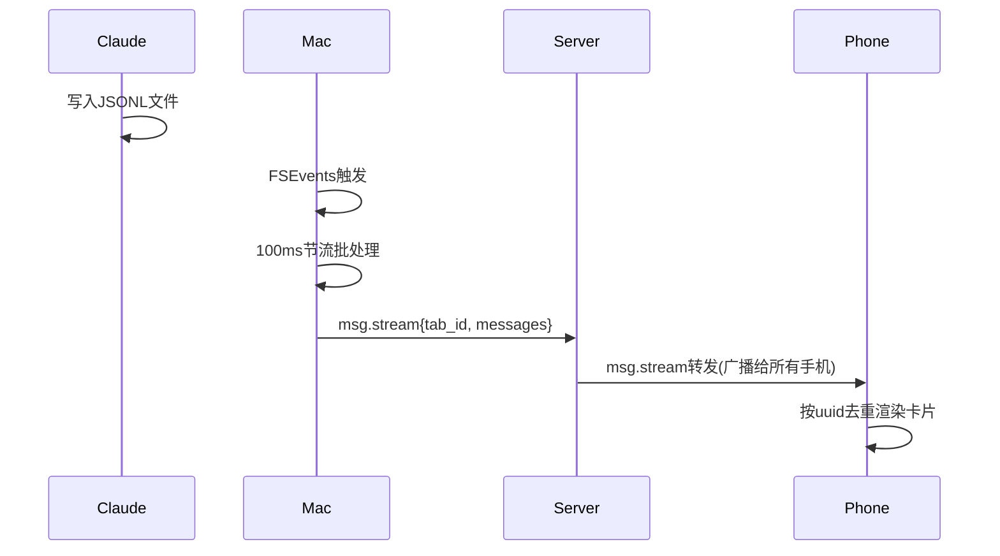
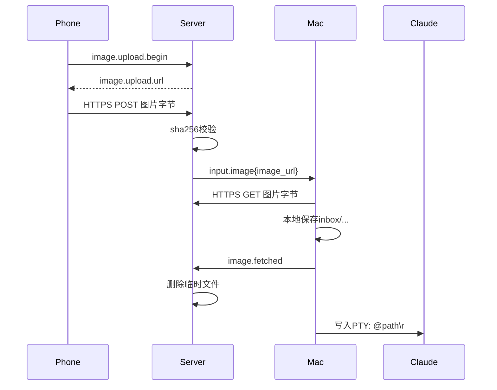
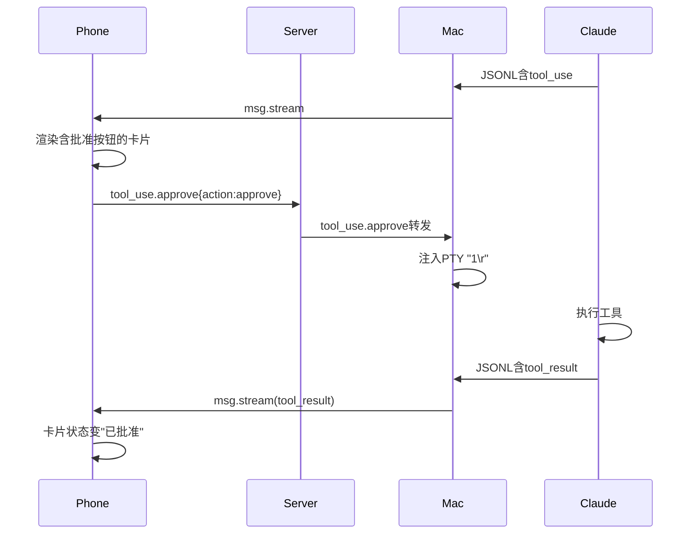

# cc-anywhere 跨端协作客户端 - 需求规格说明书

## 1. 文档信息

| 项 | 内容 |
|----|------|
| 版本号 | v1.0 |
| 创建日期 | 2026-05-13 |
| 作者 | 梁立宇（LiangLiYu） |
| 状态 | 已确认 |
| 上游依赖 | `docs/跨端协作客户端/产品需求文档.md` v1.0 |

---

## 2. 需求概述

### 2.1 功能概要

本规格说明书将 PRD 4.1 中列出的 33 项功能（MacClient 15 + AndroidClient 11 + Server 7）展开为操作级精确的需求规格。每个功能模块包含：

- **页面元素表**：列出该模块涉及的所有可见 UI 元素及其类型
- **操作场景**：从用户行为视角逐步描述每一步交互
- **业务规则**：以 R-xxx 编号的方式列出强约束

### 2.2 涉及模块

| 端 | 模块 | 模块编号 |
|----|------|---------|
| MacClient | Tab 管理 | M1 |
| MacClient | Claude Code 子进程管理 | M2 |
| MacClient | 终端渲染（SwiftTerm + PTY）| M3 |
| MacClient | JSONL 监听与推送 | M4 |
| MacClient | Server 连接与鉴权 | M5 |
| MacClient | 设备管理（QR / 撤销）| M6 |
| MacClient | 接收手机端输入与注入 PTY | M7 |
| MacClient | 状态显示与错误提示 | M8 |
| MacClient | 日志查看 | M9 |
| AndroidClient | 扫码绑定 | A1 |
| AndroidClient | Tab 列表 | A2 |
| AndroidClient | 消息卡片展示 | A3 |
| AndroidClient | 输入区（文字 / 图片）| A4 |
| AndroidClient | tool_use 批准 | A5 |
| AndroidClient | 状态条与设置 | A6 |
| Server | TLS WebSocket 监听 | S1 |
| Server | Token 鉴权 | S2 |
| Server | 设备登记 | S3 |
| Server | 消息路由 | S4 |
| Server | presence 广播 | S5 |
| Server | 图片中转 | S6 |
| Server | 主 Token 重置命令 | S7 |

### 2.3 影响范围

新建项目，无既存代码影响。三端独立目录开发。

---

## 3. 详细需求

## 3.1 MacClient 功能需求

### M1. Tab 管理

#### a) 页面元素表

| 元素 | 类型 | 位置 | 用途 |
|------|------|------|------|
| `Tab 栏` | 横向滚动 Tab 组件 | 主窗口顶部 | 展示所有已创建的 Tab |
| `+ 按钮` | 工具栏按钮 | Tab 栏最右侧 | 创建新 Tab |
| `Tab 标题` | 文本 + 关闭按钮 | 每个 Tab 上 | 显示 Tab 名称、关闭 Tab |
| `Tab 状态点` | 圆点（绿/灰/红） | Tab 标题左侧 | 运行/未启动/异常 |
| `选择文件夹对话框` | macOS NSOpenPanel | 创建新 Tab 时弹出 | 选择项目文件夹 |
| `Tab 命名输入框` | 文本输入 | 选择文件夹后弹出 | 用户给 Tab 命名 |
| `重命名菜单项` | 右键菜单项 | Tab 右键 | 修改已有 Tab 名称 |
| `关闭确认对话框` | NSAlert | 关闭 Tab 时弹出 | 确认是否杀子进程 |

#### b) 操作场景

**场景 1：创建第一个 Tab（正常流程）**

1. 用户启动 MacClient，主窗口打开，Tab 栏为空，中央显示"点击 + 创建第一个 Tab"提示
2. 用户点击 Tab 栏右上角【+】按钮
3. 系统弹出 macOS 系统文件夹选择对话框，标题"选择项目文件夹"
4. 用户选择 `/Users/liangliyu/project/foo`，点击【打开】
5. 系统弹出 Tab 命名对话框，包含：输入框（默认填入文件夹名 `foo`）、【取消】按钮、【确定】按钮
6. 用户保留默认名或修改后，点击【确定】
7. 系统执行：写入 `tabs.json`；创建子进程 `claude -c`（cwd = 选定文件夹）；Tab 加入 Tab 栏，状态点变绿
8. SwiftTerm 区域开始显示 Claude Code 启动输出
9. Tab 栏自动切换到新创建的 Tab

**场景 2：创建 Tab 时选择了已被占用的文件夹**

1. 用户点击【+】，选择 `/Users/liangliyu/project/foo`
2. 系统检测到 `tabs.json` 中已存在该路径
3. 系统弹出错误提示框，标题"无法创建 Tab"，内容"该文件夹已存在一个活动 Tab：foo。同一文件夹不允许多个并行 Tab。"
4. 用户点击【确定】，对话框关闭，不创建新 Tab

**场景 3：关闭 Tab**

1. 用户点击 Tab 标题上的【×】按钮（或在 Tab 上右键 → 关闭）
2. 系统弹出确认对话框，标题"关闭 Tab"，内容"关闭后 Claude Code 进程将退出（对话历史已自动保存）。确定关闭 foo？"
3. 用户点击【关闭】
4. 系统执行：关闭 PTY master → 子进程收到 SIGHUP → 进程退出；从 `tabs.json` 移除条目；Tab 从 Tab 栏移除
5. 若 Tab 栏还有其他 Tab，自动切换到左邻 Tab；否则显示初始空状态

**场景 4：重命名 Tab**

1. 用户在某 Tab 标题上右键
2. 系统弹出菜单，包含【重命名…】、【关闭】、【在 Finder 中显示文件夹】
3. 用户点击【重命名…】
4. Tab 标题区域变为可编辑文本输入框，光标定位在末尾
5. 用户输入新名称，按回车
6. 系统更新 `tabs.json` 中该 Tab 的 `name` 字段；Tab 标题更新；同步 `tab.list` 消息推送给所有在线手机

**场景 5：启动时自动恢复所有 Tab**

1. 用户启动 MacClient
2. 系统读取 `~/Library/Application Support/cc-anywhere/tabs.json`
3. 系统遍历每个 Tab 条目，依次创建子进程：`claude -c`（cwd = 该 Tab 对应文件夹）
4. 每个 Tab 状态点初始为灰色，进程启动成功后变绿
5. 用户切换 Tab 时，SwiftTerm 显示对应 Tab 的 PTY 输出
6. 若某 Tab 启动失败（如文件夹已被删除、claude 命令不存在），状态点变红，Tab 内容区显示错误信息和【重试】按钮

#### c) 业务规则

| 规则编号 | 规则描述 |
|---------|---------|
| R-M1-01 | Tab 列表存储在 `~/Library/Application Support/cc-anywhere/tabs.json`，文件权限 0600 |
| R-M1-02 | `tabs.json` 数据结构：`[{id: UUID, folder: 绝对路径, name: 用户命名, created_at: ISO8601}]` |
| R-M1-03 | Tab 命名最长 50 字符；空名时回退使用文件夹名 |
| R-M1-04 | 同一 folder 路径只能有一个活动 Tab，创建时严格校验 |
| R-M1-05 | 关闭 Tab 必须二次确认（避免误关导致 Claude 进程意外退出）|
| R-M1-06 | 启动时按 `tabs.json` 顺序恢复 Tab，恢复失败不阻塞其他 Tab |
| R-M1-07 | Tab 状态点：绿=子进程运行中；灰=未启动/启动中；红=异常退出 |

---

### M2. Claude Code 子进程管理

#### a) 页面元素表

| 元素 | 类型 | 位置 | 用途 |
|------|------|------|------|
| `Tab 内容区` | NSView 容器 | 主窗口主体 | 容纳 SwiftTerm + 错误提示条 |
| `进程错误条` | 黄色横向 Banner | Tab 内容区顶部 | 子进程异常退出时显示退出码与重启按钮 |
| `重启按钮` | 按钮 | 进程错误条内 | 触发重新启动 `claude -c` |

#### b) 操作场景

**场景 1：子进程正常启动**

1. Tab 创建或恢复时，MacClient 调用 `forkpty()` 创建 PTY
2. 子进程 exec 命令：`claude -c`，cwd 设为该 Tab 的 folder，environment 包含 `TERM=xterm-256color`、`LANG=zh_CN.UTF-8`、继承的 `PATH`
3. PTY master 连到 SwiftTerm
4. 子进程 PID 记录到该 Tab 的状态中

**场景 2：子进程意外退出（崩溃 / kill）**

1. MacClient 监听到 PTY EOF 或 waitpid 返回（exit code ≠ 0 或 signal）
2. 该 Tab 状态点变红
3. Tab 内容区顶部出现黄色错误条：内容"Claude Code 进程已退出（退出码 X）"、右侧【重启】按钮
4. SwiftTerm 保留最后一屏内容（不清屏）
5. 用户点击【重启】，错误条消失，重新执行 `claude -c`，状态点恢复绿色

**场景 3：MacClient 应用退出（用户关闭主窗口或退出）**

1. 用户点击主窗口红色【关闭】按钮 或 选择"Quit cc-anywhere"
2. MacClient 弹出确认对话框（仅当有运行中 Tab 时）："退出将关闭 X 个 Tab 中的 Claude Code 进程，确定退出？"
3. 用户点击【退出】
4. MacClient 遍历所有活动子进程：关闭 PTY master → 等待 100ms → 若进程仍存在则发 SIGTERM → 再等 500ms → 仍存在则 SIGKILL
5. 长连接 WebSocket 主动断开，通知 Server "Mac 下线"
6. 进程退出

**场景 4：MacClient 应用崩溃（异常退出）**

1. MacClient 在启动时检查 `~/Library/Application Support/cc-anywhere/last-pids.json` 中是否有遗留 PID
2. 若有，对每个 PID 检查是否仍为 claude 进程（按 cmdline 比对），若是则 SIGKILL 清理
3. 清理完成后才开始本次启动流程
4. 启动后每次有 Tab 变化，更新 `last-pids.json`

#### c) 业务规则

| 规则编号 | 规则描述 |
|---------|---------|
| R-M2-01 | 子进程必须设置 `TERM=xterm-256color`、`LANG=zh_CN.UTF-8`（或继承 LANG），确保 Claude Code TUI 渲染正确 |
| R-M2-02 | 子进程 cwd 必须为 Tab 关联的 folder 绝对路径 |
| R-M2-03 | 子进程退出码 ≠ 0 时视为异常退出，必须显示错误条 |
| R-M2-04 | 用户退出主程序时必须先 SIGTERM 优雅关闭子进程，超时（500ms）再 SIGKILL |
| R-M2-05 | MacClient 启动时必须先清理上次崩溃残留的 claude 子进程 |
| R-M2-06 | 不允许在主进程上下文之外创建 claude 子进程（如 daemon 模式）|

---

### M3. 终端渲染（SwiftTerm + PTY）

#### a) 页面元素表

| 元素 | 类型 | 位置 | 用途 |
|------|------|------|------|
| `SwiftTerm 视图` | LocalProcessTerminalView | Tab 内容区主体 | 渲染 Claude Code 的 ANSI TUI |
| `滚动条` | 垂直滚动条 | SwiftTerm 右侧 | 浏览历史输出 |
| `字体设置项` | 偏好设置中的字体选择 | App 偏好设置 | 调整终端字体 |
| `主题设置项` | 偏好设置中的颜色主题 | App 偏好设置 | 切换深色/浅色主题 |

#### b) 操作场景

**场景 1：实时渲染 Claude Code 流式输出**

1. SwiftTerm 接收 PTY master 的字节流
2. SwiftTerm 内部解析 ANSI escape codes：光标移动、清行、颜色、属性
3. 实时刷新可视区域
4. Claude Code 的流式 token 输出、spinner 动画、tool_use 提示、折叠/展开消息全部 100% 正确渲染

**场景 2：用户在 SwiftTerm 内键盘输入**

1. 用户在 SwiftTerm 视图获得焦点
2. 用户按下任意键
3. SwiftTerm 把键盘事件转为对应字节序列（含 ANSI 控制序列如方向键 `\e[A`）写入 PTY master
4. Claude Code 接收输入，正常处理

**场景 3：窗口大小变化**

1. 用户拖动主窗口边缘改变大小
2. MacClient 计算新的 SwiftTerm 视图尺寸（cols × rows）
3. SwiftTerm 调用 `ioctl(TIOCSWINSZ)` 改 PTY 尺寸
4. Claude Code 收到 SIGWINCH，重新布局 TUI

**场景 4：切换 Tab 时切换 SwiftTerm 显示**

1. 用户点击另一个 Tab
2. MacClient 隐藏当前 SwiftTerm 视图，显示该 Tab 关联的 SwiftTerm
3. 切换后焦点自动给新 SwiftTerm

#### c) 业务规则

| 规则编号 | 规则描述 |
|---------|---------|
| R-M3-01 | 每个 Tab 维护自己的 SwiftTerm 实例与 PTY master，互不干扰 |
| R-M3-02 | SwiftTerm 滚动缓冲区至少保留 10000 行 |
| R-M3-03 | PTY 窗口尺寸变化必须同步给 SwiftTerm 和 Claude 子进程，不允许尺寸不一致 |
| R-M3-04 | 默认字体：SF Mono / Menlo 13pt；可在偏好设置修改 |
| R-M3-05 | 默认主题跟随系统深色/浅色模式 |

---

### M4. JSONL 监听与推送

#### a) 页面元素表

无直接 UI（后台逻辑）。状态体现在 M8 状态显示模块。

#### b) 操作场景

**场景 1：Tab 创建后开始监听 JSONL**

1. 子进程 `claude -c` 启动后，等待 2 秒让 Claude Code 创建 session 文件
2. MacClient 根据 folder 计算 encoded path（`/` 替换为 `-`，前缀 `-`）
3. MacClient 用 FSEvents 监听 `~/.claude/projects/<encoded_path>/` 目录
4. 一旦发现新增的 `*.jsonl` 文件（不是 `agent-*.jsonl`），记录为该 Tab 的 active session
5. 监听该文件的 `kFSEventStreamEventFlagItemModified` 事件

**场景 2：JSONL 新行追加（实时推送）**

1. FSEvents 触发事件，MacClient 比较文件当前大小与上次读取偏移
2. 从上次偏移读到文件末尾，按 `\n` 切行
3. 解析每行 JSON，校验 type 字段（user/assistant/system/attachment/ai-title/permission-mode/last-prompt）
4. 启动/重置 100ms 节流定时器
5. 定时器到期后，把累计的消息按 `uuid` 字段去重，打包为 `msg.stream` 消息推给 Server
6. 更新上次读取偏移

**场景 3：JSONL 中包含已经推送过的行（重复事件）**

1. 同一行可能被 FSEvents 触发多次
2. 按消息 `uuid` 去重（uuid 在 user/assistant 类型中存在）
3. 对无 uuid 的 type（如 permission-mode），按 `(type, sessionId, timestamp)` 联合键去重

**场景 4：JSONL 解析失败**

1. 某行 JSON 不合法或字段缺失
2. MacClient 记录 WARN 日志（含该行内容）
3. 该行**仍然以原始字符串**封装为 `msg.stream.raw` 消息发送（手机端按"无法解析"显示）
4. 不阻塞后续行处理

#### c) 业务规则

| 规则编号 | 规则描述 |
|---------|---------|
| R-M4-01 | 每个 Tab 独立维护 FSEvents 监听、读取偏移、节流定时器 |
| R-M4-02 | 节流窗口固定 100ms，可在配置文件调整（不暴露给用户）|
| R-M4-03 | 消息按 uuid 去重，无 uuid 按 (type, sessionId, timestamp) 联合键 |
| R-M4-04 | 解析失败的行不丢弃，标记为 `raw` 类型推送 |
| R-M4-05 | 监听必须使用 FSEvents（高效），不允许用 polling |
| R-M4-06 | 启动时识别 active session：取该目录下最近修改的非 agent-* 的 .jsonl 文件 |
| R-M4-07 | 同一个 Tab 可能 session id 切换（用户在 Claude Code 内 `/new` 等），监听需要响应文件 rotation |

---

### M5. Server 连接与鉴权

#### a) 页面元素表

| 元素 | 类型 | 位置 | 用途 |
|------|------|------|------|
| `设置入口` | 菜单项"cc-anywhere → 偏好设置…" | 应用菜单 | 打开设置面板 |
| `Server 设置面板` | 偏好设置中的 Tab | 偏好设置窗口 | 配置 Server 连接信息 |
| `Server 地址输入框` | 文本输入 | Server 设置面板 | 填写域名 / IP |
| `Server 端口输入框` | 数字输入 | Server 设置面板 | 填写端口（1-65535）|
| `主 Token 输入框` | 密码输入（可显示）| Server 设置面板 | 填写主 Token |
| `自签证书信任开关` | Switch | Server 设置面板 | 是否信任自签证书 |
| `测试连接按钮` | 按钮 | Server 设置面板 | 测试当前配置是否能连通 |
| `保存按钮` | 按钮 | Server 设置面板 | 保存配置并触发重连 |

#### b) 操作场景

**场景 1：首次配置 Server（用户首次启动 MacClient）**

1. MacClient 启动检测到无 Server 配置，自动弹出"Server 设置"面板
2. 用户填写 Server 地址（如 `cc.example.com`）、端口（如 `8443`）、主 Token（从 VPS 复制）
3. 用户点击【测试连接】
4. MacClient 尝试建立 TLS WebSocket，发送 `bind` 消息，等待 Server `bind.ack` 响应
5. 测试结果：
   - 成功：按钮变绿，显示"连接成功"
   - DNS 解析失败：显示"无法解析域名 cc.example.com"
   - 连接被拒绝：显示"端口 8443 不可达"
   - TLS 握手失败：显示"证书校验失败，请检查自签证书信任设置"
   - Token 错误：显示"Token 鉴权失败"
6. 用户根据提示调整后再次测试
7. 测试成功后点击【保存】，配置写入 `~/Library/Application Support/cc-anywhere/server-config.json`（权限 0600）

**场景 2：Server 连接断开自动重连**

1. WebSocket 连接异常断开（网络抖动 / Server 重启）
2. MacClient 顶部状态灯转黄（重连中）
3. 自动重连：第 1 次延迟 1 秒，第 2 次 3 秒，第 3 次 10 秒，第 4 次起 30 秒
4. 重连成功后状态灯转绿；发送当前 Tab 列表 `tab.list` 通知 Server

**场景 3：修改 Server 配置后重连**

1. 用户在偏好设置中修改 Server 地址 / 端口 / Token
2. 用户点击【保存】
3. MacClient 主动断开当前连接
4. 用新配置发起连接，按场景 1 校验
5. 校验失败的回滚到上次配置并提示用户

#### c) 业务规则

| 规则编号 | 规则描述 |
|---------|---------|
| R-M5-01 | Server 配置文件 `server-config.json`，权限 0600，结构含 `{server, port, master_token, trust_self_signed}` |
| R-M5-02 | 主 Token 在 UI 中默认掩码显示（点击眼睛图标显示） |
| R-M5-03 | 自签证书信任默认关闭（强制 CA 校验），用户可显式开启 |
| R-M5-04 | 重连退避：1s → 3s → 10s → 30s（持续）|
| R-M5-05 | 连接断开时 MacClient 仍可本地使用，仅手机端不可达 |
| R-M5-06 | 端口范围 1-65535，否则保存时报错 |
| R-M5-07 | 测试连接最大等待 10 秒，超时视为失败 |

---

### M6. 设备管理（生成 QR、列出/撤销手机）

#### a) 页面元素表

| 元素 | 类型 | 位置 | 用途 |
|------|------|------|------|
| `设备管理面板` | 偏好设置中的 Tab | 偏好设置窗口 | 管理已绑定的手机设备 |
| `已绑定设备列表` | NSTableView | 设备管理面板 | 展示所有 sub_token 对应设备 |
| `设备名` | 列 | 设备列表 | 手机命名（绑定时由手机端上报） |
| `绑定时间` | 列 | 设备列表 | 该设备完成绑定的时间 |
| `最后在线` | 列 | 设备列表 | 该设备最后一次连接时间 |
| `撤销按钮` | 行内按钮 | 每行右侧 | 撤销该设备的 sub_token |
| `生成绑定 QR 按钮` | 按钮 | 设备列表下方 | 生成新绑定 QR 码 |
| `QR 显示弹窗` | Modal | - | 显示 QR 码与有效期 |
| `撤销确认对话框` | NSAlert | - | 撤销前确认 |

#### b) 操作场景

**场景 1：生成手机绑定 QR 码**

1. 用户在"偏好设置 → 设备管理"页点击【生成绑定 QR】
2. MacClient 向 Server 请求 `device.create_subtoken`，Server 生成新 sub_token（≥ 32 字节随机）并暂存为 `pending`
3. MacClient 接收响应，组装绑定 payload：`{server, port, sub_token, agent_id}`
4. 用 zxing-cpp 或 SwiftQRCodeGenerator 渲染为 QR 码
5. 弹出 Modal，展示 QR 码图片 + 文字"使用手机端"cc-anywhere"扫码绑定"，下方显示倒计时"有效期 5:00"
6. QR 码 5 分钟未被使用自动失效（Server 把 pending 状态的 sub_token 清除）

**场景 2：手机扫码绑定成功后 Mac 端更新**

1. 手机扫码后向 Server 发 `device.bind` + 设备名（如"小米 14"）
2. Server 把 pending sub_token 转 active，记录设备名、绑定时间
3. Server 向 MacClient 推 `device.bound`：{sub_token_id, device_name, bound_at}
4. MacClient 设备列表新增一行
5. 弹出 Toast"小米 14 已绑定"

**场景 3：撤销已绑定设备**

1. 用户在设备列表上点击某行的【撤销】按钮
2. MacClient 弹出确认对话框："撤销后 小米 14 将立即下线，且无法再连接。确定撤销？"
3. 用户点击【撤销】
4. MacClient 向 Server 发 `device.revoke`：{sub_token_id}
5. Server 删除该 sub_token，向对应设备的 WebSocket 发送 `force_disconnect` 然后关闭连接
6. Server 响应 MacClient `device.revoked`
7. MacClient 从设备列表移除该行
8. 弹出 Toast"小米 14 已撤销"

**场景 4：列表中显示设备最近在线状态**

1. Server 维护每台设备的 last_seen 时间
2. MacClient 切到设备管理 Tab 时请求 `device.list`
3. Server 返回完整设备列表
4. 列表显示规则：当前在线 = 绿点 + "在线"；离线 < 1 小时 = 灰点 + "5 分钟前在线"；离线 ≥ 1 小时 = 灰点 + 具体时间

#### c) 业务规则

| 规则编号 | 规则描述 |
|---------|---------|
| R-M6-01 | sub_token 必须 ≥ 32 字节随机串，使用 CryptoKit 生成 |
| R-M6-02 | 生成的 QR 码 5 分钟内未被绑定则失效 |
| R-M6-03 | 撤销后必须立即下线该手机（强制断开 WebSocket）|
| R-M6-04 | 撤销操作不可逆，需要二次确认 |
| R-M6-05 | 设备列表中"最近在线"按时间区间显示，不显示精确秒数 |
| R-M6-06 | 设备命名由手机端在绑定时上报，长度限制 30 字符 |

---

### M7. 接收手机端输入与注入 PTY

#### a) 页面元素表

无直接 UI（后台逻辑）。可在 M9 日志查看模块审计。

#### b) 操作场景

**场景 1：手机端发送文字输入**

1. 手机端发送 `input.text`：{tab_id, text}
2. Server 路由到 MacClient
3. MacClient 定位 tab_id 对应的 PTY master
4. 把 text 转 UTF-8 字节，末尾追加 `\r`，写入 PTY master
5. Claude Code 收到，作为用户键盘输入处理

**场景 2：手机端发送图片**

1. 手机端先发 `image.upload.begin`：{tab_id, filename, size, sha256}
2. Server 校验大小（≤ 20 MB）、生成临时存储路径（`/var/lib/cc-anywhere/inbox/<uuid>.png`）
3. Server 响应手机 `image.upload.url`：{upload_url}
4. 手机用 HTTPS POST 把图片上传到 upload_url
5. Server 验证 sha256 一致后，向 MacClient 推 `input.image`：{tab_id, image_url, filename}
6. MacClient HTTPS 下载 image_url 到 `~/Library/Application Support/cc-anywhere/inbox/<filename>`
7. MacClient 校验下载文件 sha256
8. MacClient 向 Server 确认 `image.fetched`
9. Server 收到后立即从临时存储删除该图片
10. MacClient 把本地路径以 `@~/Library/Application Support/cc-anywhere/inbox/<filename>\r` 写入 PTY master
11. Claude Code 识别 `@path` 语法，读取图片

**场景 3：手机端 tool_use 批准**

1. 手机端发送 `tool_use.approve`：{tab_id, action: "approve" | "reject" | "always_approve"}
2. Server 路由到 MacClient
3. MacClient 根据 action 映射键序列：
   - approve → "1\r"（或 "y\r"，取决于 Claude Code 当前状态）
   - reject → "2\r"（或 "n\r"）
   - always_approve → "3\r"
4. 写入对应 Tab 的 PTY master
5. Claude Code 处理批准（如果当前不在 tool_use 等待状态，则会被当成下一个 prompt，符合 D1 决策）

**场景 4：注入失败（PTY 已关闭）**

1. MacClient 尝试写 PTY master，返回 EBADF
2. MacClient 记录 ERROR 日志
3. MacClient 向 Server 发 `input.error`：{tab_id, message: "Tab 进程已退出，输入未生效"}
4. Server 转发给手机端
5. 手机端在该消息位置显示红色提示

#### c) 业务规则

| 规则编号 | 规则描述 |
|---------|---------|
| R-M7-01 | 所有手机输入注入到 PTY 时末尾追加 `\r`（回车）|
| R-M7-02 | 图片上传上限 20 MB，超过则 Server 拒绝并返回错误 |
| R-M7-03 | 图片 sha256 校验失败立即拒绝（防止传输损坏）|
| R-M7-04 | 图片在 Server 端只是临时缓冲，Mac 拉取后立即删除 |
| R-M7-05 | 注入失败必须反向通知手机端（不静默丢弃） |
| R-M7-06 | tool_use.approve 的 action 必须在 ["approve", "reject", "always_approve"] 内 |
| R-M7-07 | 图片本地存储路径 `~/Library/Application Support/cc-anywhere/inbox/`，每 7 天清理一次 |

---

### M8. 状态显示与错误提示

#### a) 页面元素表

| 元素 | 类型 | 位置 | 用途 |
|------|------|------|------|
| `顶部状态条` | NSView | 主窗口标题栏下方 | 全局连接状态 |
| `状态灯` | 圆点（绿/黄/红）| 状态条左侧 | 与 Server 的 WebSocket 状态 |
| `状态文本` | Label | 状态灯右侧 | "已连接" / "重连中…" / "未连接 - [原因]" |
| `已绑定手机指示` | 小图标 + 数字 | 状态条中部 | 当前在线手机数量 |
| `Toast` | 浮动通知卡片 | 主窗口右上角 | 严重事件通知 |
| `Tab 状态点` | 见 M1 | Tab 上 | 子进程状态 |
| `进程错误条` | 见 M2 | Tab 内容区顶部 | 子进程错误 |

#### b) 操作场景

**场景 1：连接状态变化**

1. WebSocket 已连接：状态灯绿，文本"已连接 cc.example.com:8443"
2. 重连中：状态灯黄，文本"重连中（第 N 次）…"
3. 主动断开：状态灯红，文本"未连接 - 已停止"，旁边出现【重连】按钮
4. 鉴权失败：状态灯红，文本"未连接 - Token 错误"
5. 自签证书未信任：状态灯红，文本"未连接 - 证书校验失败"

**场景 2：Toast 触发条件**

- 手机新绑定成功 → Toast"已绑定 XX"
- 手机被撤销 → Toast"已撤销 XX"
- Token 失效 → Toast"主 Token 失效，请重新配置"（持续 10 秒）
- Server 不可达持续 30 秒 → Toast"无法连接到 Server，请检查网络"
- 注入失败 → Toast"消息发送失败：Tab 进程已退出"

**场景 3：在线手机数量显示**

1. Server 推送 presence 消息：当前在线手机数 N
2. 状态条中部显示手机图标 + 数字 "N"
3. 鼠标悬停显示"在线手机：XX, YY"

#### c) 业务规则

| 规则编号 | 规则描述 |
|---------|---------|
| R-M8-01 | 状态灯颜色三态：绿（正常）/ 黄（重连中）/ 红（异常）|
| R-M8-02 | Toast 默认显示 4 秒，严重错误显示 10 秒 |
| R-M8-03 | Toast 自动堆叠，最多同时显示 3 条 |
| R-M8-04 | 状态条不可隐藏（用户必须能看到当前连接状态）|

---

### M9. 日志查看

#### a) 页面元素表

| 元素 | 类型 | 位置 | 用途 |
|------|------|------|------|
| `查看日志菜单项` | App 菜单"帮助 → 查看日志…" | 应用菜单 | 打开日志窗口 |
| `日志窗口` | 独立 NSWindow | - | 显示日志内容 |
| `日志级别过滤器` | 下拉框 | 日志窗口工具栏 | DEBUG / INFO / WARN / ERROR |
| `搜索框` | 文本输入 | 日志窗口工具栏 | 关键字过滤 |
| `导出按钮` | 工具栏按钮 | 日志窗口工具栏 | 导出 .log 文件 |
| `日志内容区` | NSTextView | 日志窗口主体 | 显示日志行 |

#### b) 操作场景

**场景 1：打开日志窗口**

1. 用户点击菜单"帮助 → 查看日志…"
2. 系统打开日志窗口，加载 `~/Library/Logs/cc-anywhere/cc-anywhere.log` 末尾 1000 行
3. 默认级别过滤器为 INFO，关键字为空

**场景 2：过滤日志**

1. 用户在下拉框选 WARN
2. 日志窗口只显示 WARN/ERROR 行
3. 用户在搜索框输入 "token"
4. 日志窗口实时过滤，只显示包含 "token" 且 ≥ WARN 级别的行

**场景 3：导出日志**

1. 用户点击【导出】
2. macOS 系统弹出保存对话框，默认文件名 `cc-anywhere-{date}.log`
3. 用户选择保存位置，点击【保存】
4. MacClient 把当前过滤后的日志写入文件

#### c) 业务规则

| 规则编号 | 规则描述 |
|---------|---------|
| R-M9-01 | 日志文件路径 `~/Library/Logs/cc-anywhere/cc-anywhere.log`，按日切割 |
| R-M9-02 | 日志保留最近 7 天，自动清理超期文件 |
| R-M9-03 | 日志级别 DEBUG / INFO / WARN / ERROR，默认 INFO |
| R-M9-04 | 日志格式 `[时间] [级别] [模块] 消息` |
| R-M9-05 | 敏感信息（token、文件绝对路径）日志中自动脱敏（前 6 + 后 4，中间 `***`）|

---

## 3.2 AndroidClient 功能需求

### A1. 扫码绑定

#### a) 页面元素表

| 元素 | 类型 | 位置 | 用途 |
|------|------|------|------|
| `首次启动欢迎页` | 全屏 Page | 启动后首次显示 | 引导用户开始绑定 |
| `开始绑定按钮` | 主按钮 | 欢迎页中部 | 进入扫码 |
| `扫码页` | 全屏 Page | 摄像头预览 | 扫描 Mac 端 QR |
| `相机预览区` | CameraView | 扫码页主体 | 实时摄像 |
| `扫码框` | 半透明边框 | 预览区中央 | 视觉引导 |
| `手动输入入口` | TextButton | 扫码页底部 | 无法扫码时手动填 |
| `手动输入页` | Page | - | 输入 server/port/sub_token |
| `设备命名页` | Page | 扫码成功后 | 输入设备名 |
| `设备名输入框` | TextField | 设备命名页 | 30 字以内 |
| `完成按钮` | 主按钮 | 设备命名页底部 | 提交绑定 |

#### b) 操作场景

**场景 1：扫码绑定（正常流程）**

1. 用户首次打开 AndroidClient，显示欢迎页：标题"cc-anywhere"、副标题"跨端 Claude Code 协作"、【开始绑定】按钮
2. 用户点击【开始绑定】
3. App 请求摄像头权限（首次）
4. 用户授权后，进入扫码页
5. 用户用相机对准 Mac 端 QR 码
6. 扫码成功，App 解析 payload `{server, port, sub_token, agent_id}`
7. 进入设备命名页，默认名为设备型号（如"Pixel 8 Pro"）
8. 用户保留默认或修改后点击【完成】
9. App 用解析的 payload 建立 TLS WebSocket，发送 `device.bind`：{sub_token, device_name, device_model, os_version}
10. Server 校验 sub_token 状态为 pending，校验通过后转 active
11. Server 响应 `bind.ack`
12. App 持久化配置到本地（path: `<app-private>/config.json`），进入主界面（Tab 列表）

**场景 2：扫码失败 - QR 码已失效**

1. 用户扫描超过 5 分钟未使用的 QR 码
2. App 解析 payload 后发送 `device.bind`
3. Server 检查 sub_token 不存在或不是 pending 状态
4. Server 响应 `bind.error`：{code: "TOKEN_EXPIRED", message: "QR 码已失效"}
5. App 显示错误提示对话框"QR 码已失效，请重新扫描"，确定后回到扫码页

**场景 3：扫码失败 - 网络不通**

1. App 解析 payload，连接 server:port 超时
2. App 显示错误提示"无法连接到 Mac 的中转服务器（server:port），请检查网络"
3. 提供【重试】和【返回扫码】两个按钮

**场景 4：手动输入绑定**

1. 用户在扫码页点击底部"手动输入"
2. 进入手动输入页，显示输入框：Server 地址、端口、sub_token、设备名
3. 用户依次填写
4. 用户点击【绑定】
5. 后续流程同场景 1 的步骤 9 及之后

#### c) 业务规则

| 规则编号 | 规则描述 |
|---------|---------|
| R-A1-01 | 摄像头权限被拒绝时仅显示提示 + 引导手动输入 |
| R-A1-02 | QR 解析失败显示"二维码内容不正确，请确认是 cc-anywhere 的 QR" |
| R-A1-03 | 绑定成功后配置写入 app 私有目录，使用 EncryptedSharedPreferences 加密存储 token |
| R-A1-04 | 设备命名 1-30 字符，超过截断 |
| R-A1-05 | 绑定失败可重试，重试不消耗 sub_token |

---

### A2. Tab 列表

#### a) 页面元素表

| 元素 | 类型 | 位置 | 用途 |
|------|------|------|------|
| `Tab 列表页` | 主页面 Scaffold | 主导航入口 | 展示所有 Tab |
| `Tab 卡片` | ListTile/Card | 列表项 | 每个 Tab 一行 |
| `Tab 名` | 主文本 | 卡片左侧 | 用户命名 |
| `文件夹路径` | 副文本 | 卡片下方 | 完整路径 |
| `最后活动时间` | 副文本 | 卡片右侧 | 该 Tab 最近一次消息时间 |
| `未读角标` | Badge | 卡片右上角 | 新消息计数（未进入时累计）|
| `状态点` | 圆点 | 卡片左侧 | 子进程状态（绿/灰/红）|
| `下拉刷新` | RefreshIndicator | 列表顶部 | 重新请求 Tab 列表 |
| `离线遮罩` | 半透明覆盖层 | 主页面之上 | Mac 离线时显示 |

#### b) 操作场景

**场景 1：首次进入主界面**

1. 绑定完成后进入 Tab 列表页
2. App 向 Server 请求 `tab.list`
3. Server 转发给 MacClient（如果在线）
4. MacClient 返回当前所有 Tab：{tab_id, name, folder, last_activity_at, claude_status, unread_count}
5. App 渲染列表

**场景 2：Mac 离线**

1. App 与 Server 已连接，但 Server 推 `presence.mac_offline`
2. App 在 Tab 列表页之上覆盖半透明遮罩
3. 遮罩中央显示大图标 + 文字"Mac 离线，请确保 cc-anywhere 已在 Mac 上启动"
4. 遮罩下方有【重试连接】按钮（向 Server 查询 Mac presence）
5. Mac 重新上线时遮罩自动消失

**场景 3：实时更新 Tab 列表**

1. Mac 创建/删除/重命名 Tab
2. MacClient 推 `tab.list.changed` 到 Server，Server 广播给所有手机
3. App 收到后立即更新列表

**场景 4：未读消息提示**

1. 用户进入 Tab 列表页（未进入具体 Tab）
2. 某 Tab 收到新 `msg.stream`
3. App 在该 Tab 卡片右上角显示红色 Badge + 数字
4. 用户进入该 Tab 时清零

#### c) 业务规则

| 规则编号 | 规则描述 |
|---------|---------|
| R-A2-01 | Tab 列表按最后活动时间倒序 |
| R-A2-02 | Mac 离线时所有 Tab 卡片置灰，不可点击 |
| R-A2-03 | 未读 Badge 数字超 99 显示 "99+" |
| R-A2-04 | 下拉刷新强制重新请求 `tab.list` |
| R-A2-05 | 长按 Tab 卡片显示菜单：复制路径 / 重命名（仅同步到 Mac）/ 关闭 Tab（仅同步到 Mac，本地不操作）|

---

### A3. 消息卡片展示

#### a) 页面元素表

| 元素 | 类型 | 位置 | 用途 |
|------|------|------|------|
| `Tab 内消息页` | 主消息流页面 | 进入某 Tab 后 | 展示该 Tab 所有消息卡片 |
| `用户消息卡片` | 右对齐气泡 | 消息流 | 用户输入的内容 |
| `Claude 文本卡片` | 左对齐气泡 | 消息流 | Claude 的 text 回复（支持 Markdown）|
| `Claude 思考卡片` | 左对齐折叠气泡 | 消息流 | thinking 内容（默认折叠）|
| `tool_use 卡片` | 特殊样式卡片 | 消息流 | Claude 的工具调用（含批准按钮，见 A5）|
| `tool_result 卡片` | 折叠卡片 | 消息流 | 工具执行结果（默认折叠）|
| `attachment 卡片` | 缩略图卡片 | 消息流 | 上传的图片 |
| `time-separator` | 居中文本 | 消息流间隔 | 跨日分隔标识 |
| `滚动到底部按钮` | FAB | 屏幕右下角 | 快速回到最新 |
| `加载更多 spinner` | CircularProgress | 列表顶部 | 向上滚动加载历史 |

#### b) 操作场景

**场景 1：进入 Tab 加载首批历史**

1. 用户在 Tab 列表点击某 Tab
2. App 路由到该 Tab 的消息页
3. App 向 Server 发 `msg.history.request`：{tab_id, limit: 50, before: null}
4. Server 转发给 MacClient
5. MacClient 读 JSONL 文件最后 50 条解析后返回 `msg.history.response`：{messages: [...]}
6. App 渲染卡片，滚动到底部
7. 之后实时收到 `msg.stream` 增量推送

**场景 2：向上滚动加载更多历史**

1. 用户在消息流向上滚动
2. 列表滚到顶部时触发 `msg.history.request`：{tab_id, limit: 50, before: <最旧消息 timestamp>}
3. Mac 返回上一批 50 条
4. App 在列表顶部插入新数据，不打断当前滚动位置
5. 若返回为空（已加载完所有历史），下次滚到顶部不再请求

**场景 3：Claude 实时输出文本**

1. App 收到 `msg.stream`：{messages: [{type: "assistant", content: [{type: "text", text: "..."}]}]}
2. App 按 uuid 检查是否为已知消息：
   - 新消息 → 在列表底部追加卡片
   - 已存在但内容更新 → 替换该卡片内容（处理 streaming 更新）
3. 卡片显示 Markdown 渲染后的内容

**场景 4：tool_use 卡片展示**

1. App 收到 `msg.stream` 含 `tool_use`
2. 卡片样式：左对齐，浅蓝色背景，顶部 icon + 工具名（如"Write file"），中部展示主要参数（file_path、command 等）
3. 若该 tool_use 仍待批准，卡片底部显示三个按钮：【批准】【拒绝】【总是批准】
4. 若已批准/拒绝（从 JSONL 后续 tool_result 推断），卡片底部显示状态文本"已批准"或"已拒绝"

**场景 5：thinking 折叠展示**

1. App 收到 assistant 消息含 `thinking`
2. 默认渲染为折叠卡片：标题"💭 思考中..."、轻灰背景
3. 用户点击展开后显示完整 thinking 内容

#### c) 业务规则

| 规则编号 | 规则描述 |
|---------|---------|
| R-A3-01 | 消息卡片按 timestamp 升序排列（旧在上，新在下）|
| R-A3-02 | 消息按 uuid 去重，重复 uuid 替换为最新内容（处理 streaming）|
| R-A3-03 | 首批拉 50 条，每次"加载更多"也是 50 条 |
| R-A3-04 | thinking 内容默认折叠，可点开 |
| R-A3-05 | text 内容用 Markdown 渲染（支持代码块、列表、加粗）|
| R-A3-06 | tool_result 默认折叠 |
| R-A3-07 | 时间分隔符：消息相隔超过 1 小时显示一条 |
| R-A3-08 | 用户滚动位置不在底部时收到新消息，右下角 FAB 显示"N 条新消息"|

---

### A4. 输入区（文字 / 图片）

#### a) 页面元素表

| 元素 | 类型 | 位置 | 用途 |
|------|------|------|------|
| `输入栏` | 底部固定 Bar | 消息页底部 | 输入区 |
| `文本输入框` | TextField | 输入栏主体 | 输入文字消息（多行可扩展）|
| `图片选择按钮` | IconButton | 输入框左侧 | 打开相册或相机 |
| `发送按钮` | IconButton | 输入框右侧 | 提交输入 |
| `图片预览缩略图` | Image 行 | 输入框上方 | 待发送图片预览 |
| `图片删除按钮` | × Icon | 缩略图右上角 | 移除待发送图片 |
| `上传进度条` | LinearProgress | 缩略图下方 | 显示上传进度 |

#### b) 操作场景

**场景 1：发送纯文字**

1. 用户在文本输入框输入"继续优化排序算法的边界条件"
2. 用户点击【发送】按钮
3. App 发送 `input.text`：{tab_id, text}
4. Server 转发到 MacClient，MacClient 注入 PTY
5. App 立即在本地消息流末尾插入一个"待发送中"卡片（灰色 + spinner）
6. 等到 JSONL 中出现对应 user 消息（通过文本匹配 + 时间窗口），把本地卡片替换为正式 user 卡片
7. 输入框清空

**场景 2：发送图片**

1. 用户点击【图片选择】按钮
2. 系统弹出菜单：从相册选 / 拍照
3. 用户选择/拍照得到图片
4. App 在输入框上方显示缩略图
5. 用户可选地输入文字描述
6. 用户点击【发送】
7. App 发起 `image.upload.begin`：{tab_id, filename, size, sha256}
8. App 接收 Server 返回的 upload_url，HTTPS POST 图片
9. 上传过程中缩略图下方显示进度条
10. 上传完成后 App 发送 `input.text`（包含图片注入路径占位 + 用户文字）
11. 同场景 1 的后续流程

**场景 3：发送失败重试**

1. App 因网络问题发送失败
2. 消息卡片显示红色"!"图标，点击可【重试】或【删除】
3. 重试时用相同 uuid 重新发送

#### c) 业务规则

| 规则编号 | 规则描述 |
|---------|---------|
| R-A4-01 | 文本输入框最长 4000 字符 |
| R-A4-02 | 图片格式支持 jpg/png/webp，单张 ≤ 20 MB |
| R-A4-03 | 单条消息可携带最多 5 张图片 |
| R-A4-04 | 发送时未连接 Server 直接拒绝（不缓冲）|
| R-A4-05 | 图片在 App 端不持久化（仅缩略图缓存 7 天）|
| R-A4-06 | 上传失败超过 3 次自动放弃并提示用户 |

---

### A5. tool_use 批准

#### a) 页面元素表

| 元素 | 类型 | 位置 | 用途 |
|------|------|------|------|
| `tool_use 卡片` | 见 A3 | 消息流中 | 展示工具调用 |
| `批准按钮` | 主按钮（绿）| 卡片底部左 | 一次性批准 |
| `拒绝按钮` | 次按钮（灰）| 卡片底部中 | 拒绝 |
| `总是批准按钮` | 次按钮（深绿）| 卡片底部右 | 永久批准该类工具（Claude Code 的 always allow）|
| `处理中遮罩` | 半透明覆盖 | 卡片之上 | 提交后到响应到达期间 |

#### b) 操作场景

**场景 1：批准 tool_use**

1. 用户看到 tool_use 卡片
2. 用户点击【批准】
3. App 发送 `tool_use.approve`：{tab_id, action: "approve"}
4. 卡片立即变为"处理中"状态
5. Mac 收到注入 PTY（按数字键 1 + \r）
6. Claude Code 处理后 JSONL 出现 tool_result
7. App 收到 tool_result 推送，卡片变为"已批准"
8. 处理中状态最长保持 30 秒，超时变回原状态并显示错误"批准未生效"

**场景 2：另一端先批准（并发场景）**

1. Mac 端用户先按了 1
2. 手机端 tool_use 卡片仍可点
3. 手机端用户点【批准】
4. 注入 PTY 时 Claude Code 已经在下一个状态（如等待新输入）
5. "1\r" 被当成新 prompt，进入下一轮对话
6. 这是预期行为（D1 决策），无需额外处理

#### c) 业务规则

| 规则编号 | 规则描述 |
|---------|---------|
| R-A5-01 | 三个按钮 action 值：approve / reject / always_approve |
| R-A5-02 | 处理中超时 30 秒回退 |
| R-A5-03 | 批准后卡片状态从 JSONL 后续 tool_result 推断 |
| R-A5-04 | 不在 App 层做并发控制 |

---

### A6. 状态条与设置

#### a) 页面元素表

| 元素 | 类型 | 位置 | 用途 |
|------|------|------|------|
| `顶部状态条` | AppBar 内嵌区域 | 所有页面顶部 | 连接状态 |
| `连接灯` | 圆点 | 状态条左侧 | 与 Server 连接状态 |
| `Mac 状态指示` | 文字 | 状态条中部 | "Mac 在线" / "Mac 离线" |
| `设置入口` | IconButton（齿轮）| 状态条右侧 | 进入设置页 |
| `设置页` | 全屏 Page | - | 修改配置 |
| `当前 Server 信息` | 只读卡片 | 设置页 | 显示已绑定 Server 地址 |
| `当前设备名` | 可编辑 | 设置页 | 修改设备名 |
| `解绑按钮` | 危险按钮（红）| 设置页底部 | 解绑当前设备 |
| `版本号` | 文本 | 设置页底部 | 显示 App 版本 |
| `查看日志入口` | 列表项 | 设置页 | 跳转日志页 |

#### b) 操作场景

**场景 1：解绑当前设备**

1. 用户进入"设置 → 解绑设备"
2. App 弹出确认对话框"解绑后将清除本地所有数据并需要重新扫码绑定。确定？"
3. 用户点击【解绑】
4. App 向 Server 发 `device.self_unbind`
5. Server 删除该 sub_token，关闭连接
6. App 清空本地配置，跳转回欢迎页

#### c) 业务规则

| 规则编号 | 规则描述 |
|---------|---------|
| R-A6-01 | 解绑必须二次确认 |
| R-A6-02 | 解绑后本地数据全部清除（token、缓存图片、消息缓存）|
| R-A6-03 | 修改设备名同步通知 Server 和 MacClient |
| R-A6-04 | 日志同 M9 结构，本地存储在 app 私有目录 |

---

## 3.3 Server 功能需求

### S1. TLS WebSocket 监听

#### a) 元素表（非 UI）

| 元素 | 类型 | 用途 |
|------|------|------|
| `配置文件` | YAML | `/etc/cc-anywhere/config.yaml` |
| `TLS 证书` | PEM | `/etc/cc-anywhere/tls/cert.pem`, `key.pem` |
| `监听端口` | int | 自定义，默认 8443 |

#### b) 操作场景

**场景 1：启动**

1. Server 进程启动，读取 `/etc/cc-anywhere/config.yaml`
2. 加载 TLS 证书与私钥
3. 监听配置中的端口
4. 等待 WebSocket Upgrade 请求

**场景 2：客户端建立 WebSocket**

1. 客户端发起 wss 连接
2. Server TLS 握手
3. HTTP Upgrade → WebSocket
4. 接收第一条消息必须为 `bind`，包含 token
5. 若 60 秒内未收到 `bind`，主动关闭连接

#### c) 业务规则

| 规则编号 | 规则描述 |
|---------|---------|
| R-S1-01 | 启动失败立即退出，输出 stderr 详细原因 |
| R-S1-02 | TLS 最低版本 TLS 1.2，禁用弱密码套件 |
| R-S1-03 | 连接建立后 60 秒未鉴权强制断开 |
| R-S1-04 | 单端口同时支持 Mac 和手机连接，按 bind 类型区分 |

---

### S2. Token 鉴权

#### b) 操作场景

**场景 1：Mac 鉴权**

1. Mac 发送 `bind`：{type: "mac", token: <master_token>}
2. Server 比对 token 与配置中存储的主 token 哈希
3. 通过 → 标记该连接为 mac_connection，响应 `bind.ack`：{agent_id}
4. 失败 → 响应 `bind.error`：{code: "INVALID_TOKEN"}，关闭连接

**场景 2：手机鉴权**

1. 手机发送 `bind`：{type: "phone", token: <sub_token>, device_name, device_model, os_version}
2. Server 查询 sub_tokens 表，匹配 token
3. 状态为 active → 鉴权通过，记录 last_seen，响应 `bind.ack`
4. 状态为 pending（首次绑定）→ 转为 active，记录 device_name 等元数据，通知 mac_connection 推 `device.bound`
5. 不存在 / revoked → `bind.error`：{code: "INVALID_TOKEN" 或 "REVOKED"}

#### c) 业务规则

| 规则编号 | 规则描述 |
|---------|---------|
| R-S2-01 | 主 token 与 sub_token 在 Server 端 sha256 哈希存储 |
| R-S2-02 | 鉴权失败必须返回明确 code，不模糊化（个人工具不需要防探测）|
| R-S2-03 | 同一 token 同时连接：旧连接强制断开，新连接生效 |
| R-S2-04 | 鉴权数据存储在 SQLite（轻量）|

---

### S3. 设备登记

#### b) 操作场景

**场景 1：MacClient 请求生成 sub_token**

1. Mac 发 `device.create_subtoken`
2. Server 生成 32 字节随机 token，sha256 哈希存入 sub_tokens 表，状态 pending，过期时间 now + 5 分钟
3. 响应 Mac `device.subtoken.created`：{sub_token: <原文，仅此次返回>}

**场景 2：MacClient 撤销 sub_token**

1. Mac 发 `device.revoke`：{sub_token_id}
2. Server 更新 sub_tokens 该行状态为 revoked
3. 找到该 token 对应的活动 phone_connection，发 `force_disconnect` 后关闭
4. 响应 Mac `device.revoked`：{sub_token_id}

#### c) 业务规则

| 规则编号 | 规则描述 |
|---------|---------|
| R-S3-01 | sub_token 原文只在生成时返回一次，存储仅哈希 |
| R-S3-02 | pending 状态超过 5 分钟自动清理 |
| R-S3-03 | revoked 的 token 永久不可激活 |
| R-S3-04 | 设备表结构：`(id, token_hash, status, device_name, device_model, os_version, created_at, bound_at, last_seen_at)` |

---

### S4. 消息路由

#### b) 操作场景

**场景 1：Mac → 手机消息**

1. Mac 发 `msg.stream`：{tab_id, messages: [...]}
2. Server 找到所有已鉴权的 phone_connection
3. 复制消息发给所有手机
4. 不持久化（A1 决策）

**场景 2：手机 → Mac 消息**

1. 任一手机发 `input.text` 等
2. Server 查找当前唯一的 mac_connection
3. 若 Mac 在线，转发；否则响应手机 `mac_offline`

#### c) 业务规则

| 规则编号 | 规则描述 |
|---------|---------|
| R-S4-01 | Server 不缓冲不持久化消息（A1）|
| R-S4-02 | 同一 Mac 同时只能一个 mac_connection；新连接踢旧的 |
| R-S4-03 | 手机数量不限 |
| R-S4-04 | Mac 离线时手机的 `input.*` 立即返回 `mac_offline` 错误 |

---

### S5. presence 广播

#### b) 操作场景

**场景 1：Mac 上线**

1. Mac 鉴权成功后，Server 标记 mac_online = true
2. Server 向所有在线手机广播 `presence.mac_online`

**场景 2：Mac 离线**

1. mac_connection 关闭（主动或异常）
2. Server 标记 mac_online = false
3. Server 向所有在线手机广播 `presence.mac_offline`

**场景 3：手机数量变化**

1. 任一手机连接/断开
2. Server 重新统计在线手机数量
3. 向 Mac 推 `presence.phone_count`：{count, names: [...]}

#### c) 业务规则

| 规则编号 | 规则描述 |
|---------|---------|
| R-S5-01 | presence 变化必须即时广播（< 100ms）|
| R-S5-02 | 异常断开按 WebSocket close 事件触发，无需心跳超时 |

---

### S6. 图片中转

#### b) 操作场景

**场景 1：手机上传图片**

1. 手机发 `image.upload.begin`：{tab_id, filename, size, sha256}
2. Server 校验 size ≤ 20MB
3. Server 生成 upload_id，预创建临时文件 `/var/lib/cc-anywhere/inbox/<upload_id>`
4. 响应 `image.upload.url`：{upload_id, upload_url: "https://server:port/upload/<upload_id>?token=..."}
5. 手机 POST 文件到 upload_url（携带短期一次性 token）
6. Server 接收并写入文件
7. Server 校验 sha256，若不一致删除文件并响应错误
8. 校验通过 → 向 Mac 推 `input.image`：{tab_id, image_url: "https://server:port/download/<upload_id>?token=...", filename, sha256}
9. Mac 完成下载后发 `image.fetched`：{upload_id}
10. Server 立即删除临时文件

**场景 2：Mac 未在 5 分钟内拉取**

1. 临时文件存在超过 5 分钟未被 `image.fetched`
2. Server 自动删除文件并向手机推 `image.upload.expired`
3. 手机端显示图片发送失败

#### c) 业务规则

| 规则编号 | 规则描述 |
|---------|---------|
| R-S6-01 | 临时文件目录 `/var/lib/cc-anywhere/inbox/`，目录权限 0700 |
| R-S6-02 | 上传/下载 URL 携带短期 token（HMAC，5 分钟过期）|
| R-S6-03 | 图片大小上限 20 MB |
| R-S6-04 | Mac 确认下载后立即删除；未确认 5 分钟自动清理 |
| R-S6-05 | sha256 校验失败立即拒绝并删除 |

---

### S7. 主 Token 重置命令

#### b) 操作场景

**场景 1：Server 端命令行重置**

1. 运维登录 VPS
2. 进入 Server 容器：`docker exec -it cc-anywhere /bin/sh`
3. 执行 `cc-anywhere admin reset-master-token`
4. CLI 生成新 token，sha256 写入数据库，原文打印到 stderr 并提示"请立即复制并妥善保存"
5. 同步踢掉当前 mac_connection（强制 Mac 重新配置）

#### c) 业务规则

| 规则编号 | 规则描述 |
|---------|---------|
| R-S7-01 | 主 token 重置后所有已绑定手机仍有效（手机不依赖主 token）|
| R-S7-02 | 重置命令输出到 stderr，不写入日志文件 |
| R-S7-03 | 必须有 `--force` 确认参数防止误操作 |

---

## 3.4 接口需求（WebSocket 协议）

### 协议总览

- 所有消息均为 JSON 单行
- 每条消息含 `type` 字段（消息类型）+ `id` 字段（消息 UUID，用于请求响应配对）+ 业务字段
- 错误响应 type 固定为 `error`，含 `code` 和 `message`

### 消息列表

#### 4.1 鉴权与连接

| type | 方向 | 字段 | 说明 |
|------|------|------|------|
| `bind` | Client → Server | type:"mac"\|"phone", token, device_name?, device_model?, os_version? | 鉴权 |
| `bind.ack` | Server → Client | agent_id (仅 mac), session_token (用于本次连接生命周期) | 鉴权成功 |
| `bind.error` | Server → Client | code, message | 鉴权失败 |
| `ping` | 双向 | - | 心跳（15 秒间隔） |
| `pong` | 双向 | - | 心跳响应 |
| `force_disconnect` | Server → Client | reason | 强制断开通知 |

#### 4.2 设备管理

| type | 方向 | 字段 | 说明 |
|------|------|------|------|
| `device.create_subtoken` | Mac → Server | - | 请求生成手机绑定 token |
| `device.subtoken.created` | Server → Mac | sub_token (原文) | 返回 token |
| `device.bound` | Server → Mac | sub_token_id, device_name, device_model, os_version, bound_at | 手机完成绑定通知 |
| `device.list` | Mac → Server | - | 请求已绑定设备列表 |
| `device.list.response` | Server → Mac | devices: [{id, device_name, ..., last_seen_at, online}] | 设备列表 |
| `device.revoke` | Mac → Server | sub_token_id | 撤销手机 |
| `device.revoked` | Server → Mac | sub_token_id | 撤销完成 |
| `device.self_unbind` | Phone → Server | - | 手机自己解绑 |

#### 4.3 Tab 管理

| type | 方向 | 字段 | 说明 |
|------|------|------|------|
| `tab.list` | Mac → Server | tabs: [{id, name, folder, claude_status, last_activity_at}] | Mac 上线/Tab 变化时主动上报 |
| `tab.list.request` | Phone → Server | - | 手机请求当前 Tab 列表 |
| `tab.list.response` | Server → Phone | tabs: [...] | 转发自 Mac |
| `tab.changed` | Mac → Server → Phone | tab: {id, name, ...}, action: "added"\|"removed"\|"renamed" | Tab 变更广播 |

#### 4.4 消息流

| type | 方向 | 字段 | 说明 |
|------|------|------|------|
| `msg.stream` | Mac → Server → Phone | tab_id, messages: [JSONL 行解析后的对象] | 新消息批量推送 |
| `msg.history.request` | Phone → Server → Mac | tab_id, limit, before? (timestamp) | 拉历史 |
| `msg.history.response` | Mac → Server → Phone | tab_id, messages: [...], has_more | 历史响应 |
| `msg.raw` | Mac → Server → Phone | tab_id, line, parse_error | 解析失败的原始行 |

#### 4.5 输入

| type | 方向 | 字段 | 说明 |
|------|------|------|------|
| `input.text` | Phone → Server → Mac | tab_id, text | 文字输入 |
| `image.upload.begin` | Phone → Server | tab_id, filename, size, sha256 | 请求上传图片 |
| `image.upload.url` | Server → Phone | upload_id, upload_url | 上传地址（含 HMAC token） |
| `input.image` | Server → Mac | tab_id, image_url, filename, sha256 | 通知 Mac 拉取 |
| `image.fetched` | Mac → Server | upload_id | 已下载，可删除 |
| `image.upload.expired` | Server → Phone | upload_id | 超时未取，已删除 |
| `tool_use.approve` | Phone → Server → Mac | tab_id, action: "approve"\|"reject"\|"always_approve" | 批准 |
| `input.error` | Mac → Server → Phone | tab_id, message | 注入失败 |

#### 4.6 presence

| type | 方向 | 字段 | 说明 |
|------|------|------|------|
| `presence.mac_online` | Server → Phone | - | Mac 上线 |
| `presence.mac_offline` | Server → Phone | - | Mac 下线 |
| `presence.phone_count` | Server → Mac | count, names: [...] | 手机数量变化 |

### 错误码

| code | 含义 |
|------|------|
| `INVALID_TOKEN` | Token 不正确 |
| `TOKEN_EXPIRED` | 绑定 QR 已失效 |
| `REVOKED` | Token 已撤销 |
| `MAC_OFFLINE` | Mac 不在线 |
| `TAB_NOT_FOUND` | Tab 不存在 |
| `IMAGE_TOO_LARGE` | 图片超过 20MB |
| `SHA256_MISMATCH` | sha256 校验失败 |
| `INTERNAL` | 服务端内部错误 |

---

## 3.5 数据需求

### 3.5.1 MacClient 本地数据

#### tabs.json

```json
[
  {
    "id": "uuid",
    "folder": "/Users/liangliyu/project/foo",
    "name": "foo",
    "created_at": "2026-05-13T04:00:00Z"
  }
]
```

#### server-config.json

```json
{
  "server": "cc.example.com",
  "port": 8443,
  "master_token": "...",
  "trust_self_signed": false
}
```

#### last-pids.json

```json
{
  "<tab_id>": <pid>
}
```

### 3.5.2 Server 数据库（SQLite）

```sql
CREATE TABLE master_token (
  id INTEGER PRIMARY KEY,
  token_hash TEXT NOT NULL,
  created_at TIMESTAMP NOT NULL
);

CREATE TABLE sub_tokens (
  id INTEGER PRIMARY KEY,
  token_hash TEXT UNIQUE NOT NULL,
  status TEXT NOT NULL CHECK(status IN ('pending', 'active', 'revoked')),
  device_name TEXT,
  device_model TEXT,
  os_version TEXT,
  created_at TIMESTAMP NOT NULL,
  bound_at TIMESTAMP,
  last_seen_at TIMESTAMP,
  expires_at TIMESTAMP -- pending 状态的过期时间
);

CREATE INDEX idx_sub_tokens_status ON sub_tokens(status);
CREATE INDEX idx_sub_tokens_hash ON sub_tokens(token_hash);
```

### 3.5.3 AndroidClient 本地数据

- `config.json`（EncryptedSharedPreferences）：{server, port, sub_token, agent_id, device_name}
- SQLite 数据库：仅缓存消息列表（用于离线打开 App 时秒进入主页，但不依赖此数据，重新连接后以 Mac 拉取的为准）

---

## 3.6 页面/交互需求

### MacClient 布局

```
┌─────────────────────────────────────────────────────────┐
│ ● 已连接 cc.example.com:8443  📱2 已绑定        ⚙       │ ← 状态条
├─────────────────────────────────────────────────────────┤
│ ● foo │ ● bar │ ● baz │ +                                │ ← Tab 栏
├─────────────────────────────────────────────────────────┤
│                                                          │
│  ┌─ SwiftTerm ────────────────────────────────────┐    │
│  │                                                  │    │
│  │   ●  你好,我帮你优化排序                       │    │
│  │                                                  │    │
│  │   以下是 quicksort 实现:                         │    │
│  │                                                  │    │
│  │   ```python                                      │    │
│  │   def quicksort(arr):                            │    │
│  │       ...                                        │    │
│  │   ```                                            │    │
│  │                                                  │    │
│  │   ❯ _                                            │    │
│  │                                                  │    │
│  └──────────────────────────────────────────────────┘    │
│                                                          │
└─────────────────────────────────────────────────────────┘
```

### AndroidClient 布局

#### Tab 列表

```
┌──────────────────────────┐
│ ● Mac 在线         ⚙     │
├──────────────────────────┤
│ ┌──────────────────────┐ │
│ │ ● foo            ❷    │ │
│ │ /project/foo         │ │
│ │ 3 分钟前              │ │
│ └──────────────────────┘ │
│ ┌──────────────────────┐ │
│ │ ● bar                │ │
│ │ /project/bar         │ │
│ │ 1 小时前              │ │
│ └──────────────────────┘ │
└──────────────────────────┘
```

#### Tab 内消息流

```
┌──────────────────────────┐
│ ← foo            ⚙       │
├──────────────────────────┤
│                          │
│       ┌─ user ─────────┐ │
│       │ 帮我写排序算法 │ │
│       └────────────────┘ │
│                          │
│ ┌─ Claude ───────────┐   │
│ │ 我来帮你写...      │   │
│ │ ```python          │   │
│ │ def sort()...      │   │
│ │ ```                │   │
│ └────────────────────┘   │
│                          │
│ ┌─ Write file ───────┐   │
│ │ 📝 sort.py         │   │
│ │ ┌──────────────┐   │   │
│ │ │ [批准][拒绝]  │   │   │
│ │ │ [总是批准]    │   │   │
│ │ └──────────────┘   │   │
│ └────────────────────┘   │
│                          │
├──────────────────────────┤
│ 📷 [输入消息......] ▶    │
└──────────────────────────┘
```

### 关键状态流转

```
[未连接] ──测试连接成功 + 保存──> [已连接]
[已连接] ──网络断开──> [重连中] ──1/3/10/30s──> [已连接 or 重连中]
[已连接] ──token 失效──> [未连接(Token 错误)]
[已连接] ──证书校验失败──> [未连接(证书校验失败)]
```

---

## 4. 业务流程图

### 4.1 手机绑定流程



### 4.2 消息流转（Mac → 手机）



### 4.3 手机发图



### 4.4 tool_use 批准（手机端）



---

## 5. 约束与限制

| 约束 | 说明 |
|------|------|
| 性能 | 见 PRD §5.1 |
| 安全 | 仅 TLS；token sha256 哈希；图片走 HMAC 短期 URL |
| 兼容 | macOS 14+ / Android 10+ / Linux+Docker 20.10+ |
| 资源 | Server 内存 < 50MB；MacClient < 500MB |
| 网络 | 必须双向公网可达 Server；Mac 与手机均出网即可 |
| 并发 | 不做应用层冲突控制（D1/E1 决策）|
| 持久化 | Server 不缓冲消息；对话历史完全依赖 Claude Code 的 JSONL |

---

## 6. 名词解释

| 术语 | 含义 |
|------|------|
| Tab | MacClient 中一个独立的 Claude Code 会话单元，对应一个文件夹 |
| Session | Claude Code 自己管理的对话单元，由 UUID 标识，对应一个 `.jsonl` 文件 |
| 主 Token | Mac 与 Server 之间的鉴权凭证，由 Server 生成，存在于配置中 |
| sub_token | 每台手机独立的鉴权凭证，Mac 端可单独撤销 |
| Encoded Path | Claude Code 把项目路径中的 `/` 替换为 `-`，前缀 `-`，作为 JSONL 文件夹名 |
| Active Session | 一个 Tab 当前正在被 `claude -c` 使用的 session 文件 |
| PTY | Pseudo-Terminal，操作系统提供的伪终端，承载 Claude Code 的输入输出 |
| FSEvents | macOS 的文件系统变化通知机制 |
| JSONL | JSON Lines，每行一个 JSON 对象的文件格式，Claude Code 用于存对话 |
| presence | Server 维护并广播的设备在线状态 |
| sidechain | JSONL 中 `isSidechain=true` 的消息，代表 sub-agent 派生对话（手机端需识别但不阻塞主对话流）|

---

*本文档由 yoolines-dev-workflow L4 流程阶段三自动产出。后续阶段四技术实施文档将基于此文档进行模块划分、接口契约、数据模型的代码级细化。*
